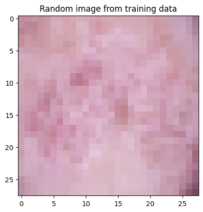

```python
import pandas as pd
import numpy as np
import warnings 
warnings.filterwarnings('ignore')

#path='skin-cancer-mnist-ham10000/hmnist_28_28_RGB.csv'
df=pd.read_csv("hmnist_28_28_RGB.csv")
df.tail()
```


<div>
<style scoped>
    .dataframe tbody tr th:only-of-type {
        vertical-align: middle;
    }

    .dataframe tbody tr th {
        vertical-align: top;
    }

    .dataframe thead th {
        text-align: right;
    }
</style>
<table border="1" class="dataframe">
  <thead>
    <tr style="text-align: right;">
      <th></th>
      <th>pixel0000</th>
      <th>pixel0001</th>
      <th>pixel0002</th>
      <th>pixel0003</th>
      <th>pixel0004</th>
      <th>pixel0005</th>
      <th>pixel0006</th>
      <th>pixel0007</th>
      <th>pixel0008</th>
      <th>pixel0009</th>
      <th>...</th>
      <th>pixel2343</th>
      <th>pixel2344</th>
      <th>pixel2345</th>
      <th>pixel2346</th>
      <th>pixel2347</th>
      <th>pixel2348</th>
      <th>pixel2349</th>
      <th>pixel2350</th>
      <th>pixel2351</th>
      <th>label</th>
    </tr>
  </thead>
  <tbody>
    <tr>
      <th>10010</th>
      <td>183</td>
      <td>165</td>
      <td>181</td>
      <td>182</td>
      <td>165</td>
      <td>180</td>
      <td>184</td>
      <td>166</td>
      <td>182</td>
      <td>188</td>
      <td>...</td>
      <td>208</td>
      <td>185</td>
      <td>187</td>
      <td>208</td>
      <td>186</td>
      <td>186</td>
      <td>206</td>
      <td>187</td>
      <td>189</td>
      <td>0</td>
    </tr>
    <tr>
      <th>10011</th>
      <td>2</td>
      <td>3</td>
      <td>1</td>
      <td>38</td>
      <td>33</td>
      <td>32</td>
      <td>121</td>
      <td>104</td>
      <td>103</td>
      <td>132</td>
      <td>...</td>
      <td>96</td>
      <td>79</td>
      <td>76</td>
      <td>24</td>
      <td>23</td>
      <td>21</td>
      <td>3</td>
      <td>4</td>
      <td>1</td>
      <td>0</td>
    </tr>
    <tr>
      <th>10012</th>
      <td>132</td>
      <td>118</td>
      <td>118</td>
      <td>167</td>
      <td>149</td>
      <td>149</td>
      <td>175</td>
      <td>156</td>
      <td>160</td>
      <td>184</td>
      <td>...</td>
      <td>204</td>
      <td>181</td>
      <td>178</td>
      <td>181</td>
      <td>159</td>
      <td>153</td>
      <td>172</td>
      <td>151</td>
      <td>145</td>
      <td>0</td>
    </tr>
    <tr>
      <th>10013</th>
      <td>160</td>
      <td>124</td>
      <td>146</td>
      <td>164</td>
      <td>131</td>
      <td>152</td>
      <td>167</td>
      <td>127</td>
      <td>146</td>
      <td>169</td>
      <td>...</td>
      <td>185</td>
      <td>162</td>
      <td>167</td>
      <td>184</td>
      <td>157</td>
      <td>166</td>
      <td>185</td>
      <td>162</td>
      <td>172</td>
      <td>0</td>
    </tr>
    <tr>
      <th>10014</th>
      <td>175</td>
      <td>142</td>
      <td>121</td>
      <td>181</td>
      <td>150</td>
      <td>134</td>
      <td>181</td>
      <td>150</td>
      <td>133</td>
      <td>178</td>
      <td>...</td>
      <td>159</td>
      <td>79</td>
      <td>82</td>
      <td>174</td>
      <td>137</td>
      <td>125</td>
      <td>175</td>
      <td>139</td>
      <td>126</td>
      <td>6</td>
    </tr>
  </tbody>
</table>
<p>5 rows × 2353 columns</p>
</div>


```python
fractions=np.array([0.5,0.5])
df=df.sample(frac=1)
train_set, test_set = np.array_split(
    df, (fractions[:-1].cumsum() * len(df)).astype(int))

print(len(train_set))
print(len(test_set))

```

    5007
    5008
    


```python
df.label.unique()

```


    array([4, 2, 5, 6, 0, 3, 1], dtype=int64)


```python
classes={0:('akiec', 'actinic keratoses and intraepithelial carcinomae'),
         1:('bcc' , 'basal cell carcinoma'),
         2:('bkl', 'benign keratosis-like lesions'),
         3:('df', 'dermatofibroma'),
         4:('nv', ' melanocytic nevi'),
         5:('vasc', ' pyogenic granulomas and hemorrhage'),
         6:('mel', 'melanoma'),}
```


```python
y_train=train_set['label']
x_train=train_set.drop(columns=['label'])
y_test=test_set['label']
x_test=test_set.drop(columns=['label'])

columns=list(x_train)
```


```python
from imblearn.over_sampling import RandomOverSampler 
oversample = RandomOverSampler()
x_train,y_train  = oversample.fit_resample(x_train,y_train)
```


```python
import matplotlib.pyplot as plt
import random
num=random.randint(0,8000)
x_train=np.array(x_train, dtype=np.uint8).reshape(-1,28,28,3)

plt.imshow(x_train[num].reshape(28,28,3))
plt.title("Random image from training data")
plt.show()
num=random.randint(0,8000)
plt.imshow(x_train[num].reshape(28,28,3))
plt.title("Random image from training data")
plt.show()

num=random.randint(0,8000)
plt.imshow(x_train[num].reshape(28,28,3))
plt.title("Random image from training data")
plt.show()
```


    

    


    

    


    

    


```python
import numpy as np
import matplotlib.pyplot as plt
from tensorflow.keras.preprocessing.image import ImageDataGenerator
from tensorflow.keras.layers import Input
from tensorflow.keras.models import Sequential
import tensorflow as tf
from tensorflow.keras.layers import Dense, Reshape, Flatten, Conv2D, UpSampling2D, BatchNormalization, LeakyReLU, MaxPool2D


# Example generator model
generator = Sequential()
generator.add(Dense(128, input_dim=100, activation='relu'))
generator.add(Dense(784, activation='sigmoid'))
generator.add(Dense(28*28*3))
generator.add(Reshape((28, 28, 3)))

# Discriminator model
discriminator = Sequential()

discriminator.add(Conv2D(16, kernel_size=(3, 3), input_shape=(28, 28, 3), activation='relu', padding='same'))
discriminator.add(MaxPool2D(pool_size=(2, 2)))
discriminator.add(tf.keras.layers.BatchNormalization())

discriminator.add(Conv2D(32, kernel_size=(3, 3), activation='relu'))
discriminator.add(Conv2D(64, kernel_size=(3, 3), activation='relu'))

discriminator.add(MaxPool2D(pool_size=(2, 2)))
discriminator.add(tf.keras.layers.BatchNormalization())

discriminator.add(Conv2D(128, kernel_size=(3, 3), activation='relu'))
discriminator.add(Conv2D(256, kernel_size=(3, 3), activation='relu'))

discriminator.add(Flatten())
discriminator.add(tf.keras.layers.Dropout(0.2))
discriminator.add(Dense(256, activation='relu'))

discriminator.add(tf.keras.layers.BatchNormalization())
discriminator.add(tf.keras.layers.Dropout(0.2))
discriminator.add(Dense(128, activation='relu'))

discriminator.add(tf.keras.layers.BatchNormalization())
discriminator.add(Dense(64, activation='relu'))

discriminator.add(tf.keras.layers.BatchNormalization())
discriminator.add(tf.keras.layers.Dropout(0.2))
discriminator.add(Dense(32, activation='relu'))

discriminator.add(tf.keras.layers.BatchNormalization())
discriminator.add(Dense(1, activation='sigmoid'))  # Binary classification (real or fake)


# Compile the discriminator
discriminator.compile(optimizer='adam', loss='binary_crossentropy', metrics=['accuracy'])

discriminator.summary()
```


<pre style="white-space:pre;overflow-x:auto;line-height:normal;font-family:Menlo,'DejaVu Sans Mono',consolas,'Courier New',monospace"><span style="font-weight: bold">Model: "sequential_3"</span>
</pre>


<pre style="white-space:pre;overflow-x:auto;line-height:normal;font-family:Menlo,'DejaVu Sans Mono',consolas,'Courier New',monospace">┏━━━━━━━━━━━━━━━━━━━━━━━━━━━━━━━━━━━━┳━━━━━━━━━━━━━━━━━━━━━━━━━━━━━━━┳━━━━━━━━━━━━━┓
┃<span style="font-weight: bold"> Layer (type)                       </span>┃<span style="font-weight: bold"> Output Shape                  </span>┃<span style="font-weight: bold">     Param # </span>┃
┡━━━━━━━━━━━━━━━━━━━━━━━━━━━━━━━━━━━━╇━━━━━━━━━━━━━━━━━━━━━━━━━━━━━━━╇━━━━━━━━━━━━━┩
│ conv2d_5 (<span style="color: #0087ff; text-decoration-color: #0087ff">Conv2D</span>)                  │ (<span style="color: #00d7ff; text-decoration-color: #00d7ff">None</span>, <span style="color: #00af00; text-decoration-color: #00af00">28</span>, <span style="color: #00af00; text-decoration-color: #00af00">28</span>, <span style="color: #00af00; text-decoration-color: #00af00">16</span>)            │         <span style="color: #00af00; text-decoration-color: #00af00">448</span> │
├────────────────────────────────────┼───────────────────────────────┼─────────────┤
│ max_pooling2d_2 (<span style="color: #0087ff; text-decoration-color: #0087ff">MaxPooling2D</span>)     │ (<span style="color: #00d7ff; text-decoration-color: #00d7ff">None</span>, <span style="color: #00af00; text-decoration-color: #00af00">14</span>, <span style="color: #00af00; text-decoration-color: #00af00">14</span>, <span style="color: #00af00; text-decoration-color: #00af00">16</span>)            │           <span style="color: #00af00; text-decoration-color: #00af00">0</span> │
├────────────────────────────────────┼───────────────────────────────┼─────────────┤
│ batch_normalization_6              │ (<span style="color: #00d7ff; text-decoration-color: #00d7ff">None</span>, <span style="color: #00af00; text-decoration-color: #00af00">14</span>, <span style="color: #00af00; text-decoration-color: #00af00">14</span>, <span style="color: #00af00; text-decoration-color: #00af00">16</span>)            │          <span style="color: #00af00; text-decoration-color: #00af00">64</span> │
│ (<span style="color: #0087ff; text-decoration-color: #0087ff">BatchNormalization</span>)               │                               │             │
├────────────────────────────────────┼───────────────────────────────┼─────────────┤
│ conv2d_6 (<span style="color: #0087ff; text-decoration-color: #0087ff">Conv2D</span>)                  │ (<span style="color: #00d7ff; text-decoration-color: #00d7ff">None</span>, <span style="color: #00af00; text-decoration-color: #00af00">12</span>, <span style="color: #00af00; text-decoration-color: #00af00">12</span>, <span style="color: #00af00; text-decoration-color: #00af00">32</span>)            │       <span style="color: #00af00; text-decoration-color: #00af00">4,640</span> │
├────────────────────────────────────┼───────────────────────────────┼─────────────┤
│ conv2d_7 (<span style="color: #0087ff; text-decoration-color: #0087ff">Conv2D</span>)                  │ (<span style="color: #00d7ff; text-decoration-color: #00d7ff">None</span>, <span style="color: #00af00; text-decoration-color: #00af00">10</span>, <span style="color: #00af00; text-decoration-color: #00af00">10</span>, <span style="color: #00af00; text-decoration-color: #00af00">64</span>)            │      <span style="color: #00af00; text-decoration-color: #00af00">18,496</span> │
├────────────────────────────────────┼───────────────────────────────┼─────────────┤
│ max_pooling2d_3 (<span style="color: #0087ff; text-decoration-color: #0087ff">MaxPooling2D</span>)     │ (<span style="color: #00d7ff; text-decoration-color: #00d7ff">None</span>, <span style="color: #00af00; text-decoration-color: #00af00">5</span>, <span style="color: #00af00; text-decoration-color: #00af00">5</span>, <span style="color: #00af00; text-decoration-color: #00af00">64</span>)              │           <span style="color: #00af00; text-decoration-color: #00af00">0</span> │
├────────────────────────────────────┼───────────────────────────────┼─────────────┤
│ batch_normalization_7              │ (<span style="color: #00d7ff; text-decoration-color: #00d7ff">None</span>, <span style="color: #00af00; text-decoration-color: #00af00">5</span>, <span style="color: #00af00; text-decoration-color: #00af00">5</span>, <span style="color: #00af00; text-decoration-color: #00af00">64</span>)              │         <span style="color: #00af00; text-decoration-color: #00af00">256</span> │
│ (<span style="color: #0087ff; text-decoration-color: #0087ff">BatchNormalization</span>)               │                               │             │
├────────────────────────────────────┼───────────────────────────────┼─────────────┤
│ conv2d_8 (<span style="color: #0087ff; text-decoration-color: #0087ff">Conv2D</span>)                  │ (<span style="color: #00d7ff; text-decoration-color: #00d7ff">None</span>, <span style="color: #00af00; text-decoration-color: #00af00">3</span>, <span style="color: #00af00; text-decoration-color: #00af00">3</span>, <span style="color: #00af00; text-decoration-color: #00af00">128</span>)             │      <span style="color: #00af00; text-decoration-color: #00af00">73,856</span> │
├────────────────────────────────────┼───────────────────────────────┼─────────────┤
│ conv2d_9 (<span style="color: #0087ff; text-decoration-color: #0087ff">Conv2D</span>)                  │ (<span style="color: #00d7ff; text-decoration-color: #00d7ff">None</span>, <span style="color: #00af00; text-decoration-color: #00af00">1</span>, <span style="color: #00af00; text-decoration-color: #00af00">1</span>, <span style="color: #00af00; text-decoration-color: #00af00">256</span>)             │     <span style="color: #00af00; text-decoration-color: #00af00">295,168</span> │
├────────────────────────────────────┼───────────────────────────────┼─────────────┤
│ flatten_1 (<span style="color: #0087ff; text-decoration-color: #0087ff">Flatten</span>)                │ (<span style="color: #00d7ff; text-decoration-color: #00d7ff">None</span>, <span style="color: #00af00; text-decoration-color: #00af00">256</span>)                   │           <span style="color: #00af00; text-decoration-color: #00af00">0</span> │
├────────────────────────────────────┼───────────────────────────────┼─────────────┤
│ dropout_3 (<span style="color: #0087ff; text-decoration-color: #0087ff">Dropout</span>)                │ (<span style="color: #00d7ff; text-decoration-color: #00d7ff">None</span>, <span style="color: #00af00; text-decoration-color: #00af00">256</span>)                   │           <span style="color: #00af00; text-decoration-color: #00af00">0</span> │
├────────────────────────────────────┼───────────────────────────────┼─────────────┤
│ dense_11 (<span style="color: #0087ff; text-decoration-color: #0087ff">Dense</span>)                   │ (<span style="color: #00d7ff; text-decoration-color: #00d7ff">None</span>, <span style="color: #00af00; text-decoration-color: #00af00">256</span>)                   │      <span style="color: #00af00; text-decoration-color: #00af00">65,792</span> │
├────────────────────────────────────┼───────────────────────────────┼─────────────┤
│ batch_normalization_8              │ (<span style="color: #00d7ff; text-decoration-color: #00d7ff">None</span>, <span style="color: #00af00; text-decoration-color: #00af00">256</span>)                   │       <span style="color: #00af00; text-decoration-color: #00af00">1,024</span> │
│ (<span style="color: #0087ff; text-decoration-color: #0087ff">BatchNormalization</span>)               │                               │             │
├────────────────────────────────────┼───────────────────────────────┼─────────────┤
│ dropout_4 (<span style="color: #0087ff; text-decoration-color: #0087ff">Dropout</span>)                │ (<span style="color: #00d7ff; text-decoration-color: #00d7ff">None</span>, <span style="color: #00af00; text-decoration-color: #00af00">256</span>)                   │           <span style="color: #00af00; text-decoration-color: #00af00">0</span> │
├────────────────────────────────────┼───────────────────────────────┼─────────────┤
│ dense_12 (<span style="color: #0087ff; text-decoration-color: #0087ff">Dense</span>)                   │ (<span style="color: #00d7ff; text-decoration-color: #00d7ff">None</span>, <span style="color: #00af00; text-decoration-color: #00af00">128</span>)                   │      <span style="color: #00af00; text-decoration-color: #00af00">32,896</span> │
├────────────────────────────────────┼───────────────────────────────┼─────────────┤
│ batch_normalization_9              │ (<span style="color: #00d7ff; text-decoration-color: #00d7ff">None</span>, <span style="color: #00af00; text-decoration-color: #00af00">128</span>)                   │         <span style="color: #00af00; text-decoration-color: #00af00">512</span> │
│ (<span style="color: #0087ff; text-decoration-color: #0087ff">BatchNormalization</span>)               │                               │             │
├────────────────────────────────────┼───────────────────────────────┼─────────────┤
│ dense_13 (<span style="color: #0087ff; text-decoration-color: #0087ff">Dense</span>)                   │ (<span style="color: #00d7ff; text-decoration-color: #00d7ff">None</span>, <span style="color: #00af00; text-decoration-color: #00af00">64</span>)                    │       <span style="color: #00af00; text-decoration-color: #00af00">8,256</span> │
├────────────────────────────────────┼───────────────────────────────┼─────────────┤
│ batch_normalization_10             │ (<span style="color: #00d7ff; text-decoration-color: #00d7ff">None</span>, <span style="color: #00af00; text-decoration-color: #00af00">64</span>)                    │         <span style="color: #00af00; text-decoration-color: #00af00">256</span> │
│ (<span style="color: #0087ff; text-decoration-color: #0087ff">BatchNormalization</span>)               │                               │             │
├────────────────────────────────────┼───────────────────────────────┼─────────────┤
│ dropout_5 (<span style="color: #0087ff; text-decoration-color: #0087ff">Dropout</span>)                │ (<span style="color: #00d7ff; text-decoration-color: #00d7ff">None</span>, <span style="color: #00af00; text-decoration-color: #00af00">64</span>)                    │           <span style="color: #00af00; text-decoration-color: #00af00">0</span> │
├────────────────────────────────────┼───────────────────────────────┼─────────────┤
│ dense_14 (<span style="color: #0087ff; text-decoration-color: #0087ff">Dense</span>)                   │ (<span style="color: #00d7ff; text-decoration-color: #00d7ff">None</span>, <span style="color: #00af00; text-decoration-color: #00af00">32</span>)                    │       <span style="color: #00af00; text-decoration-color: #00af00">2,080</span> │
├────────────────────────────────────┼───────────────────────────────┼─────────────┤
│ batch_normalization_11             │ (<span style="color: #00d7ff; text-decoration-color: #00d7ff">None</span>, <span style="color: #00af00; text-decoration-color: #00af00">32</span>)                    │         <span style="color: #00af00; text-decoration-color: #00af00">128</span> │
│ (<span style="color: #0087ff; text-decoration-color: #0087ff">BatchNormalization</span>)               │                               │             │
├────────────────────────────────────┼───────────────────────────────┼─────────────┤
│ dense_15 (<span style="color: #0087ff; text-decoration-color: #0087ff">Dense</span>)                   │ (<span style="color: #00d7ff; text-decoration-color: #00d7ff">None</span>, <span style="color: #00af00; text-decoration-color: #00af00">1</span>)                     │          <span style="color: #00af00; text-decoration-color: #00af00">33</span> │
└────────────────────────────────────┴───────────────────────────────┴─────────────┘
</pre>


<pre style="white-space:pre;overflow-x:auto;line-height:normal;font-family:Menlo,'DejaVu Sans Mono',consolas,'Courier New',monospace"><span style="font-weight: bold"> Total params: </span><span style="color: #00af00; text-decoration-color: #00af00">503,905</span> (1.92 MB)
</pre>


<pre style="white-space:pre;overflow-x:auto;line-height:normal;font-family:Menlo,'DejaVu Sans Mono',consolas,'Courier New',monospace"><span style="font-weight: bold"> Trainable params: </span><span style="color: #00af00; text-decoration-color: #00af00">502,785</span> (1.92 MB)
</pre>


<pre style="white-space:pre;overflow-x:auto;line-height:normal;font-family:Menlo,'DejaVu Sans Mono',consolas,'Courier New',monospace"><span style="font-weight: bold"> Non-trainable params: </span><span style="color: #00af00; text-decoration-color: #00af00">1,120</span> (4.38 KB)
</pre>


```python
# GAN model
from keras.models import Model
from keras.layers import Input
from keras.optimizers import Adam  # Import the Adam optimizer

discriminator.trainable = False
gan_input = Input(shape=(100,))
generated_image = generator(gan_input)
gan_output = discriminator(generated_image)
gan_model = Model(gan_input, gan_output)

# Compile the GAN model
gan_model.compile(optimizer=Adam(learning_rate=0.0002, beta_1=0.5), loss='binary_crossentropy')

```


```python
datagen = ImageDataGenerator(
    rotation_range=20,
    width_shift_range=0.2,
    height_shift_range=0.2,
    shear_range=0.2,
    zoom_range=0.2,
    horizontal_flip=True,
    fill_mode='nearest'
)

x_train_augmented = np.array(x_train, dtype=np.uint8)

def save_generated_images(epoch, generator):
    noise = np.random.normal(0, 1, (9, 100))  # Generate 9 random noise vectors
    generated_images = generator.predict(noise)

    plt.figure(figsize=(10, 10))
    for i in range(7):  # Adjust the loop range to match the number of classes
        plt.subplot(3, 3, i + 1)
        plt.imshow(generated_images[i, :, :, 0], cmap='gray')
        plt.title(classes[i][1], fontsize=10)  # Add class label as the title
        plt.axis('off')

    plt.savefig(f'generated_images_epoch_{epoch}.png')
    plt.show()  # Add this line to display the generated images
    plt.close()

```


```python
# Number of epochs and batch size
epochs = 1000
batch_size = 32
```


```python
import numpy as np
from sklearn.metrics import accuracy_score

x_train_augmented = np.array(x_train, dtype=np.uint8).reshape(-1, 28, 28, 1)
d_losses_real = []
d_losses_fake = []
g_losses = []

for epoch in range(epochs):
    # Generate synthetic images using the generator
    noise = np.random.normal(0, 1, (batch_size, 100))
    generated_images = generator.predict(noise)

    # Create augmented batches from the synthetic images
    batch = datagen.flow(generated_images, np.zeros(batch_size), batch_size=batch_size)

    # Train the discriminator on real samples
    idx = np.random.randint(0, x_train.shape[0], batch_size)
    real_images = x_train[idx]
    real_labels = np.ones((batch_size, 1))
    d_loss_real = discriminator.train_on_batch(real_images, real_labels)

    # Train the discriminator on synthetic samples
    fake_images, fake_labels = next(batch)
    d_loss_fake = discriminator.train_on_batch(fake_images, fake_labels)

    # Calculate discriminator loss
    d_loss = 0.5 * np.add(d_loss_real, d_loss_fake)

    # Train the GAN model to fool the discriminator
    valid_labels = np.ones((batch_size, 1))
    g_loss = gan_model.train_on_batch(noise, valid_labels)

    real_labels_pred = discriminator.predict(real_images)
    real_accuracy = accuracy_score(np.ones_like(real_labels), real_labels_pred > 0.5)

    # Calculate accuracy on fake samples
    fake_labels_pred = discriminator.predict(fake_images)
    fake_accuracy = accuracy_score(np.zeros_like(fake_labels), fake_labels_pred > 0.5)

    # Print progress with accuracy
    if epoch % 100 == 0:
        print(f"Epoch {epoch}, D Loss: {d_loss[0]}, G Loss: {g_loss}, Real Accuracy: {real_accuracy}, Fake Accuracy: {fake_accuracy}")

    # Save generated images at certain intervals
    if epoch % 1000 == 0:
        save_generated_images(epoch, generator)

    d_losses_real.append(d_loss_real[0])
    d_losses_fake.append(d_loss_fake[0])
    g_losses.append(g_loss)
```

    1/1 ━━━━━━━━━━━━━━━━━━━━ 0s 70ms/step
    WARNING:tensorflow:5 out of the last 5 calls to <function TensorFlowTrainer.make_train_function.<locals>.one_step_on_iterator at 0x0000023D61AF5440> triggered tf.function retracing. Tracing is expensive and the excessive number of tracings could be due to (1) creating @tf.function repeatedly in a loop, (2) passing tensors with different shapes, (3) passing Python objects instead of tensors. For (1), please define your @tf.function outside of the loop. For (2), @tf.function has reduce_retracing=True option that can avoid unnecessary retracing. For (3), please refer to https://www.tensorflow.org/guide/function#controlling_retracing and https://www.tensorflow.org/api_docs/python/tf/function for  more details.
    WARNING:tensorflow:6 out of the last 6 calls to <function TensorFlowTrainer.make_train_function.<locals>.one_step_on_iterator at 0x0000023D60F13600> triggered tf.function retracing. Tracing is expensive and the excessive number of tracings could be due to (1) creating @tf.function repeatedly in a loop, (2) passing tensors with different shapes, (3) passing Python objects instead of tensors. For (1), please define your @tf.function outside of the loop. For (2), @tf.function has reduce_retracing=True option that can avoid unnecessary retracing. For (3), please refer to https://www.tensorflow.org/guide/function#controlling_retracing and https://www.tensorflow.org/api_docs/python/tf/function for  more details.
    1/1 ━━━━━━━━━━━━━━━━━━━━ 0s 298ms/step
    WARNING:tensorflow:5 out of the last 5 calls to <function TensorFlowTrainer.make_predict_function.<locals>.one_step_on_data_distributed at 0x0000023D2B02B4C0> triggered tf.function retracing. Tracing is expensive and the excessive number of tracings could be due to (1) creating @tf.function repeatedly in a loop, (2) passing tensors with different shapes, (3) passing Python objects instead of tensors. For (1), please define your @tf.function outside of the loop. For (2), @tf.function has reduce_retracing=True option that can avoid unnecessary retracing. For (3), please refer to https://www.tensorflow.org/guide/function#controlling_retracing and https://www.tensorflow.org/api_docs/python/tf/function for  more details.
    1/1 ━━━━━━━━━━━━━━━━━━━━ 0s 358ms/step
    Epoch 0, D Loss: 8.410734176635742, G Loss: 0.711575984954834, Real Accuracy: 0.0, Fake Accuracy: 1.0
    WARNING:tensorflow:6 out of the last 6 calls to <function TensorFlowTrainer.make_predict_function.<locals>.one_step_on_data_distributed at 0x0000023D61AFED40> triggered tf.function retracing. Tracing is expensive and the excessive number of tracings could be due to (1) creating @tf.function repeatedly in a loop, (2) passing tensors with different shapes, (3) passing Python objects instead of tensors. For (1), please define your @tf.function outside of the loop. For (2), @tf.function has reduce_retracing=True option that can avoid unnecessary retracing. For (3), please refer to https://www.tensorflow.org/guide/function#controlling_retracing and https://www.tensorflow.org/api_docs/python/tf/function for  more details.
    1/1 ━━━━━━━━━━━━━━━━━━━━ 0s 66ms/step
    


    

    


    1/1 ━━━━━━━━━━━━━━━━━━━━ 0s 39ms/step
    1/1 ━━━━━━━━━━━━━━━━━━━━ 0s 45ms/step
    1/1 ━━━━━━━━━━━━━━━━━━━━ 0s 50ms/step
    1/1 ━━━━━━━━━━━━━━━━━━━━ 0s 37ms/step
    1/1 ━━━━━━━━━━━━━━━━━━━━ 0s 31ms/step
    1/1 ━━━━━━━━━━━━━━━━━━━━ 0s 45ms/step
    1/1 ━━━━━━━━━━━━━━━━━━━━ 0s 33ms/step
    1/1 ━━━━━━━━━━━━━━━━━━━━ 0s 34ms/step
    1/1 ━━━━━━━━━━━━━━━━━━━━ 0s 26ms/step
    1/1 ━━━━━━━━━━━━━━━━━━━━ 0s 25ms/step
    1/1 ━━━━━━━━━━━━━━━━━━━━ 0s 31ms/step
    1/1 ━━━━━━━━━━━━━━━━━━━━ 0s 26ms/step
    1/1 ━━━━━━━━━━━━━━━━━━━━ 0s 26ms/step
    1/1 ━━━━━━━━━━━━━━━━━━━━ 0s 23ms/step
    1/1 ━━━━━━━━━━━━━━━━━━━━ 0s 36ms/step
    1/1 ━━━━━━━━━━━━━━━━━━━━ 0s 27ms/step
    1/1 ━━━━━━━━━━━━━━━━━━━━ 0s 34ms/step
    1/1 ━━━━━━━━━━━━━━━━━━━━ 0s 21ms/step
    1/1 ━━━━━━━━━━━━━━━━━━━━ 0s 16ms/step
    1/1 ━━━━━━━━━━━━━━━━━━━━ 0s 27ms/step
    1/1 ━━━━━━━━━━━━━━━━━━━━ 0s 31ms/step
    1/1 ━━━━━━━━━━━━━━━━━━━━ 0s 14ms/step
    1/1 ━━━━━━━━━━━━━━━━━━━━ 0s 35ms/step
    1/1 ━━━━━━━━━━━━━━━━━━━━ 0s 17ms/step
    1/1 ━━━━━━━━━━━━━━━━━━━━ 0s 28ms/step
    1/1 ━━━━━━━━━━━━━━━━━━━━ 0s 35ms/step
    1/1 ━━━━━━━━━━━━━━━━━━━━ 0s 16ms/step
    1/1 ━━━━━━━━━━━━━━━━━━━━ 0s 24ms/step
    1/1 ━━━━━━━━━━━━━━━━━━━━ 0s 37ms/step
    1/1 ━━━━━━━━━━━━━━━━━━━━ 0s 17ms/step
    1/1 ━━━━━━━━━━━━━━━━━━━━ 0s 16ms/step
    1/1 ━━━━━━━━━━━━━━━━━━━━ 0s 17ms/step
    1/1 ━━━━━━━━━━━━━━━━━━━━ 0s 38ms/step
    1/1 ━━━━━━━━━━━━━━━━━━━━ 0s 40ms/step
    1/1 ━━━━━━━━━━━━━━━━━━━━ 0s 34ms/step
    1/1 ━━━━━━━━━━━━━━━━━━━━ 0s 26ms/step
    1/1 ━━━━━━━━━━━━━━━━━━━━ 0s 26ms/step
    1/1 ━━━━━━━━━━━━━━━━━━━━ 0s 28ms/step
    1/1 ━━━━━━━━━━━━━━━━━━━━ 0s 24ms/step
    1/1 ━━━━━━━━━━━━━━━━━━━━ 0s 16ms/step
    1/1 ━━━━━━━━━━━━━━━━━━━━ 0s 16ms/step
    1/1 ━━━━━━━━━━━━━━━━━━━━ 0s 27ms/step
    1/1 ━━━━━━━━━━━━━━━━━━━━ 0s 16ms/step
    1/1 ━━━━━━━━━━━━━━━━━━━━ 0s 31ms/step
    1/1 ━━━━━━━━━━━━━━━━━━━━ 0s 17ms/step
    1/1 ━━━━━━━━━━━━━━━━━━━━ 0s 49ms/step
    1/1 ━━━━━━━━━━━━━━━━━━━━ 0s 45ms/step
    1/1 ━━━━━━━━━━━━━━━━━━━━ 0s 34ms/step
    1/1 ━━━━━━━━━━━━━━━━━━━━ 0s 25ms/step
    1/1 ━━━━━━━━━━━━━━━━━━━━ 0s 31ms/step
    1/1 ━━━━━━━━━━━━━━━━━━━━ 0s 32ms/step
    1/1 ━━━━━━━━━━━━━━━━━━━━ 0s 27ms/step
    1/1 ━━━━━━━━━━━━━━━━━━━━ 0s 34ms/step
    1/1 ━━━━━━━━━━━━━━━━━━━━ 0s 31ms/step
    1/1 ━━━━━━━━━━━━━━━━━━━━ 0s 26ms/step
    1/1 ━━━━━━━━━━━━━━━━━━━━ 0s 16ms/step
    1/1 ━━━━━━━━━━━━━━━━━━━━ 0s 32ms/step
    1/1 ━━━━━━━━━━━━━━━━━━━━ 0s 16ms/step
    1/1 ━━━━━━━━━━━━━━━━━━━━ 0s 25ms/step
    1/1 ━━━━━━━━━━━━━━━━━━━━ 0s 29ms/step
    1/1 ━━━━━━━━━━━━━━━━━━━━ 0s 33ms/step
    1/1 ━━━━━━━━━━━━━━━━━━━━ 0s 43ms/step
    1/1 ━━━━━━━━━━━━━━━━━━━━ 0s 16ms/step
    1/1 ━━━━━━━━━━━━━━━━━━━━ 0s 22ms/step
    1/1 ━━━━━━━━━━━━━━━━━━━━ 0s 37ms/step
    1/1 ━━━━━━━━━━━━━━━━━━━━ 0s 33ms/step
    1/1 ━━━━━━━━━━━━━━━━━━━━ 0s 24ms/step
    1/1 ━━━━━━━━━━━━━━━━━━━━ 0s 19ms/step
    1/1 ━━━━━━━━━━━━━━━━━━━━ 0s 32ms/step
    1/1 ━━━━━━━━━━━━━━━━━━━━ 0s 25ms/step
    1/1 ━━━━━━━━━━━━━━━━━━━━ 0s 26ms/step
    1/1 ━━━━━━━━━━━━━━━━━━━━ 0s 25ms/step
    1/1 ━━━━━━━━━━━━━━━━━━━━ 0s 33ms/step
    1/1 ━━━━━━━━━━━━━━━━━━━━ 0s 24ms/step
    1/1 ━━━━━━━━━━━━━━━━━━━━ 0s 8ms/step
    1/1 ━━━━━━━━━━━━━━━━━━━━ 0s 24ms/step
    1/1 ━━━━━━━━━━━━━━━━━━━━ 0s 22ms/step
    1/1 ━━━━━━━━━━━━━━━━━━━━ 0s 33ms/step
    1/1 ━━━━━━━━━━━━━━━━━━━━ 0s 32ms/step
    1/1 ━━━━━━━━━━━━━━━━━━━━ 0s 34ms/step
    1/1 ━━━━━━━━━━━━━━━━━━━━ 0s 25ms/step
    1/1 ━━━━━━━━━━━━━━━━━━━━ 0s 24ms/step
    1/1 ━━━━━━━━━━━━━━━━━━━━ 0s 25ms/step
    1/1 ━━━━━━━━━━━━━━━━━━━━ 0s 32ms/step
    1/1 ━━━━━━━━━━━━━━━━━━━━ 0s 16ms/step
    1/1 ━━━━━━━━━━━━━━━━━━━━ 0s 32ms/step
    1/1 ━━━━━━━━━━━━━━━━━━━━ 0s 26ms/step
    1/1 ━━━━━━━━━━━━━━━━━━━━ 0s 24ms/step
    1/1 ━━━━━━━━━━━━━━━━━━━━ 0s 16ms/step
    1/1 ━━━━━━━━━━━━━━━━━━━━ 0s 34ms/step
    1/1 ━━━━━━━━━━━━━━━━━━━━ 0s 36ms/step
    1/1 ━━━━━━━━━━━━━━━━━━━━ 0s 31ms/step
    1/1 ━━━━━━━━━━━━━━━━━━━━ 0s 50ms/step
    1/1 ━━━━━━━━━━━━━━━━━━━━ 0s 35ms/step
    1/1 ━━━━━━━━━━━━━━━━━━━━ 0s 26ms/step
    1/1 ━━━━━━━━━━━━━━━━━━━━ 0s 25ms/step
    1/1 ━━━━━━━━━━━━━━━━━━━━ 0s 16ms/step
    1/1 ━━━━━━━━━━━━━━━━━━━━ 0s 34ms/step
    1/1 ━━━━━━━━━━━━━━━━━━━━ 0s 27ms/step
    1/1 ━━━━━━━━━━━━━━━━━━━━ 0s 31ms/step
    1/1 ━━━━━━━━━━━━━━━━━━━━ 0s 35ms/step
    1/1 ━━━━━━━━━━━━━━━━━━━━ 0s 28ms/step
    1/1 ━━━━━━━━━━━━━━━━━━━━ 0s 32ms/step
    1/1 ━━━━━━━━━━━━━━━━━━━━ 0s 16ms/step
    1/1 ━━━━━━━━━━━━━━━━━━━━ 0s 25ms/step
    1/1 ━━━━━━━━━━━━━━━━━━━━ 0s 34ms/step
    1/1 ━━━━━━━━━━━━━━━━━━━━ 0s 36ms/step
    1/1 ━━━━━━━━━━━━━━━━━━━━ 0s 29ms/step
    1/1 ━━━━━━━━━━━━━━━━━━━━ 0s 16ms/step
    1/1 ━━━━━━━━━━━━━━━━━━━━ 0s 31ms/step
    1/1 ━━━━━━━━━━━━━━━━━━━━ 0s 32ms/step
    1/1 ━━━━━━━━━━━━━━━━━━━━ 0s 27ms/step
    1/1 ━━━━━━━━━━━━━━━━━━━━ 0s 25ms/step
    1/1 ━━━━━━━━━━━━━━━━━━━━ 0s 36ms/step
    1/1 ━━━━━━━━━━━━━━━━━━━━ 0s 25ms/step
    1/1 ━━━━━━━━━━━━━━━━━━━━ 0s 33ms/step
    1/1 ━━━━━━━━━━━━━━━━━━━━ 0s 27ms/step
    1/1 ━━━━━━━━━━━━━━━━━━━━ 0s 33ms/step
    1/1 ━━━━━━━━━━━━━━━━━━━━ 0s 36ms/step
    1/1 ━━━━━━━━━━━━━━━━━━━━ 0s 19ms/step
    1/1 ━━━━━━━━━━━━━━━━━━━━ 0s 17ms/step
    1/1 ━━━━━━━━━━━━━━━━━━━━ 0s 24ms/step
    1/1 ━━━━━━━━━━━━━━━━━━━━ 0s 25ms/step
    1/1 ━━━━━━━━━━━━━━━━━━━━ 0s 26ms/step
    1/1 ━━━━━━━━━━━━━━━━━━━━ 0s 41ms/step
    1/1 ━━━━━━━━━━━━━━━━━━━━ 0s 32ms/step
    1/1 ━━━━━━━━━━━━━━━━━━━━ 0s 24ms/step
    1/1 ━━━━━━━━━━━━━━━━━━━━ 0s 30ms/step
    1/1 ━━━━━━━━━━━━━━━━━━━━ 0s 27ms/step
    1/1 ━━━━━━━━━━━━━━━━━━━━ 0s 62ms/step
    1/1 ━━━━━━━━━━━━━━━━━━━━ 0s 34ms/step
    1/1 ━━━━━━━━━━━━━━━━━━━━ 0s 49ms/step
    1/1 ━━━━━━━━━━━━━━━━━━━━ 0s 16ms/step
    1/1 ━━━━━━━━━━━━━━━━━━━━ 0s 38ms/step
    1/1 ━━━━━━━━━━━━━━━━━━━━ 0s 48ms/step
    1/1 ━━━━━━━━━━━━━━━━━━━━ 0s 18ms/step
    1/1 ━━━━━━━━━━━━━━━━━━━━ 0s 33ms/step
    1/1 ━━━━━━━━━━━━━━━━━━━━ 0s 33ms/step
    1/1 ━━━━━━━━━━━━━━━━━━━━ 0s 34ms/step
    1/1 ━━━━━━━━━━━━━━━━━━━━ 0s 33ms/step
    1/1 ━━━━━━━━━━━━━━━━━━━━ 0s 37ms/step
    1/1 ━━━━━━━━━━━━━━━━━━━━ 0s 29ms/step
    1/1 ━━━━━━━━━━━━━━━━━━━━ 0s 24ms/step
    1/1 ━━━━━━━━━━━━━━━━━━━━ 0s 38ms/step
    1/1 ━━━━━━━━━━━━━━━━━━━━ 0s 40ms/step
    1/1 ━━━━━━━━━━━━━━━━━━━━ 0s 33ms/step
    1/1 ━━━━━━━━━━━━━━━━━━━━ 0s 45ms/step
    1/1 ━━━━━━━━━━━━━━━━━━━━ 0s 25ms/step
    1/1 ━━━━━━━━━━━━━━━━━━━━ 0s 16ms/step
    1/1 ━━━━━━━━━━━━━━━━━━━━ 0s 32ms/step
    1/1 ━━━━━━━━━━━━━━━━━━━━ 0s 13ms/step
    1/1 ━━━━━━━━━━━━━━━━━━━━ 0s 28ms/step
    1/1 ━━━━━━━━━━━━━━━━━━━━ 0s 34ms/step
    1/1 ━━━━━━━━━━━━━━━━━━━━ 0s 31ms/step
    1/1 ━━━━━━━━━━━━━━━━━━━━ 0s 32ms/step
    1/1 ━━━━━━━━━━━━━━━━━━━━ 0s 44ms/step
    1/1 ━━━━━━━━━━━━━━━━━━━━ 0s 40ms/step
    1/1 ━━━━━━━━━━━━━━━━━━━━ 0s 27ms/step
    1/1 ━━━━━━━━━━━━━━━━━━━━ 0s 43ms/step
    1/1 ━━━━━━━━━━━━━━━━━━━━ 0s 39ms/step
    1/1 ━━━━━━━━━━━━━━━━━━━━ 0s 31ms/step
    1/1 ━━━━━━━━━━━━━━━━━━━━ 0s 40ms/step
    1/1 ━━━━━━━━━━━━━━━━━━━━ 0s 38ms/step
    1/1 ━━━━━━━━━━━━━━━━━━━━ 0s 34ms/step
    1/1 ━━━━━━━━━━━━━━━━━━━━ 0s 34ms/step
    1/1 ━━━━━━━━━━━━━━━━━━━━ 0s 32ms/step
    1/1 ━━━━━━━━━━━━━━━━━━━━ 0s 33ms/step
    1/1 ━━━━━━━━━━━━━━━━━━━━ 0s 30ms/step
    1/1 ━━━━━━━━━━━━━━━━━━━━ 0s 36ms/step
    1/1 ━━━━━━━━━━━━━━━━━━━━ 0s 31ms/step
    1/1 ━━━━━━━━━━━━━━━━━━━━ 0s 35ms/step
    1/1 ━━━━━━━━━━━━━━━━━━━━ 0s 26ms/step
    1/1 ━━━━━━━━━━━━━━━━━━━━ 0s 40ms/step
    1/1 ━━━━━━━━━━━━━━━━━━━━ 0s 31ms/step
    1/1 ━━━━━━━━━━━━━━━━━━━━ 0s 37ms/step
    1/1 ━━━━━━━━━━━━━━━━━━━━ 0s 32ms/step
    1/1 ━━━━━━━━━━━━━━━━━━━━ 0s 50ms/step
    1/1 ━━━━━━━━━━━━━━━━━━━━ 0s 41ms/step
    1/1 ━━━━━━━━━━━━━━━━━━━━ 0s 16ms/step
    1/1 ━━━━━━━━━━━━━━━━━━━━ 0s 39ms/step
    1/1 ━━━━━━━━━━━━━━━━━━━━ 0s 41ms/step
    1/1 ━━━━━━━━━━━━━━━━━━━━ 0s 44ms/step
    1/1 ━━━━━━━━━━━━━━━━━━━━ 0s 30ms/step
    1/1 ━━━━━━━━━━━━━━━━━━━━ 0s 36ms/step
    1/1 ━━━━━━━━━━━━━━━━━━━━ 0s 23ms/step
    1/1 ━━━━━━━━━━━━━━━━━━━━ 0s 27ms/step
    1/1 ━━━━━━━━━━━━━━━━━━━━ 0s 26ms/step
    1/1 ━━━━━━━━━━━━━━━━━━━━ 0s 47ms/step
    1/1 ━━━━━━━━━━━━━━━━━━━━ 0s 45ms/step
    1/1 ━━━━━━━━━━━━━━━━━━━━ 0s 36ms/step
    1/1 ━━━━━━━━━━━━━━━━━━━━ 0s 25ms/step
    1/1 ━━━━━━━━━━━━━━━━━━━━ 0s 36ms/step
    1/1 ━━━━━━━━━━━━━━━━━━━━ 0s 34ms/step
    1/1 ━━━━━━━━━━━━━━━━━━━━ 0s 34ms/step
    1/1 ━━━━━━━━━━━━━━━━━━━━ 0s 36ms/step
    1/1 ━━━━━━━━━━━━━━━━━━━━ 0s 25ms/step
    1/1 ━━━━━━━━━━━━━━━━━━━━ 0s 16ms/step
    1/1 ━━━━━━━━━━━━━━━━━━━━ 0s 39ms/step
    1/1 ━━━━━━━━━━━━━━━━━━━━ 0s 32ms/step
    1/1 ━━━━━━━━━━━━━━━━━━━━ 0s 31ms/step
    1/1 ━━━━━━━━━━━━━━━━━━━━ 0s 43ms/step
    1/1 ━━━━━━━━━━━━━━━━━━━━ 0s 32ms/step
    1/1 ━━━━━━━━━━━━━━━━━━━━ 0s 34ms/step
    1/1 ━━━━━━━━━━━━━━━━━━━━ 0s 56ms/step
    1/1 ━━━━━━━━━━━━━━━━━━━━ 0s 25ms/step
    1/1 ━━━━━━━━━━━━━━━━━━━━ 0s 26ms/step
    1/1 ━━━━━━━━━━━━━━━━━━━━ 0s 23ms/step
    1/1 ━━━━━━━━━━━━━━━━━━━━ 0s 27ms/step
    1/1 ━━━━━━━━━━━━━━━━━━━━ 0s 25ms/step
    1/1 ━━━━━━━━━━━━━━━━━━━━ 0s 32ms/step
    1/1 ━━━━━━━━━━━━━━━━━━━━ 0s 27ms/step
    1/1 ━━━━━━━━━━━━━━━━━━━━ 0s 51ms/step
    1/1 ━━━━━━━━━━━━━━━━━━━━ 0s 34ms/step
    1/1 ━━━━━━━━━━━━━━━━━━━━ 0s 28ms/step
    1/1 ━━━━━━━━━━━━━━━━━━━━ 0s 37ms/step
    1/1 ━━━━━━━━━━━━━━━━━━━━ 0s 46ms/step
    1/1 ━━━━━━━━━━━━━━━━━━━━ 0s 33ms/step
    1/1 ━━━━━━━━━━━━━━━━━━━━ 0s 27ms/step
    1/1 ━━━━━━━━━━━━━━━━━━━━ 0s 33ms/step
    1/1 ━━━━━━━━━━━━━━━━━━━━ 0s 41ms/step
    1/1 ━━━━━━━━━━━━━━━━━━━━ 0s 47ms/step
    1/1 ━━━━━━━━━━━━━━━━━━━━ 0s 31ms/step
    1/1 ━━━━━━━━━━━━━━━━━━━━ 0s 19ms/step
    1/1 ━━━━━━━━━━━━━━━━━━━━ 0s 38ms/step
    1/1 ━━━━━━━━━━━━━━━━━━━━ 0s 37ms/step
    1/1 ━━━━━━━━━━━━━━━━━━━━ 0s 32ms/step
    1/1 ━━━━━━━━━━━━━━━━━━━━ 0s 35ms/step
    1/1 ━━━━━━━━━━━━━━━━━━━━ 0s 49ms/step
    1/1 ━━━━━━━━━━━━━━━━━━━━ 0s 33ms/step
    1/1 ━━━━━━━━━━━━━━━━━━━━ 0s 47ms/step
    1/1 ━━━━━━━━━━━━━━━━━━━━ 0s 42ms/step
    1/1 ━━━━━━━━━━━━━━━━━━━━ 0s 31ms/step
    1/1 ━━━━━━━━━━━━━━━━━━━━ 0s 34ms/step
    1/1 ━━━━━━━━━━━━━━━━━━━━ 0s 57ms/step
    1/1 ━━━━━━━━━━━━━━━━━━━━ 0s 35ms/step
    1/1 ━━━━━━━━━━━━━━━━━━━━ 0s 26ms/step
    1/1 ━━━━━━━━━━━━━━━━━━━━ 0s 33ms/step
    1/1 ━━━━━━━━━━━━━━━━━━━━ 0s 32ms/step
    1/1 ━━━━━━━━━━━━━━━━━━━━ 0s 32ms/step
    1/1 ━━━━━━━━━━━━━━━━━━━━ 0s 33ms/step
    1/1 ━━━━━━━━━━━━━━━━━━━━ 0s 26ms/step
    1/1 ━━━━━━━━━━━━━━━━━━━━ 0s 35ms/step
    1/1 ━━━━━━━━━━━━━━━━━━━━ 0s 70ms/step
    1/1 ━━━━━━━━━━━━━━━━━━━━ 0s 25ms/step
    1/1 ━━━━━━━━━━━━━━━━━━━━ 0s 34ms/step
    1/1 ━━━━━━━━━━━━━━━━━━━━ 0s 41ms/step
    1/1 ━━━━━━━━━━━━━━━━━━━━ 0s 29ms/step
    1/1 ━━━━━━━━━━━━━━━━━━━━ 0s 31ms/step
    1/1 ━━━━━━━━━━━━━━━━━━━━ 0s 32ms/step
    1/1 ━━━━━━━━━━━━━━━━━━━━ 0s 25ms/step
    1/1 ━━━━━━━━━━━━━━━━━━━━ 0s 32ms/step
    1/1 ━━━━━━━━━━━━━━━━━━━━ 0s 34ms/step
    1/1 ━━━━━━━━━━━━━━━━━━━━ 0s 34ms/step
    1/1 ━━━━━━━━━━━━━━━━━━━━ 0s 16ms/step
    1/1 ━━━━━━━━━━━━━━━━━━━━ 0s 36ms/step
    1/1 ━━━━━━━━━━━━━━━━━━━━ 0s 25ms/step
    1/1 ━━━━━━━━━━━━━━━━━━━━ 0s 31ms/step
    1/1 ━━━━━━━━━━━━━━━━━━━━ 0s 53ms/step
    1/1 ━━━━━━━━━━━━━━━━━━━━ 0s 26ms/step
    1/1 ━━━━━━━━━━━━━━━━━━━━ 0s 34ms/step
    1/1 ━━━━━━━━━━━━━━━━━━━━ 0s 31ms/step
    1/1 ━━━━━━━━━━━━━━━━━━━━ 0s 26ms/step
    1/1 ━━━━━━━━━━━━━━━━━━━━ 0s 34ms/step
    1/1 ━━━━━━━━━━━━━━━━━━━━ 0s 35ms/step
    1/1 ━━━━━━━━━━━━━━━━━━━━ 0s 50ms/step
    1/1 ━━━━━━━━━━━━━━━━━━━━ 0s 23ms/step
    1/1 ━━━━━━━━━━━━━━━━━━━━ 0s 31ms/step
    1/1 ━━━━━━━━━━━━━━━━━━━━ 0s 29ms/step
    1/1 ━━━━━━━━━━━━━━━━━━━━ 0s 32ms/step
    1/1 ━━━━━━━━━━━━━━━━━━━━ 0s 31ms/step
    1/1 ━━━━━━━━━━━━━━━━━━━━ 0s 48ms/step
    1/1 ━━━━━━━━━━━━━━━━━━━━ 0s 16ms/step
    1/1 ━━━━━━━━━━━━━━━━━━━━ 0s 34ms/step
    1/1 ━━━━━━━━━━━━━━━━━━━━ 0s 32ms/step
    1/1 ━━━━━━━━━━━━━━━━━━━━ 0s 34ms/step
    1/1 ━━━━━━━━━━━━━━━━━━━━ 0s 32ms/step
    1/1 ━━━━━━━━━━━━━━━━━━━━ 0s 54ms/step
    1/1 ━━━━━━━━━━━━━━━━━━━━ 0s 33ms/step
    1/1 ━━━━━━━━━━━━━━━━━━━━ 0s 37ms/step
    1/1 ━━━━━━━━━━━━━━━━━━━━ 0s 21ms/step
    1/1 ━━━━━━━━━━━━━━━━━━━━ 0s 44ms/step
    1/1 ━━━━━━━━━━━━━━━━━━━━ 0s 33ms/step
    1/1 ━━━━━━━━━━━━━━━━━━━━ 0s 31ms/step
    1/1 ━━━━━━━━━━━━━━━━━━━━ 0s 31ms/step
    1/1 ━━━━━━━━━━━━━━━━━━━━ 0s 34ms/step
    1/1 ━━━━━━━━━━━━━━━━━━━━ 0s 18ms/step
    1/1 ━━━━━━━━━━━━━━━━━━━━ 0s 33ms/step
    1/1 ━━━━━━━━━━━━━━━━━━━━ 0s 33ms/step
    1/1 ━━━━━━━━━━━━━━━━━━━━ 0s 32ms/step
    1/1 ━━━━━━━━━━━━━━━━━━━━ 0s 31ms/step
    1/1 ━━━━━━━━━━━━━━━━━━━━ 0s 32ms/step
    1/1 ━━━━━━━━━━━━━━━━━━━━ 0s 33ms/step
    1/1 ━━━━━━━━━━━━━━━━━━━━ 0s 30ms/step
    1/1 ━━━━━━━━━━━━━━━━━━━━ 0s 31ms/step
    1/1 ━━━━━━━━━━━━━━━━━━━━ 0s 33ms/step
    1/1 ━━━━━━━━━━━━━━━━━━━━ 0s 35ms/step
    1/1 ━━━━━━━━━━━━━━━━━━━━ 0s 49ms/step
    1/1 ━━━━━━━━━━━━━━━━━━━━ 0s 27ms/step
    1/1 ━━━━━━━━━━━━━━━━━━━━ 0s 31ms/step
    1/1 ━━━━━━━━━━━━━━━━━━━━ 0s 34ms/step
    Epoch 100, D Loss: 5.578123092651367, G Loss: 0.5646117329597473, Real Accuracy: 0.0, Fake Accuracy: 1.0
    1/1 ━━━━━━━━━━━━━━━━━━━━ 0s 35ms/step
    1/1 ━━━━━━━━━━━━━━━━━━━━ 0s 44ms/step
    1/1 ━━━━━━━━━━━━━━━━━━━━ 0s 44ms/step
    1/1 ━━━━━━━━━━━━━━━━━━━━ 0s 41ms/step
    1/1 ━━━━━━━━━━━━━━━━━━━━ 0s 47ms/step
    1/1 ━━━━━━━━━━━━━━━━━━━━ 0s 33ms/step
    1/1 ━━━━━━━━━━━━━━━━━━━━ 0s 33ms/step
    1/1 ━━━━━━━━━━━━━━━━━━━━ 0s 25ms/step
    1/1 ━━━━━━━━━━━━━━━━━━━━ 0s 34ms/step
    1/1 ━━━━━━━━━━━━━━━━━━━━ 0s 33ms/step
    1/1 ━━━━━━━━━━━━━━━━━━━━ 0s 34ms/step
    1/1 ━━━━━━━━━━━━━━━━━━━━ 0s 28ms/step
    1/1 ━━━━━━━━━━━━━━━━━━━━ 0s 36ms/step
    1/1 ━━━━━━━━━━━━━━━━━━━━ 0s 27ms/step
    1/1 ━━━━━━━━━━━━━━━━━━━━ 0s 39ms/step
    1/1 ━━━━━━━━━━━━━━━━━━━━ 0s 39ms/step
    1/1 ━━━━━━━━━━━━━━━━━━━━ 0s 54ms/step
    1/1 ━━━━━━━━━━━━━━━━━━━━ 0s 32ms/step
    1/1 ━━━━━━━━━━━━━━━━━━━━ 0s 33ms/step
    1/1 ━━━━━━━━━━━━━━━━━━━━ 0s 27ms/step
    1/1 ━━━━━━━━━━━━━━━━━━━━ 0s 34ms/step
    1/1 ━━━━━━━━━━━━━━━━━━━━ 0s 34ms/step
    1/1 ━━━━━━━━━━━━━━━━━━━━ 0s 33ms/step
    1/1 ━━━━━━━━━━━━━━━━━━━━ 0s 41ms/step
    1/1 ━━━━━━━━━━━━━━━━━━━━ 0s 35ms/step
    1/1 ━━━━━━━━━━━━━━━━━━━━ 0s 25ms/step
    1/1 ━━━━━━━━━━━━━━━━━━━━ 0s 39ms/step
    1/1 ━━━━━━━━━━━━━━━━━━━━ 0s 24ms/step
    1/1 ━━━━━━━━━━━━━━━━━━━━ 0s 27ms/step
    1/1 ━━━━━━━━━━━━━━━━━━━━ 0s 37ms/step
    1/1 ━━━━━━━━━━━━━━━━━━━━ 0s 31ms/step
    1/1 ━━━━━━━━━━━━━━━━━━━━ 0s 32ms/step
    1/1 ━━━━━━━━━━━━━━━━━━━━ 0s 37ms/step
    1/1 ━━━━━━━━━━━━━━━━━━━━ 0s 33ms/step
    1/1 ━━━━━━━━━━━━━━━━━━━━ 0s 16ms/step
    1/1 ━━━━━━━━━━━━━━━━━━━━ 0s 30ms/step
    1/1 ━━━━━━━━━━━━━━━━━━━━ 0s 71ms/step
    1/1 ━━━━━━━━━━━━━━━━━━━━ 0s 27ms/step
    1/1 ━━━━━━━━━━━━━━━━━━━━ 0s 29ms/step
    1/1 ━━━━━━━━━━━━━━━━━━━━ 0s 25ms/step
    1/1 ━━━━━━━━━━━━━━━━━━━━ 0s 26ms/step
    1/1 ━━━━━━━━━━━━━━━━━━━━ 0s 58ms/step
    1/1 ━━━━━━━━━━━━━━━━━━━━ 0s 27ms/step
    1/1 ━━━━━━━━━━━━━━━━━━━━ 0s 32ms/step
    1/1 ━━━━━━━━━━━━━━━━━━━━ 0s 34ms/step
    1/1 ━━━━━━━━━━━━━━━━━━━━ 0s 36ms/step
    1/1 ━━━━━━━━━━━━━━━━━━━━ 0s 31ms/step
    1/1 ━━━━━━━━━━━━━━━━━━━━ 0s 37ms/step
    1/1 ━━━━━━━━━━━━━━━━━━━━ 0s 28ms/step
    1/1 ━━━━━━━━━━━━━━━━━━━━ 0s 26ms/step
    1/1 ━━━━━━━━━━━━━━━━━━━━ 0s 27ms/step
    1/1 ━━━━━━━━━━━━━━━━━━━━ 0s 52ms/step
    1/1 ━━━━━━━━━━━━━━━━━━━━ 0s 31ms/step
    1/1 ━━━━━━━━━━━━━━━━━━━━ 0s 33ms/step
    1/1 ━━━━━━━━━━━━━━━━━━━━ 0s 23ms/step
    1/1 ━━━━━━━━━━━━━━━━━━━━ 0s 16ms/step
    1/1 ━━━━━━━━━━━━━━━━━━━━ 0s 41ms/step
    1/1 ━━━━━━━━━━━━━━━━━━━━ 0s 41ms/step
    1/1 ━━━━━━━━━━━━━━━━━━━━ 0s 34ms/step
    1/1 ━━━━━━━━━━━━━━━━━━━━ 0s 36ms/step
    1/1 ━━━━━━━━━━━━━━━━━━━━ 0s 36ms/step
    1/1 ━━━━━━━━━━━━━━━━━━━━ 0s 16ms/step
    1/1 ━━━━━━━━━━━━━━━━━━━━ 0s 73ms/step
    1/1 ━━━━━━━━━━━━━━━━━━━━ 0s 26ms/step
    1/1 ━━━━━━━━━━━━━━━━━━━━ 0s 32ms/step
    1/1 ━━━━━━━━━━━━━━━━━━━━ 0s 36ms/step
    1/1 ━━━━━━━━━━━━━━━━━━━━ 0s 25ms/step
    1/1 ━━━━━━━━━━━━━━━━━━━━ 0s 31ms/step
    1/1 ━━━━━━━━━━━━━━━━━━━━ 0s 34ms/step
    1/1 ━━━━━━━━━━━━━━━━━━━━ 0s 21ms/step
    1/1 ━━━━━━━━━━━━━━━━━━━━ 0s 32ms/step
    1/1 ━━━━━━━━━━━━━━━━━━━━ 0s 33ms/step
    1/1 ━━━━━━━━━━━━━━━━━━━━ 0s 25ms/step
    1/1 ━━━━━━━━━━━━━━━━━━━━ 0s 16ms/step
    1/1 ━━━━━━━━━━━━━━━━━━━━ 0s 36ms/step
    1/1 ━━━━━━━━━━━━━━━━━━━━ 0s 25ms/step
    1/1 ━━━━━━━━━━━━━━━━━━━━ 0s 35ms/step
    1/1 ━━━━━━━━━━━━━━━━━━━━ 0s 35ms/step
    1/1 ━━━━━━━━━━━━━━━━━━━━ 0s 50ms/step
    1/1 ━━━━━━━━━━━━━━━━━━━━ 0s 32ms/step
    1/1 ━━━━━━━━━━━━━━━━━━━━ 0s 33ms/step
    1/1 ━━━━━━━━━━━━━━━━━━━━ 0s 23ms/step
    1/1 ━━━━━━━━━━━━━━━━━━━━ 0s 31ms/step
    1/1 ━━━━━━━━━━━━━━━━━━━━ 0s 32ms/step
    1/1 ━━━━━━━━━━━━━━━━━━━━ 0s 34ms/step
    1/1 ━━━━━━━━━━━━━━━━━━━━ 0s 58ms/step
    1/1 ━━━━━━━━━━━━━━━━━━━━ 0s 32ms/step
    1/1 ━━━━━━━━━━━━━━━━━━━━ 0s 50ms/step
    1/1 ━━━━━━━━━━━━━━━━━━━━ 0s 33ms/step
    1/1 ━━━━━━━━━━━━━━━━━━━━ 0s 51ms/step
    1/1 ━━━━━━━━━━━━━━━━━━━━ 0s 32ms/step
    1/1 ━━━━━━━━━━━━━━━━━━━━ 0s 19ms/step
    1/1 ━━━━━━━━━━━━━━━━━━━━ 0s 48ms/step
    1/1 ━━━━━━━━━━━━━━━━━━━━ 0s 35ms/step
    1/1 ━━━━━━━━━━━━━━━━━━━━ 0s 31ms/step
    1/1 ━━━━━━━━━━━━━━━━━━━━ 0s 44ms/step
    1/1 ━━━━━━━━━━━━━━━━━━━━ 0s 33ms/step
    1/1 ━━━━━━━━━━━━━━━━━━━━ 0s 33ms/step
    1/1 ━━━━━━━━━━━━━━━━━━━━ 0s 34ms/step
    1/1 ━━━━━━━━━━━━━━━━━━━━ 0s 37ms/step
    1/1 ━━━━━━━━━━━━━━━━━━━━ 0s 33ms/step
    1/1 ━━━━━━━━━━━━━━━━━━━━ 0s 35ms/step
    1/1 ━━━━━━━━━━━━━━━━━━━━ 0s 44ms/step
    1/1 ━━━━━━━━━━━━━━━━━━━━ 0s 32ms/step
    1/1 ━━━━━━━━━━━━━━━━━━━━ 0s 36ms/step
    1/1 ━━━━━━━━━━━━━━━━━━━━ 0s 27ms/step
    1/1 ━━━━━━━━━━━━━━━━━━━━ 0s 31ms/step
    1/1 ━━━━━━━━━━━━━━━━━━━━ 0s 34ms/step
    1/1 ━━━━━━━━━━━━━━━━━━━━ 0s 35ms/step
    1/1 ━━━━━━━━━━━━━━━━━━━━ 0s 31ms/step
    1/1 ━━━━━━━━━━━━━━━━━━━━ 0s 25ms/step
    1/1 ━━━━━━━━━━━━━━━━━━━━ 0s 33ms/step
    1/1 ━━━━━━━━━━━━━━━━━━━━ 0s 31ms/step
    1/1 ━━━━━━━━━━━━━━━━━━━━ 0s 34ms/step
    1/1 ━━━━━━━━━━━━━━━━━━━━ 0s 25ms/step
    1/1 ━━━━━━━━━━━━━━━━━━━━ 0s 27ms/step
    1/1 ━━━━━━━━━━━━━━━━━━━━ 0s 35ms/step
    1/1 ━━━━━━━━━━━━━━━━━━━━ 0s 24ms/step
    1/1 ━━━━━━━━━━━━━━━━━━━━ 0s 23ms/step
    1/1 ━━━━━━━━━━━━━━━━━━━━ 0s 38ms/step
    1/1 ━━━━━━━━━━━━━━━━━━━━ 0s 43ms/step
    1/1 ━━━━━━━━━━━━━━━━━━━━ 0s 32ms/step
    1/1 ━━━━━━━━━━━━━━━━━━━━ 0s 45ms/step
    1/1 ━━━━━━━━━━━━━━━━━━━━ 0s 23ms/step
    1/1 ━━━━━━━━━━━━━━━━━━━━ 0s 37ms/step
    1/1 ━━━━━━━━━━━━━━━━━━━━ 0s 44ms/step
    1/1 ━━━━━━━━━━━━━━━━━━━━ 0s 27ms/step
    1/1 ━━━━━━━━━━━━━━━━━━━━ 0s 33ms/step
    1/1 ━━━━━━━━━━━━━━━━━━━━ 0s 41ms/step
    1/1 ━━━━━━━━━━━━━━━━━━━━ 0s 26ms/step
    1/1 ━━━━━━━━━━━━━━━━━━━━ 0s 30ms/step
    1/1 ━━━━━━━━━━━━━━━━━━━━ 0s 37ms/step
    1/1 ━━━━━━━━━━━━━━━━━━━━ 0s 23ms/step
    1/1 ━━━━━━━━━━━━━━━━━━━━ 0s 33ms/step
    1/1 ━━━━━━━━━━━━━━━━━━━━ 0s 27ms/step
    1/1 ━━━━━━━━━━━━━━━━━━━━ 0s 25ms/step
    1/1 ━━━━━━━━━━━━━━━━━━━━ 0s 33ms/step
    1/1 ━━━━━━━━━━━━━━━━━━━━ 0s 27ms/step
    1/1 ━━━━━━━━━━━━━━━━━━━━ 0s 30ms/step
    1/1 ━━━━━━━━━━━━━━━━━━━━ 0s 32ms/step
    1/1 ━━━━━━━━━━━━━━━━━━━━ 0s 33ms/step
    1/1 ━━━━━━━━━━━━━━━━━━━━ 0s 27ms/step
    1/1 ━━━━━━━━━━━━━━━━━━━━ 0s 31ms/step
    1/1 ━━━━━━━━━━━━━━━━━━━━ 0s 38ms/step
    1/1 ━━━━━━━━━━━━━━━━━━━━ 0s 25ms/step
    1/1 ━━━━━━━━━━━━━━━━━━━━ 0s 39ms/step
    1/1 ━━━━━━━━━━━━━━━━━━━━ 0s 25ms/step
    1/1 ━━━━━━━━━━━━━━━━━━━━ 0s 27ms/step
    1/1 ━━━━━━━━━━━━━━━━━━━━ 0s 33ms/step
    1/1 ━━━━━━━━━━━━━━━━━━━━ 0s 35ms/step
    1/1 ━━━━━━━━━━━━━━━━━━━━ 0s 27ms/step
    1/1 ━━━━━━━━━━━━━━━━━━━━ 0s 33ms/step
    1/1 ━━━━━━━━━━━━━━━━━━━━ 0s 38ms/step
    1/1 ━━━━━━━━━━━━━━━━━━━━ 0s 34ms/step
    1/1 ━━━━━━━━━━━━━━━━━━━━ 0s 32ms/step
    1/1 ━━━━━━━━━━━━━━━━━━━━ 0s 36ms/step
    1/1 ━━━━━━━━━━━━━━━━━━━━ 0s 27ms/step
    1/1 ━━━━━━━━━━━━━━━━━━━━ 0s 38ms/step
    1/1 ━━━━━━━━━━━━━━━━━━━━ 0s 33ms/step
    1/1 ━━━━━━━━━━━━━━━━━━━━ 0s 25ms/step
    1/1 ━━━━━━━━━━━━━━━━━━━━ 0s 46ms/step
    1/1 ━━━━━━━━━━━━━━━━━━━━ 0s 48ms/step
    1/1 ━━━━━━━━━━━━━━━━━━━━ 0s 50ms/step
    1/1 ━━━━━━━━━━━━━━━━━━━━ 0s 34ms/step
    1/1 ━━━━━━━━━━━━━━━━━━━━ 0s 45ms/step
    1/1 ━━━━━━━━━━━━━━━━━━━━ 0s 30ms/step
    1/1 ━━━━━━━━━━━━━━━━━━━━ 0s 32ms/step
    1/1 ━━━━━━━━━━━━━━━━━━━━ 0s 42ms/step
    1/1 ━━━━━━━━━━━━━━━━━━━━ 0s 33ms/step
    1/1 ━━━━━━━━━━━━━━━━━━━━ 0s 29ms/step
    1/1 ━━━━━━━━━━━━━━━━━━━━ 0s 35ms/step
    1/1 ━━━━━━━━━━━━━━━━━━━━ 0s 36ms/step
    1/1 ━━━━━━━━━━━━━━━━━━━━ 0s 28ms/step
    1/1 ━━━━━━━━━━━━━━━━━━━━ 0s 59ms/step
    1/1 ━━━━━━━━━━━━━━━━━━━━ 0s 17ms/step
    1/1 ━━━━━━━━━━━━━━━━━━━━ 0s 16ms/step
    1/1 ━━━━━━━━━━━━━━━━━━━━ 0s 32ms/step
    1/1 ━━━━━━━━━━━━━━━━━━━━ 0s 25ms/step
    1/1 ━━━━━━━━━━━━━━━━━━━━ 0s 33ms/step
    1/1 ━━━━━━━━━━━━━━━━━━━━ 0s 28ms/step
    1/1 ━━━━━━━━━━━━━━━━━━━━ 0s 25ms/step
    1/1 ━━━━━━━━━━━━━━━━━━━━ 0s 32ms/step
    1/1 ━━━━━━━━━━━━━━━━━━━━ 0s 73ms/step
    1/1 ━━━━━━━━━━━━━━━━━━━━ 0s 25ms/step
    1/1 ━━━━━━━━━━━━━━━━━━━━ 0s 35ms/step
    1/1 ━━━━━━━━━━━━━━━━━━━━ 0s 31ms/step
    1/1 ━━━━━━━━━━━━━━━━━━━━ 0s 26ms/step
    1/1 ━━━━━━━━━━━━━━━━━━━━ 0s 41ms/step
    1/1 ━━━━━━━━━━━━━━━━━━━━ 0s 30ms/step
    1/1 ━━━━━━━━━━━━━━━━━━━━ 0s 25ms/step
    1/1 ━━━━━━━━━━━━━━━━━━━━ 0s 32ms/step
    1/1 ━━━━━━━━━━━━━━━━━━━━ 0s 36ms/step
    1/1 ━━━━━━━━━━━━━━━━━━━━ 0s 25ms/step
    1/1 ━━━━━━━━━━━━━━━━━━━━ 0s 16ms/step
    1/1 ━━━━━━━━━━━━━━━━━━━━ 0s 42ms/step
    1/1 ━━━━━━━━━━━━━━━━━━━━ 0s 25ms/step
    1/1 ━━━━━━━━━━━━━━━━━━━━ 0s 19ms/step
    1/1 ━━━━━━━━━━━━━━━━━━━━ 0s 33ms/step
    1/1 ━━━━━━━━━━━━━━━━━━━━ 0s 25ms/step
    1/1 ━━━━━━━━━━━━━━━━━━━━ 0s 31ms/step
    1/1 ━━━━━━━━━━━━━━━━━━━━ 0s 39ms/step
    1/1 ━━━━━━━━━━━━━━━━━━━━ 0s 25ms/step
    1/1 ━━━━━━━━━━━━━━━━━━━━ 0s 38ms/step
    1/1 ━━━━━━━━━━━━━━━━━━━━ 0s 30ms/step
    1/1 ━━━━━━━━━━━━━━━━━━━━ 0s 26ms/step
    1/1 ━━━━━━━━━━━━━━━━━━━━ 0s 16ms/step
    1/1 ━━━━━━━━━━━━━━━━━━━━ 0s 32ms/step
    1/1 ━━━━━━━━━━━━━━━━━━━━ 0s 24ms/step
    1/1 ━━━━━━━━━━━━━━━━━━━━ 0s 31ms/step
    1/1 ━━━━━━━━━━━━━━━━━━━━ 0s 39ms/step
    1/1 ━━━━━━━━━━━━━━━━━━━━ 0s 23ms/step
    1/1 ━━━━━━━━━━━━━━━━━━━━ 0s 34ms/step
    1/1 ━━━━━━━━━━━━━━━━━━━━ 0s 24ms/step
    1/1 ━━━━━━━━━━━━━━━━━━━━ 0s 21ms/step
    1/1 ━━━━━━━━━━━━━━━━━━━━ 0s 30ms/step
    1/1 ━━━━━━━━━━━━━━━━━━━━ 0s 38ms/step
    1/1 ━━━━━━━━━━━━━━━━━━━━ 0s 24ms/step
    1/1 ━━━━━━━━━━━━━━━━━━━━ 0s 16ms/step
    1/1 ━━━━━━━━━━━━━━━━━━━━ 0s 46ms/step
    1/1 ━━━━━━━━━━━━━━━━━━━━ 0s 31ms/step
    1/1 ━━━━━━━━━━━━━━━━━━━━ 0s 31ms/step
    1/1 ━━━━━━━━━━━━━━━━━━━━ 0s 33ms/step
    1/1 ━━━━━━━━━━━━━━━━━━━━ 0s 19ms/step
    1/1 ━━━━━━━━━━━━━━━━━━━━ 0s 39ms/step
    1/1 ━━━━━━━━━━━━━━━━━━━━ 0s 30ms/step
    1/1 ━━━━━━━━━━━━━━━━━━━━ 0s 25ms/step
    1/1 ━━━━━━━━━━━━━━━━━━━━ 0s 33ms/step
    1/1 ━━━━━━━━━━━━━━━━━━━━ 0s 33ms/step
    1/1 ━━━━━━━━━━━━━━━━━━━━ 0s 33ms/step
    1/1 ━━━━━━━━━━━━━━━━━━━━ 0s 33ms/step
    1/1 ━━━━━━━━━━━━━━━━━━━━ 0s 60ms/step
    1/1 ━━━━━━━━━━━━━━━━━━━━ 0s 24ms/step
    1/1 ━━━━━━━━━━━━━━━━━━━━ 0s 32ms/step
    1/1 ━━━━━━━━━━━━━━━━━━━━ 0s 35ms/step
    1/1 ━━━━━━━━━━━━━━━━━━━━ 0s 19ms/step
    1/1 ━━━━━━━━━━━━━━━━━━━━ 0s 38ms/step
    1/1 ━━━━━━━━━━━━━━━━━━━━ 0s 36ms/step
    1/1 ━━━━━━━━━━━━━━━━━━━━ 0s 33ms/step
    1/1 ━━━━━━━━━━━━━━━━━━━━ 0s 28ms/step
    1/1 ━━━━━━━━━━━━━━━━━━━━ 0s 41ms/step
    1/1 ━━━━━━━━━━━━━━━━━━━━ 0s 25ms/step
    1/1 ━━━━━━━━━━━━━━━━━━━━ 0s 36ms/step
    1/1 ━━━━━━━━━━━━━━━━━━━━ 0s 74ms/step
    1/1 ━━━━━━━━━━━━━━━━━━━━ 0s 24ms/step
    1/1 ━━━━━━━━━━━━━━━━━━━━ 0s 36ms/step
    1/1 ━━━━━━━━━━━━━━━━━━━━ 0s 43ms/step
    1/1 ━━━━━━━━━━━━━━━━━━━━ 0s 28ms/step
    1/1 ━━━━━━━━━━━━━━━━━━━━ 0s 35ms/step
    1/1 ━━━━━━━━━━━━━━━━━━━━ 0s 36ms/step
    1/1 ━━━━━━━━━━━━━━━━━━━━ 0s 25ms/step
    1/1 ━━━━━━━━━━━━━━━━━━━━ 0s 31ms/step
    1/1 ━━━━━━━━━━━━━━━━━━━━ 0s 38ms/step
    1/1 ━━━━━━━━━━━━━━━━━━━━ 0s 25ms/step
    1/1 ━━━━━━━━━━━━━━━━━━━━ 0s 43ms/step
    1/1 ━━━━━━━━━━━━━━━━━━━━ 0s 34ms/step
    1/1 ━━━━━━━━━━━━━━━━━━━━ 0s 33ms/step
    1/1 ━━━━━━━━━━━━━━━━━━━━ 0s 29ms/step
    1/1 ━━━━━━━━━━━━━━━━━━━━ 0s 35ms/step
    1/1 ━━━━━━━━━━━━━━━━━━━━ 0s 33ms/step
    1/1 ━━━━━━━━━━━━━━━━━━━━ 0s 32ms/step
    1/1 ━━━━━━━━━━━━━━━━━━━━ 0s 26ms/step
    1/1 ━━━━━━━━━━━━━━━━━━━━ 0s 30ms/step
    1/1 ━━━━━━━━━━━━━━━━━━━━ 0s 31ms/step
    1/1 ━━━━━━━━━━━━━━━━━━━━ 0s 34ms/step
    1/1 ━━━━━━━━━━━━━━━━━━━━ 0s 25ms/step
    1/1 ━━━━━━━━━━━━━━━━━━━━ 0s 32ms/step
    1/1 ━━━━━━━━━━━━━━━━━━━━ 0s 43ms/step
    1/1 ━━━━━━━━━━━━━━━━━━━━ 0s 40ms/step
    1/1 ━━━━━━━━━━━━━━━━━━━━ 0s 41ms/step
    1/1 ━━━━━━━━━━━━━━━━━━━━ 0s 30ms/step
    1/1 ━━━━━━━━━━━━━━━━━━━━ 0s 29ms/step
    1/1 ━━━━━━━━━━━━━━━━━━━━ 0s 31ms/step
    1/1 ━━━━━━━━━━━━━━━━━━━━ 0s 42ms/step
    1/1 ━━━━━━━━━━━━━━━━━━━━ 0s 32ms/step
    1/1 ━━━━━━━━━━━━━━━━━━━━ 0s 35ms/step
    1/1 ━━━━━━━━━━━━━━━━━━━━ 0s 42ms/step
    1/1 ━━━━━━━━━━━━━━━━━━━━ 0s 25ms/step
    1/1 ━━━━━━━━━━━━━━━━━━━━ 0s 21ms/step
    1/1 ━━━━━━━━━━━━━━━━━━━━ 0s 33ms/step
    1/1 ━━━━━━━━━━━━━━━━━━━━ 0s 26ms/step
    1/1 ━━━━━━━━━━━━━━━━━━━━ 0s 44ms/step
    1/1 ━━━━━━━━━━━━━━━━━━━━ 0s 26ms/step
    1/1 ━━━━━━━━━━━━━━━━━━━━ 0s 33ms/step
    1/1 ━━━━━━━━━━━━━━━━━━━━ 0s 33ms/step
    1/1 ━━━━━━━━━━━━━━━━━━━━ 0s 41ms/step
    1/1 ━━━━━━━━━━━━━━━━━━━━ 0s 25ms/step
    1/1 ━━━━━━━━━━━━━━━━━━━━ 0s 36ms/step
    1/1 ━━━━━━━━━━━━━━━━━━━━ 0s 36ms/step
    1/1 ━━━━━━━━━━━━━━━━━━━━ 0s 21ms/step
    1/1 ━━━━━━━━━━━━━━━━━━━━ 0s 29ms/step
    1/1 ━━━━━━━━━━━━━━━━━━━━ 0s 36ms/step
    1/1 ━━━━━━━━━━━━━━━━━━━━ 0s 31ms/step
    1/1 ━━━━━━━━━━━━━━━━━━━━ 0s 35ms/step
    1/1 ━━━━━━━━━━━━━━━━━━━━ 0s 34ms/step
    1/1 ━━━━━━━━━━━━━━━━━━━━ 0s 33ms/step
    1/1 ━━━━━━━━━━━━━━━━━━━━ 0s 32ms/step
    1/1 ━━━━━━━━━━━━━━━━━━━━ 0s 34ms/step
    1/1 ━━━━━━━━━━━━━━━━━━━━ 0s 34ms/step
    1/1 ━━━━━━━━━━━━━━━━━━━━ 0s 34ms/step
    1/1 ━━━━━━━━━━━━━━━━━━━━ 0s 39ms/step
    Epoch 200, D Loss: 5.557885646820068, G Loss: 0.43705323338508606, Real Accuracy: 0.0, Fake Accuracy: 1.0
    1/1 ━━━━━━━━━━━━━━━━━━━━ 0s 28ms/step
    1/1 ━━━━━━━━━━━━━━━━━━━━ 0s 30ms/step
    1/1 ━━━━━━━━━━━━━━━━━━━━ 0s 33ms/step
    1/1 ━━━━━━━━━━━━━━━━━━━━ 0s 33ms/step
    1/1 ━━━━━━━━━━━━━━━━━━━━ 0s 40ms/step
    1/1 ━━━━━━━━━━━━━━━━━━━━ 0s 37ms/step
    1/1 ━━━━━━━━━━━━━━━━━━━━ 0s 29ms/step
    1/1 ━━━━━━━━━━━━━━━━━━━━ 0s 47ms/step
    1/1 ━━━━━━━━━━━━━━━━━━━━ 0s 41ms/step
    1/1 ━━━━━━━━━━━━━━━━━━━━ 0s 32ms/step
    1/1 ━━━━━━━━━━━━━━━━━━━━ 0s 36ms/step
    1/1 ━━━━━━━━━━━━━━━━━━━━ 0s 42ms/step
    1/1 ━━━━━━━━━━━━━━━━━━━━ 0s 40ms/step
    1/1 ━━━━━━━━━━━━━━━━━━━━ 0s 32ms/step
    1/1 ━━━━━━━━━━━━━━━━━━━━ 0s 33ms/step
    1/1 ━━━━━━━━━━━━━━━━━━━━ 0s 32ms/step
    1/1 ━━━━━━━━━━━━━━━━━━━━ 0s 30ms/step
    1/1 ━━━━━━━━━━━━━━━━━━━━ 0s 33ms/step
    1/1 ━━━━━━━━━━━━━━━━━━━━ 0s 24ms/step
    1/1 ━━━━━━━━━━━━━━━━━━━━ 0s 32ms/step
    1/1 ━━━━━━━━━━━━━━━━━━━━ 0s 40ms/step
    1/1 ━━━━━━━━━━━━━━━━━━━━ 0s 33ms/step
    1/1 ━━━━━━━━━━━━━━━━━━━━ 0s 32ms/step
    1/1 ━━━━━━━━━━━━━━━━━━━━ 0s 37ms/step
    1/1 ━━━━━━━━━━━━━━━━━━━━ 0s 25ms/step
    1/1 ━━━━━━━━━━━━━━━━━━━━ 0s 15ms/step
    1/1 ━━━━━━━━━━━━━━━━━━━━ 0s 27ms/step
    1/1 ━━━━━━━━━━━━━━━━━━━━ 0s 32ms/step
    1/1 ━━━━━━━━━━━━━━━━━━━━ 0s 16ms/step
    1/1 ━━━━━━━━━━━━━━━━━━━━ 0s 33ms/step
    1/1 ━━━━━━━━━━━━━━━━━━━━ 0s 25ms/step
    1/1 ━━━━━━━━━━━━━━━━━━━━ 0s 42ms/step
    1/1 ━━━━━━━━━━━━━━━━━━━━ 0s 34ms/step
    1/1 ━━━━━━━━━━━━━━━━━━━━ 0s 25ms/step
    1/1 ━━━━━━━━━━━━━━━━━━━━ 0s 38ms/step
    1/1 ━━━━━━━━━━━━━━━━━━━━ 0s 41ms/step
    1/1 ━━━━━━━━━━━━━━━━━━━━ 0s 33ms/step
    1/1 ━━━━━━━━━━━━━━━━━━━━ 0s 31ms/step
    1/1 ━━━━━━━━━━━━━━━━━━━━ 0s 36ms/step
    1/1 ━━━━━━━━━━━━━━━━━━━━ 0s 29ms/step
    1/1 ━━━━━━━━━━━━━━━━━━━━ 0s 30ms/step
    1/1 ━━━━━━━━━━━━━━━━━━━━ 0s 35ms/step
    1/1 ━━━━━━━━━━━━━━━━━━━━ 0s 30ms/step
    1/1 ━━━━━━━━━━━━━━━━━━━━ 0s 27ms/step
    1/1 ━━━━━━━━━━━━━━━━━━━━ 0s 41ms/step
    1/1 ━━━━━━━━━━━━━━━━━━━━ 0s 28ms/step
    1/1 ━━━━━━━━━━━━━━━━━━━━ 0s 31ms/step
    1/1 ━━━━━━━━━━━━━━━━━━━━ 0s 32ms/step
    1/1 ━━━━━━━━━━━━━━━━━━━━ 0s 35ms/step
    1/1 ━━━━━━━━━━━━━━━━━━━━ 0s 31ms/step
    1/1 ━━━━━━━━━━━━━━━━━━━━ 0s 33ms/step
    1/1 ━━━━━━━━━━━━━━━━━━━━ 0s 29ms/step
    1/1 ━━━━━━━━━━━━━━━━━━━━ 0s 17ms/step
    1/1 ━━━━━━━━━━━━━━━━━━━━ 0s 37ms/step
    1/1 ━━━━━━━━━━━━━━━━━━━━ 0s 31ms/step
    1/1 ━━━━━━━━━━━━━━━━━━━━ 0s 31ms/step
    1/1 ━━━━━━━━━━━━━━━━━━━━ 0s 33ms/step
    1/1 ━━━━━━━━━━━━━━━━━━━━ 0s 21ms/step
    1/1 ━━━━━━━━━━━━━━━━━━━━ 0s 28ms/step
    1/1 ━━━━━━━━━━━━━━━━━━━━ 0s 33ms/step
    1/1 ━━━━━━━━━━━━━━━━━━━━ 0s 30ms/step
    1/1 ━━━━━━━━━━━━━━━━━━━━ 0s 26ms/step
    1/1 ━━━━━━━━━━━━━━━━━━━━ 0s 46ms/step
    1/1 ━━━━━━━━━━━━━━━━━━━━ 0s 37ms/step
    1/1 ━━━━━━━━━━━━━━━━━━━━ 0s 51ms/step
    1/1 ━━━━━━━━━━━━━━━━━━━━ 0s 37ms/step
    1/1 ━━━━━━━━━━━━━━━━━━━━ 0s 33ms/step
    1/1 ━━━━━━━━━━━━━━━━━━━━ 0s 36ms/step
    1/1 ━━━━━━━━━━━━━━━━━━━━ 0s 32ms/step
    1/1 ━━━━━━━━━━━━━━━━━━━━ 0s 44ms/step
    1/1 ━━━━━━━━━━━━━━━━━━━━ 0s 29ms/step
    1/1 ━━━━━━━━━━━━━━━━━━━━ 0s 27ms/step
    1/1 ━━━━━━━━━━━━━━━━━━━━ 0s 33ms/step
    1/1 ━━━━━━━━━━━━━━━━━━━━ 0s 35ms/step
    1/1 ━━━━━━━━━━━━━━━━━━━━ 0s 34ms/step
    1/1 ━━━━━━━━━━━━━━━━━━━━ 0s 25ms/step
    1/1 ━━━━━━━━━━━━━━━━━━━━ 0s 32ms/step
    1/1 ━━━━━━━━━━━━━━━━━━━━ 0s 41ms/step
    1/1 ━━━━━━━━━━━━━━━━━━━━ 0s 41ms/step
    1/1 ━━━━━━━━━━━━━━━━━━━━ 0s 33ms/step
    1/1 ━━━━━━━━━━━━━━━━━━━━ 0s 32ms/step
    1/1 ━━━━━━━━━━━━━━━━━━━━ 0s 33ms/step
    1/1 ━━━━━━━━━━━━━━━━━━━━ 0s 33ms/step
    1/1 ━━━━━━━━━━━━━━━━━━━━ 0s 37ms/step
    1/1 ━━━━━━━━━━━━━━━━━━━━ 0s 46ms/step
    1/1 ━━━━━━━━━━━━━━━━━━━━ 0s 35ms/step
    1/1 ━━━━━━━━━━━━━━━━━━━━ 0s 33ms/step
    1/1 ━━━━━━━━━━━━━━━━━━━━ 0s 31ms/step
    1/1 ━━━━━━━━━━━━━━━━━━━━ 0s 43ms/step
    1/1 ━━━━━━━━━━━━━━━━━━━━ 0s 44ms/step
    1/1 ━━━━━━━━━━━━━━━━━━━━ 0s 44ms/step
    1/1 ━━━━━━━━━━━━━━━━━━━━ 0s 40ms/step
    1/1 ━━━━━━━━━━━━━━━━━━━━ 0s 45ms/step
    1/1 ━━━━━━━━━━━━━━━━━━━━ 0s 17ms/step
    1/1 ━━━━━━━━━━━━━━━━━━━━ 0s 20ms/step
    1/1 ━━━━━━━━━━━━━━━━━━━━ 0s 34ms/step
    1/1 ━━━━━━━━━━━━━━━━━━━━ 0s 69ms/step
    1/1 ━━━━━━━━━━━━━━━━━━━━ 0s 28ms/step
    1/1 ━━━━━━━━━━━━━━━━━━━━ 0s 32ms/step
    1/1 ━━━━━━━━━━━━━━━━━━━━ 0s 26ms/step
    1/1 ━━━━━━━━━━━━━━━━━━━━ 0s 27ms/step
    1/1 ━━━━━━━━━━━━━━━━━━━━ 0s 33ms/step
    1/1 ━━━━━━━━━━━━━━━━━━━━ 0s 35ms/step
    1/1 ━━━━━━━━━━━━━━━━━━━━ 0s 16ms/step
    1/1 ━━━━━━━━━━━━━━━━━━━━ 0s 40ms/step
    1/1 ━━━━━━━━━━━━━━━━━━━━ 0s 25ms/step
    1/1 ━━━━━━━━━━━━━━━━━━━━ 0s 24ms/step
    1/1 ━━━━━━━━━━━━━━━━━━━━ 0s 28ms/step
    1/1 ━━━━━━━━━━━━━━━━━━━━ 0s 34ms/step
    1/1 ━━━━━━━━━━━━━━━━━━━━ 0s 24ms/step
    1/1 ━━━━━━━━━━━━━━━━━━━━ 0s 35ms/step
    1/1 ━━━━━━━━━━━━━━━━━━━━ 0s 35ms/step
    1/1 ━━━━━━━━━━━━━━━━━━━━ 0s 16ms/step
    1/1 ━━━━━━━━━━━━━━━━━━━━ 0s 33ms/step
    1/1 ━━━━━━━━━━━━━━━━━━━━ 0s 31ms/step
    1/1 ━━━━━━━━━━━━━━━━━━━━ 0s 37ms/step
    1/1 ━━━━━━━━━━━━━━━━━━━━ 0s 35ms/step
    1/1 ━━━━━━━━━━━━━━━━━━━━ 0s 24ms/step
    1/1 ━━━━━━━━━━━━━━━━━━━━ 0s 31ms/step
    1/1 ━━━━━━━━━━━━━━━━━━━━ 0s 34ms/step
    1/1 ━━━━━━━━━━━━━━━━━━━━ 0s 27ms/step
    1/1 ━━━━━━━━━━━━━━━━━━━━ 0s 31ms/step
    1/1 ━━━━━━━━━━━━━━━━━━━━ 0s 32ms/step
    1/1 ━━━━━━━━━━━━━━━━━━━━ 0s 28ms/step
    1/1 ━━━━━━━━━━━━━━━━━━━━ 0s 31ms/step
    1/1 ━━━━━━━━━━━━━━━━━━━━ 0s 33ms/step
    1/1 ━━━━━━━━━━━━━━━━━━━━ 0s 20ms/step
    1/1 ━━━━━━━━━━━━━━━━━━━━ 0s 38ms/step
    1/1 ━━━━━━━━━━━━━━━━━━━━ 0s 32ms/step
    1/1 ━━━━━━━━━━━━━━━━━━━━ 0s 26ms/step
    1/1 ━━━━━━━━━━━━━━━━━━━━ 0s 31ms/step
    1/1 ━━━━━━━━━━━━━━━━━━━━ 0s 35ms/step
    1/1 ━━━━━━━━━━━━━━━━━━━━ 0s 23ms/step
    1/1 ━━━━━━━━━━━━━━━━━━━━ 0s 41ms/step
    1/1 ━━━━━━━━━━━━━━━━━━━━ 0s 41ms/step
    1/1 ━━━━━━━━━━━━━━━━━━━━ 0s 25ms/step
    1/1 ━━━━━━━━━━━━━━━━━━━━ 0s 35ms/step
    1/1 ━━━━━━━━━━━━━━━━━━━━ 0s 33ms/step
    1/1 ━━━━━━━━━━━━━━━━━━━━ 0s 14ms/step
    1/1 ━━━━━━━━━━━━━━━━━━━━ 0s 29ms/step
    1/1 ━━━━━━━━━━━━━━━━━━━━ 0s 28ms/step
    1/1 ━━━━━━━━━━━━━━━━━━━━ 0s 35ms/step
    1/1 ━━━━━━━━━━━━━━━━━━━━ 0s 25ms/step
    1/1 ━━━━━━━━━━━━━━━━━━━━ 0s 33ms/step
    1/1 ━━━━━━━━━━━━━━━━━━━━ 0s 32ms/step
    1/1 ━━━━━━━━━━━━━━━━━━━━ 0s 38ms/step
    1/1 ━━━━━━━━━━━━━━━━━━━━ 0s 26ms/step
    1/1 ━━━━━━━━━━━━━━━━━━━━ 0s 25ms/step
    1/1 ━━━━━━━━━━━━━━━━━━━━ 0s 32ms/step
    1/1 ━━━━━━━━━━━━━━━━━━━━ 0s 25ms/step
    1/1 ━━━━━━━━━━━━━━━━━━━━ 0s 25ms/step
    1/1 ━━━━━━━━━━━━━━━━━━━━ 0s 24ms/step
    1/1 ━━━━━━━━━━━━━━━━━━━━ 0s 34ms/step
    1/1 ━━━━━━━━━━━━━━━━━━━━ 0s 33ms/step
    1/1 ━━━━━━━━━━━━━━━━━━━━ 0s 31ms/step
    1/1 ━━━━━━━━━━━━━━━━━━━━ 0s 33ms/step
    1/1 ━━━━━━━━━━━━━━━━━━━━ 0s 17ms/step
    1/1 ━━━━━━━━━━━━━━━━━━━━ 0s 26ms/step
    1/1 ━━━━━━━━━━━━━━━━━━━━ 0s 43ms/step
    1/1 ━━━━━━━━━━━━━━━━━━━━ 0s 25ms/step
    1/1 ━━━━━━━━━━━━━━━━━━━━ 0s 43ms/step
    1/1 ━━━━━━━━━━━━━━━━━━━━ 0s 28ms/step
    1/1 ━━━━━━━━━━━━━━━━━━━━ 0s 33ms/step
    1/1 ━━━━━━━━━━━━━━━━━━━━ 0s 39ms/step
    1/1 ━━━━━━━━━━━━━━━━━━━━ 0s 56ms/step
    1/1 ━━━━━━━━━━━━━━━━━━━━ 0s 33ms/step
    1/1 ━━━━━━━━━━━━━━━━━━━━ 0s 40ms/step
    1/1 ━━━━━━━━━━━━━━━━━━━━ 0s 36ms/step
    1/1 ━━━━━━━━━━━━━━━━━━━━ 0s 32ms/step
    1/1 ━━━━━━━━━━━━━━━━━━━━ 0s 32ms/step
    1/1 ━━━━━━━━━━━━━━━━━━━━ 0s 48ms/step
    1/1 ━━━━━━━━━━━━━━━━━━━━ 0s 33ms/step
    1/1 ━━━━━━━━━━━━━━━━━━━━ 0s 16ms/step
    1/1 ━━━━━━━━━━━━━━━━━━━━ 0s 36ms/step
    1/1 ━━━━━━━━━━━━━━━━━━━━ 0s 48ms/step
    1/1 ━━━━━━━━━━━━━━━━━━━━ 0s 31ms/step
    1/1 ━━━━━━━━━━━━━━━━━━━━ 0s 37ms/step
    1/1 ━━━━━━━━━━━━━━━━━━━━ 0s 32ms/step
    1/1 ━━━━━━━━━━━━━━━━━━━━ 0s 40ms/step
    1/1 ━━━━━━━━━━━━━━━━━━━━ 0s 33ms/step
    1/1 ━━━━━━━━━━━━━━━━━━━━ 0s 16ms/step
    1/1 ━━━━━━━━━━━━━━━━━━━━ 0s 35ms/step
    1/1 ━━━━━━━━━━━━━━━━━━━━ 0s 33ms/step
    1/1 ━━━━━━━━━━━━━━━━━━━━ 0s 27ms/step
    1/1 ━━━━━━━━━━━━━━━━━━━━ 0s 34ms/step
    1/1 ━━━━━━━━━━━━━━━━━━━━ 0s 31ms/step
    1/1 ━━━━━━━━━━━━━━━━━━━━ 0s 25ms/step
    1/1 ━━━━━━━━━━━━━━━━━━━━ 0s 36ms/step
    1/1 ━━━━━━━━━━━━━━━━━━━━ 0s 25ms/step
    1/1 ━━━━━━━━━━━━━━━━━━━━ 0s 55ms/step
    1/1 ━━━━━━━━━━━━━━━━━━━━ 0s 30ms/step
    1/1 ━━━━━━━━━━━━━━━━━━━━ 0s 45ms/step
    1/1 ━━━━━━━━━━━━━━━━━━━━ 0s 33ms/step
    1/1 ━━━━━━━━━━━━━━━━━━━━ 0s 24ms/step
    1/1 ━━━━━━━━━━━━━━━━━━━━ 0s 32ms/step
    1/1 ━━━━━━━━━━━━━━━━━━━━ 0s 40ms/step
    1/1 ━━━━━━━━━━━━━━━━━━━━ 0s 30ms/step
    1/1 ━━━━━━━━━━━━━━━━━━━━ 0s 39ms/step
    1/1 ━━━━━━━━━━━━━━━━━━━━ 0s 30ms/step
    1/1 ━━━━━━━━━━━━━━━━━━━━ 0s 34ms/step
    1/1 ━━━━━━━━━━━━━━━━━━━━ 0s 37ms/step
    1/1 ━━━━━━━━━━━━━━━━━━━━ 0s 25ms/step
    1/1 ━━━━━━━━━━━━━━━━━━━━ 0s 43ms/step
    1/1 ━━━━━━━━━━━━━━━━━━━━ 0s 28ms/step
    1/1 ━━━━━━━━━━━━━━━━━━━━ 0s 26ms/step
    1/1 ━━━━━━━━━━━━━━━━━━━━ 0s 34ms/step
    1/1 ━━━━━━━━━━━━━━━━━━━━ 0s 28ms/step
    1/1 ━━━━━━━━━━━━━━━━━━━━ 0s 34ms/step
    1/1 ━━━━━━━━━━━━━━━━━━━━ 0s 44ms/step
    1/1 ━━━━━━━━━━━━━━━━━━━━ 0s 41ms/step
    1/1 ━━━━━━━━━━━━━━━━━━━━ 0s 26ms/step
    1/1 ━━━━━━━━━━━━━━━━━━━━ 0s 32ms/step
    1/1 ━━━━━━━━━━━━━━━━━━━━ 0s 31ms/step
    1/1 ━━━━━━━━━━━━━━━━━━━━ 0s 25ms/step
    1/1 ━━━━━━━━━━━━━━━━━━━━ 0s 24ms/step
    1/1 ━━━━━━━━━━━━━━━━━━━━ 0s 41ms/step
    1/1 ━━━━━━━━━━━━━━━━━━━━ 0s 36ms/step
    1/1 ━━━━━━━━━━━━━━━━━━━━ 0s 32ms/step
    1/1 ━━━━━━━━━━━━━━━━━━━━ 0s 43ms/step
    1/1 ━━━━━━━━━━━━━━━━━━━━ 0s 33ms/step
    1/1 ━━━━━━━━━━━━━━━━━━━━ 0s 23ms/step
    1/1 ━━━━━━━━━━━━━━━━━━━━ 0s 29ms/step
    1/1 ━━━━━━━━━━━━━━━━━━━━ 0s 33ms/step
    1/1 ━━━━━━━━━━━━━━━━━━━━ 0s 35ms/step
    1/1 ━━━━━━━━━━━━━━━━━━━━ 0s 39ms/step
    1/1 ━━━━━━━━━━━━━━━━━━━━ 0s 35ms/step
    1/1 ━━━━━━━━━━━━━━━━━━━━ 0s 31ms/step
    1/1 ━━━━━━━━━━━━━━━━━━━━ 0s 34ms/step
    1/1 ━━━━━━━━━━━━━━━━━━━━ 0s 25ms/step
    1/1 ━━━━━━━━━━━━━━━━━━━━ 0s 16ms/step
    1/1 ━━━━━━━━━━━━━━━━━━━━ 0s 33ms/step
    1/1 ━━━━━━━━━━━━━━━━━━━━ 0s 35ms/step
    1/1 ━━━━━━━━━━━━━━━━━━━━ 0s 31ms/step
    1/1 ━━━━━━━━━━━━━━━━━━━━ 0s 38ms/step
    1/1 ━━━━━━━━━━━━━━━━━━━━ 0s 28ms/step
    1/1 ━━━━━━━━━━━━━━━━━━━━ 0s 28ms/step
    1/1 ━━━━━━━━━━━━━━━━━━━━ 0s 32ms/step
    1/1 ━━━━━━━━━━━━━━━━━━━━ 0s 26ms/step
    1/1 ━━━━━━━━━━━━━━━━━━━━ 0s 32ms/step
    1/1 ━━━━━━━━━━━━━━━━━━━━ 0s 23ms/step
    1/1 ━━━━━━━━━━━━━━━━━━━━ 0s 33ms/step
    1/1 ━━━━━━━━━━━━━━━━━━━━ 0s 35ms/step
    1/1 ━━━━━━━━━━━━━━━━━━━━ 0s 32ms/step
    1/1 ━━━━━━━━━━━━━━━━━━━━ 0s 34ms/step
    1/1 ━━━━━━━━━━━━━━━━━━━━ 0s 16ms/step
    1/1 ━━━━━━━━━━━━━━━━━━━━ 0s 40ms/step
    1/1 ━━━━━━━━━━━━━━━━━━━━ 0s 24ms/step
    1/1 ━━━━━━━━━━━━━━━━━━━━ 0s 32ms/step
    1/1 ━━━━━━━━━━━━━━━━━━━━ 0s 37ms/step
    1/1 ━━━━━━━━━━━━━━━━━━━━ 0s 34ms/step
    1/1 ━━━━━━━━━━━━━━━━━━━━ 0s 32ms/step
    1/1 ━━━━━━━━━━━━━━━━━━━━ 0s 42ms/step
    1/1 ━━━━━━━━━━━━━━━━━━━━ 0s 29ms/step
    1/1 ━━━━━━━━━━━━━━━━━━━━ 0s 33ms/step
    1/1 ━━━━━━━━━━━━━━━━━━━━ 0s 32ms/step
    1/1 ━━━━━━━━━━━━━━━━━━━━ 0s 26ms/step
    1/1 ━━━━━━━━━━━━━━━━━━━━ 0s 25ms/step
    1/1 ━━━━━━━━━━━━━━━━━━━━ 0s 30ms/step
    1/1 ━━━━━━━━━━━━━━━━━━━━ 0s 33ms/step
    1/1 ━━━━━━━━━━━━━━━━━━━━ 0s 16ms/step
    1/1 ━━━━━━━━━━━━━━━━━━━━ 0s 37ms/step
    1/1 ━━━━━━━━━━━━━━━━━━━━ 0s 33ms/step
    1/1 ━━━━━━━━━━━━━━━━━━━━ 0s 31ms/step
    1/1 ━━━━━━━━━━━━━━━━━━━━ 0s 27ms/step
    1/1 ━━━━━━━━━━━━━━━━━━━━ 0s 24ms/step
    1/1 ━━━━━━━━━━━━━━━━━━━━ 0s 29ms/step
    1/1 ━━━━━━━━━━━━━━━━━━━━ 0s 25ms/step
    1/1 ━━━━━━━━━━━━━━━━━━━━ 0s 34ms/step
    1/1 ━━━━━━━━━━━━━━━━━━━━ 0s 28ms/step
    1/1 ━━━━━━━━━━━━━━━━━━━━ 0s 34ms/step
    1/1 ━━━━━━━━━━━━━━━━━━━━ 0s 31ms/step
    1/1 ━━━━━━━━━━━━━━━━━━━━ 0s 53ms/step
    1/1 ━━━━━━━━━━━━━━━━━━━━ 0s 41ms/step
    1/1 ━━━━━━━━━━━━━━━━━━━━ 0s 26ms/step
    1/1 ━━━━━━━━━━━━━━━━━━━━ 0s 42ms/step
    1/1 ━━━━━━━━━━━━━━━━━━━━ 0s 42ms/step
    1/1 ━━━━━━━━━━━━━━━━━━━━ 0s 25ms/step
    1/1 ━━━━━━━━━━━━━━━━━━━━ 0s 33ms/step
    1/1 ━━━━━━━━━━━━━━━━━━━━ 0s 33ms/step
    1/1 ━━━━━━━━━━━━━━━━━━━━ 0s 26ms/step
    1/1 ━━━━━━━━━━━━━━━━━━━━ 0s 29ms/step
    1/1 ━━━━━━━━━━━━━━━━━━━━ 0s 31ms/step
    1/1 ━━━━━━━━━━━━━━━━━━━━ 0s 28ms/step
    1/1 ━━━━━━━━━━━━━━━━━━━━ 0s 16ms/step
    1/1 ━━━━━━━━━━━━━━━━━━━━ 0s 28ms/step
    1/1 ━━━━━━━━━━━━━━━━━━━━ 0s 29ms/step
    1/1 ━━━━━━━━━━━━━━━━━━━━ 0s 37ms/step
    1/1 ━━━━━━━━━━━━━━━━━━━━ 0s 42ms/step
    1/1 ━━━━━━━━━━━━━━━━━━━━ 0s 28ms/step
    1/1 ━━━━━━━━━━━━━━━━━━━━ 0s 15ms/step
    1/1 ━━━━━━━━━━━━━━━━━━━━ 0s 34ms/step
    1/1 ━━━━━━━━━━━━━━━━━━━━ 0s 25ms/step
    1/1 ━━━━━━━━━━━━━━━━━━━━ 0s 32ms/step
    1/1 ━━━━━━━━━━━━━━━━━━━━ 0s 47ms/step
    1/1 ━━━━━━━━━━━━━━━━━━━━ 0s 26ms/step
    1/1 ━━━━━━━━━━━━━━━━━━━━ 0s 36ms/step
    1/1 ━━━━━━━━━━━━━━━━━━━━ 0s 35ms/step
    1/1 ━━━━━━━━━━━━━━━━━━━━ 0s 27ms/step
    1/1 ━━━━━━━━━━━━━━━━━━━━ 0s 30ms/step
    1/1 ━━━━━━━━━━━━━━━━━━━━ 0s 31ms/step
    Epoch 300, D Loss: 5.520862579345703, G Loss: 0.3557731509208679, Real Accuracy: 0.0, Fake Accuracy: 1.0
    1/1 ━━━━━━━━━━━━━━━━━━━━ 0s 42ms/step
    1/1 ━━━━━━━━━━━━━━━━━━━━ 0s 36ms/step
    1/1 ━━━━━━━━━━━━━━━━━━━━ 0s 33ms/step
    1/1 ━━━━━━━━━━━━━━━━━━━━ 0s 25ms/step
    1/1 ━━━━━━━━━━━━━━━━━━━━ 0s 32ms/step
    1/1 ━━━━━━━━━━━━━━━━━━━━ 0s 33ms/step
    1/1 ━━━━━━━━━━━━━━━━━━━━ 0s 26ms/step
    1/1 ━━━━━━━━━━━━━━━━━━━━ 0s 16ms/step
    1/1 ━━━━━━━━━━━━━━━━━━━━ 0s 41ms/step
    1/1 ━━━━━━━━━━━━━━━━━━━━ 0s 17ms/step
    1/1 ━━━━━━━━━━━━━━━━━━━━ 0s 38ms/step
    1/1 ━━━━━━━━━━━━━━━━━━━━ 0s 40ms/step
    1/1 ━━━━━━━━━━━━━━━━━━━━ 0s 35ms/step
    1/1 ━━━━━━━━━━━━━━━━━━━━ 0s 28ms/step
    1/1 ━━━━━━━━━━━━━━━━━━━━ 0s 32ms/step
    1/1 ━━━━━━━━━━━━━━━━━━━━ 0s 22ms/step
    1/1 ━━━━━━━━━━━━━━━━━━━━ 0s 26ms/step
    1/1 ━━━━━━━━━━━━━━━━━━━━ 0s 36ms/step
    1/1 ━━━━━━━━━━━━━━━━━━━━ 0s 34ms/step
    1/1 ━━━━━━━━━━━━━━━━━━━━ 0s 28ms/step
    1/1 ━━━━━━━━━━━━━━━━━━━━ 0s 34ms/step
    1/1 ━━━━━━━━━━━━━━━━━━━━ 0s 33ms/step
    1/1 ━━━━━━━━━━━━━━━━━━━━ 0s 16ms/step
    1/1 ━━━━━━━━━━━━━━━━━━━━ 0s 37ms/step
    1/1 ━━━━━━━━━━━━━━━━━━━━ 0s 29ms/step
    1/1 ━━━━━━━━━━━━━━━━━━━━ 0s 33ms/step
    1/1 ━━━━━━━━━━━━━━━━━━━━ 0s 37ms/step
    1/1 ━━━━━━━━━━━━━━━━━━━━ 0s 34ms/step
    1/1 ━━━━━━━━━━━━━━━━━━━━ 0s 27ms/step
    1/1 ━━━━━━━━━━━━━━━━━━━━ 0s 26ms/step
    1/1 ━━━━━━━━━━━━━━━━━━━━ 0s 33ms/step
    1/1 ━━━━━━━━━━━━━━━━━━━━ 0s 33ms/step
    1/1 ━━━━━━━━━━━━━━━━━━━━ 0s 36ms/step
    1/1 ━━━━━━━━━━━━━━━━━━━━ 0s 27ms/step
    1/1 ━━━━━━━━━━━━━━━━━━━━ 0s 35ms/step
    1/1 ━━━━━━━━━━━━━━━━━━━━ 0s 33ms/step
    1/1 ━━━━━━━━━━━━━━━━━━━━ 0s 27ms/step
    1/1 ━━━━━━━━━━━━━━━━━━━━ 0s 36ms/step
    1/1 ━━━━━━━━━━━━━━━━━━━━ 0s 31ms/step
    1/1 ━━━━━━━━━━━━━━━━━━━━ 0s 17ms/step
    1/1 ━━━━━━━━━━━━━━━━━━━━ 0s 33ms/step
    1/1 ━━━━━━━━━━━━━━━━━━━━ 0s 32ms/step
    1/1 ━━━━━━━━━━━━━━━━━━━━ 0s 24ms/step
    1/1 ━━━━━━━━━━━━━━━━━━━━ 0s 32ms/step
    1/1 ━━━━━━━━━━━━━━━━━━━━ 0s 34ms/step
    1/1 ━━━━━━━━━━━━━━━━━━━━ 0s 33ms/step
    1/1 ━━━━━━━━━━━━━━━━━━━━ 0s 31ms/step
    1/1 ━━━━━━━━━━━━━━━━━━━━ 0s 32ms/step
    1/1 ━━━━━━━━━━━━━━━━━━━━ 0s 25ms/step
    1/1 ━━━━━━━━━━━━━━━━━━━━ 0s 37ms/step
    1/1 ━━━━━━━━━━━━━━━━━━━━ 0s 24ms/step
    1/1 ━━━━━━━━━━━━━━━━━━━━ 0s 33ms/step
    1/1 ━━━━━━━━━━━━━━━━━━━━ 0s 31ms/step
    1/1 ━━━━━━━━━━━━━━━━━━━━ 0s 37ms/step
    1/1 ━━━━━━━━━━━━━━━━━━━━ 0s 25ms/step
    1/1 ━━━━━━━━━━━━━━━━━━━━ 0s 44ms/step
    1/1 ━━━━━━━━━━━━━━━━━━━━ 0s 33ms/step
    1/1 ━━━━━━━━━━━━━━━━━━━━ 0s 28ms/step
    1/1 ━━━━━━━━━━━━━━━━━━━━ 0s 29ms/step
    1/1 ━━━━━━━━━━━━━━━━━━━━ 0s 25ms/step
    1/1 ━━━━━━━━━━━━━━━━━━━━ 0s 33ms/step
    1/1 ━━━━━━━━━━━━━━━━━━━━ 0s 48ms/step
    1/1 ━━━━━━━━━━━━━━━━━━━━ 0s 38ms/step
    1/1 ━━━━━━━━━━━━━━━━━━━━ 0s 23ms/step
    1/1 ━━━━━━━━━━━━━━━━━━━━ 0s 31ms/step
    1/1 ━━━━━━━━━━━━━━━━━━━━ 0s 31ms/step
    1/1 ━━━━━━━━━━━━━━━━━━━━ 0s 28ms/step
    1/1 ━━━━━━━━━━━━━━━━━━━━ 0s 37ms/step
    1/1 ━━━━━━━━━━━━━━━━━━━━ 0s 26ms/step
    1/1 ━━━━━━━━━━━━━━━━━━━━ 0s 32ms/step
    1/1 ━━━━━━━━━━━━━━━━━━━━ 0s 29ms/step
    1/1 ━━━━━━━━━━━━━━━━━━━━ 0s 38ms/step
    1/1 ━━━━━━━━━━━━━━━━━━━━ 0s 32ms/step
    1/1 ━━━━━━━━━━━━━━━━━━━━ 0s 39ms/step
    1/1 ━━━━━━━━━━━━━━━━━━━━ 0s 43ms/step
    1/1 ━━━━━━━━━━━━━━━━━━━━ 0s 29ms/step
    1/1 ━━━━━━━━━━━━━━━━━━━━ 0s 31ms/step
    1/1 ━━━━━━━━━━━━━━━━━━━━ 0s 33ms/step
    1/1 ━━━━━━━━━━━━━━━━━━━━ 0s 30ms/step
    1/1 ━━━━━━━━━━━━━━━━━━━━ 0s 32ms/step
    1/1 ━━━━━━━━━━━━━━━━━━━━ 0s 32ms/step
    1/1 ━━━━━━━━━━━━━━━━━━━━ 0s 27ms/step
    1/1 ━━━━━━━━━━━━━━━━━━━━ 0s 32ms/step
    1/1 ━━━━━━━━━━━━━━━━━━━━ 0s 37ms/step
    1/1 ━━━━━━━━━━━━━━━━━━━━ 0s 34ms/step
    1/1 ━━━━━━━━━━━━━━━━━━━━ 0s 31ms/step
    1/1 ━━━━━━━━━━━━━━━━━━━━ 0s 37ms/step
    1/1 ━━━━━━━━━━━━━━━━━━━━ 0s 26ms/step
    1/1 ━━━━━━━━━━━━━━━━━━━━ 0s 39ms/step
    1/1 ━━━━━━━━━━━━━━━━━━━━ 0s 41ms/step
    1/1 ━━━━━━━━━━━━━━━━━━━━ 0s 34ms/step
    1/1 ━━━━━━━━━━━━━━━━━━━━ 0s 31ms/step
    1/1 ━━━━━━━━━━━━━━━━━━━━ 0s 34ms/step
    1/1 ━━━━━━━━━━━━━━━━━━━━ 0s 34ms/step
    1/1 ━━━━━━━━━━━━━━━━━━━━ 0s 33ms/step
    1/1 ━━━━━━━━━━━━━━━━━━━━ 0s 41ms/step
    1/1 ━━━━━━━━━━━━━━━━━━━━ 0s 25ms/step
    1/1 ━━━━━━━━━━━━━━━━━━━━ 0s 31ms/step
    1/1 ━━━━━━━━━━━━━━━━━━━━ 0s 39ms/step
    1/1 ━━━━━━━━━━━━━━━━━━━━ 0s 24ms/step
    1/1 ━━━━━━━━━━━━━━━━━━━━ 0s 34ms/step
    1/1 ━━━━━━━━━━━━━━━━━━━━ 0s 33ms/step
    1/1 ━━━━━━━━━━━━━━━━━━━━ 0s 25ms/step
    1/1 ━━━━━━━━━━━━━━━━━━━━ 0s 31ms/step
    1/1 ━━━━━━━━━━━━━━━━━━━━ 0s 26ms/step
    1/1 ━━━━━━━━━━━━━━━━━━━━ 0s 34ms/step
    1/1 ━━━━━━━━━━━━━━━━━━━━ 0s 31ms/step
    1/1 ━━━━━━━━━━━━━━━━━━━━ 0s 32ms/step
    1/1 ━━━━━━━━━━━━━━━━━━━━ 0s 31ms/step
    1/1 ━━━━━━━━━━━━━━━━━━━━ 0s 34ms/step
    1/1 ━━━━━━━━━━━━━━━━━━━━ 0s 29ms/step
    1/1 ━━━━━━━━━━━━━━━━━━━━ 0s 24ms/step
    1/1 ━━━━━━━━━━━━━━━━━━━━ 0s 33ms/step
    1/1 ━━━━━━━━━━━━━━━━━━━━ 0s 37ms/step
    1/1 ━━━━━━━━━━━━━━━━━━━━ 0s 35ms/step
    1/1 ━━━━━━━━━━━━━━━━━━━━ 0s 32ms/step
    1/1 ━━━━━━━━━━━━━━━━━━━━ 0s 24ms/step
    1/1 ━━━━━━━━━━━━━━━━━━━━ 0s 25ms/step
    1/1 ━━━━━━━━━━━━━━━━━━━━ 0s 39ms/step
    1/1 ━━━━━━━━━━━━━━━━━━━━ 0s 28ms/step
    1/1 ━━━━━━━━━━━━━━━━━━━━ 0s 44ms/step
    1/1 ━━━━━━━━━━━━━━━━━━━━ 0s 33ms/step
    1/1 ━━━━━━━━━━━━━━━━━━━━ 0s 35ms/step
    1/1 ━━━━━━━━━━━━━━━━━━━━ 0s 32ms/step
    1/1 ━━━━━━━━━━━━━━━━━━━━ 0s 41ms/step
    1/1 ━━━━━━━━━━━━━━━━━━━━ 0s 43ms/step
    1/1 ━━━━━━━━━━━━━━━━━━━━ 0s 38ms/step
    1/1 ━━━━━━━━━━━━━━━━━━━━ 0s 42ms/step
    1/1 ━━━━━━━━━━━━━━━━━━━━ 0s 28ms/step
    1/1 ━━━━━━━━━━━━━━━━━━━━ 0s 29ms/step
    1/1 ━━━━━━━━━━━━━━━━━━━━ 0s 33ms/step
    1/1 ━━━━━━━━━━━━━━━━━━━━ 0s 40ms/step
    1/1 ━━━━━━━━━━━━━━━━━━━━ 0s 33ms/step
    1/1 ━━━━━━━━━━━━━━━━━━━━ 0s 22ms/step
    1/1 ━━━━━━━━━━━━━━━━━━━━ 0s 35ms/step
    1/1 ━━━━━━━━━━━━━━━━━━━━ 0s 27ms/step
    1/1 ━━━━━━━━━━━━━━━━━━━━ 0s 27ms/step
    1/1 ━━━━━━━━━━━━━━━━━━━━ 0s 26ms/step
    1/1 ━━━━━━━━━━━━━━━━━━━━ 0s 25ms/step
    1/1 ━━━━━━━━━━━━━━━━━━━━ 0s 21ms/step
    1/1 ━━━━━━━━━━━━━━━━━━━━ 0s 36ms/step
    1/1 ━━━━━━━━━━━━━━━━━━━━ 0s 37ms/step
    1/1 ━━━━━━━━━━━━━━━━━━━━ 0s 27ms/step
    1/1 ━━━━━━━━━━━━━━━━━━━━ 0s 31ms/step
    1/1 ━━━━━━━━━━━━━━━━━━━━ 0s 38ms/step
    1/1 ━━━━━━━━━━━━━━━━━━━━ 0s 31ms/step
    1/1 ━━━━━━━━━━━━━━━━━━━━ 0s 50ms/step
    1/1 ━━━━━━━━━━━━━━━━━━━━ 0s 31ms/step
    1/1 ━━━━━━━━━━━━━━━━━━━━ 0s 39ms/step
    1/1 ━━━━━━━━━━━━━━━━━━━━ 0s 32ms/step
    1/1 ━━━━━━━━━━━━━━━━━━━━ 0s 33ms/step
    1/1 ━━━━━━━━━━━━━━━━━━━━ 0s 27ms/step
    1/1 ━━━━━━━━━━━━━━━━━━━━ 0s 34ms/step
    1/1 ━━━━━━━━━━━━━━━━━━━━ 0s 34ms/step
    1/1 ━━━━━━━━━━━━━━━━━━━━ 0s 32ms/step
    1/1 ━━━━━━━━━━━━━━━━━━━━ 0s 25ms/step
    1/1 ━━━━━━━━━━━━━━━━━━━━ 0s 27ms/step
    1/1 ━━━━━━━━━━━━━━━━━━━━ 0s 33ms/step
    1/1 ━━━━━━━━━━━━━━━━━━━━ 0s 33ms/step
    1/1 ━━━━━━━━━━━━━━━━━━━━ 0s 66ms/step
    1/1 ━━━━━━━━━━━━━━━━━━━━ 0s 32ms/step
    1/1 ━━━━━━━━━━━━━━━━━━━━ 0s 33ms/step
    1/1 ━━━━━━━━━━━━━━━━━━━━ 0s 17ms/step
    1/1 ━━━━━━━━━━━━━━━━━━━━ 0s 38ms/step
    1/1 ━━━━━━━━━━━━━━━━━━━━ 0s 33ms/step
    1/1 ━━━━━━━━━━━━━━━━━━━━ 0s 26ms/step
    1/1 ━━━━━━━━━━━━━━━━━━━━ 0s 32ms/step
    1/1 ━━━━━━━━━━━━━━━━━━━━ 0s 36ms/step
    1/1 ━━━━━━━━━━━━━━━━━━━━ 0s 44ms/step
    1/1 ━━━━━━━━━━━━━━━━━━━━ 0s 33ms/step
    1/1 ━━━━━━━━━━━━━━━━━━━━ 0s 34ms/step
    1/1 ━━━━━━━━━━━━━━━━━━━━ 0s 26ms/step
    1/1 ━━━━━━━━━━━━━━━━━━━━ 0s 27ms/step
    1/1 ━━━━━━━━━━━━━━━━━━━━ 0s 48ms/step
    1/1 ━━━━━━━━━━━━━━━━━━━━ 0s 27ms/step
    1/1 ━━━━━━━━━━━━━━━━━━━━ 0s 29ms/step
    1/1 ━━━━━━━━━━━━━━━━━━━━ 0s 40ms/step
    1/1 ━━━━━━━━━━━━━━━━━━━━ 0s 33ms/step
    1/1 ━━━━━━━━━━━━━━━━━━━━ 0s 31ms/step
    1/1 ━━━━━━━━━━━━━━━━━━━━ 0s 29ms/step
    1/1 ━━━━━━━━━━━━━━━━━━━━ 0s 24ms/step
    1/1 ━━━━━━━━━━━━━━━━━━━━ 0s 31ms/step
    1/1 ━━━━━━━━━━━━━━━━━━━━ 0s 31ms/step
    1/1 ━━━━━━━━━━━━━━━━━━━━ 0s 23ms/step
    1/1 ━━━━━━━━━━━━━━━━━━━━ 0s 16ms/step
    1/1 ━━━━━━━━━━━━━━━━━━━━ 0s 33ms/step
    1/1 ━━━━━━━━━━━━━━━━━━━━ 0s 34ms/step
    1/1 ━━━━━━━━━━━━━━━━━━━━ 0s 32ms/step
    1/1 ━━━━━━━━━━━━━━━━━━━━ 0s 27ms/step
    1/1 ━━━━━━━━━━━━━━━━━━━━ 0s 16ms/step
    1/1 ━━━━━━━━━━━━━━━━━━━━ 0s 40ms/step
    1/1 ━━━━━━━━━━━━━━━━━━━━ 0s 25ms/step
    1/1 ━━━━━━━━━━━━━━━━━━━━ 0s 34ms/step
    1/1 ━━━━━━━━━━━━━━━━━━━━ 0s 31ms/step
    1/1 ━━━━━━━━━━━━━━━━━━━━ 0s 49ms/step
    1/1 ━━━━━━━━━━━━━━━━━━━━ 0s 38ms/step
    1/1 ━━━━━━━━━━━━━━━━━━━━ 0s 27ms/step
    1/1 ━━━━━━━━━━━━━━━━━━━━ 0s 35ms/step
    1/1 ━━━━━━━━━━━━━━━━━━━━ 0s 36ms/step
    1/1 ━━━━━━━━━━━━━━━━━━━━ 0s 31ms/step
    1/1 ━━━━━━━━━━━━━━━━━━━━ 0s 37ms/step
    1/1 ━━━━━━━━━━━━━━━━━━━━ 0s 26ms/step
    1/1 ━━━━━━━━━━━━━━━━━━━━ 0s 34ms/step
    1/1 ━━━━━━━━━━━━━━━━━━━━ 0s 36ms/step
    1/1 ━━━━━━━━━━━━━━━━━━━━ 0s 25ms/step
    1/1 ━━━━━━━━━━━━━━━━━━━━ 0s 31ms/step
    1/1 ━━━━━━━━━━━━━━━━━━━━ 0s 46ms/step
    1/1 ━━━━━━━━━━━━━━━━━━━━ 0s 27ms/step
    1/1 ━━━━━━━━━━━━━━━━━━━━ 0s 32ms/step
    1/1 ━━━━━━━━━━━━━━━━━━━━ 0s 32ms/step
    1/1 ━━━━━━━━━━━━━━━━━━━━ 0s 36ms/step
    1/1 ━━━━━━━━━━━━━━━━━━━━ 0s 43ms/step
    1/1 ━━━━━━━━━━━━━━━━━━━━ 0s 26ms/step
    1/1 ━━━━━━━━━━━━━━━━━━━━ 0s 31ms/step
    1/1 ━━━━━━━━━━━━━━━━━━━━ 0s 33ms/step
    1/1 ━━━━━━━━━━━━━━━━━━━━ 0s 41ms/step
    1/1 ━━━━━━━━━━━━━━━━━━━━ 0s 24ms/step
    1/1 ━━━━━━━━━━━━━━━━━━━━ 0s 35ms/step
    1/1 ━━━━━━━━━━━━━━━━━━━━ 0s 44ms/step
    1/1 ━━━━━━━━━━━━━━━━━━━━ 0s 25ms/step
    1/1 ━━━━━━━━━━━━━━━━━━━━ 0s 32ms/step
    1/1 ━━━━━━━━━━━━━━━━━━━━ 0s 25ms/step
    1/1 ━━━━━━━━━━━━━━━━━━━━ 0s 33ms/step
    1/1 ━━━━━━━━━━━━━━━━━━━━ 0s 31ms/step
    1/1 ━━━━━━━━━━━━━━━━━━━━ 0s 38ms/step
    1/1 ━━━━━━━━━━━━━━━━━━━━ 0s 33ms/step
    1/1 ━━━━━━━━━━━━━━━━━━━━ 0s 30ms/step
    1/1 ━━━━━━━━━━━━━━━━━━━━ 0s 24ms/step
    1/1 ━━━━━━━━━━━━━━━━━━━━ 0s 29ms/step
    1/1 ━━━━━━━━━━━━━━━━━━━━ 0s 31ms/step
    1/1 ━━━━━━━━━━━━━━━━━━━━ 0s 47ms/step
    1/1 ━━━━━━━━━━━━━━━━━━━━ 0s 28ms/step
    1/1 ━━━━━━━━━━━━━━━━━━━━ 0s 17ms/step
    1/1 ━━━━━━━━━━━━━━━━━━━━ 0s 31ms/step
    1/1 ━━━━━━━━━━━━━━━━━━━━ 0s 26ms/step
    1/1 ━━━━━━━━━━━━━━━━━━━━ 0s 27ms/step
    1/1 ━━━━━━━━━━━━━━━━━━━━ 0s 28ms/step
    1/1 ━━━━━━━━━━━━━━━━━━━━ 0s 23ms/step
    1/1 ━━━━━━━━━━━━━━━━━━━━ 0s 33ms/step
    1/1 ━━━━━━━━━━━━━━━━━━━━ 0s 26ms/step
    1/1 ━━━━━━━━━━━━━━━━━━━━ 0s 24ms/step
    1/1 ━━━━━━━━━━━━━━━━━━━━ 0s 35ms/step
    1/1 ━━━━━━━━━━━━━━━━━━━━ 0s 28ms/step
    1/1 ━━━━━━━━━━━━━━━━━━━━ 0s 29ms/step
    1/1 ━━━━━━━━━━━━━━━━━━━━ 0s 41ms/step
    1/1 ━━━━━━━━━━━━━━━━━━━━ 0s 36ms/step
    1/1 ━━━━━━━━━━━━━━━━━━━━ 0s 40ms/step
    1/1 ━━━━━━━━━━━━━━━━━━━━ 0s 33ms/step
    1/1 ━━━━━━━━━━━━━━━━━━━━ 0s 34ms/step
    1/1 ━━━━━━━━━━━━━━━━━━━━ 0s 39ms/step
    1/1 ━━━━━━━━━━━━━━━━━━━━ 0s 27ms/step
    1/1 ━━━━━━━━━━━━━━━━━━━━ 0s 33ms/step
    1/1 ━━━━━━━━━━━━━━━━━━━━ 0s 42ms/step
    1/1 ━━━━━━━━━━━━━━━━━━━━ 0s 31ms/step
    1/1 ━━━━━━━━━━━━━━━━━━━━ 0s 34ms/step
    1/1 ━━━━━━━━━━━━━━━━━━━━ 0s 59ms/step
    1/1 ━━━━━━━━━━━━━━━━━━━━ 0s 28ms/step
    1/1 ━━━━━━━━━━━━━━━━━━━━ 0s 41ms/step
    1/1 ━━━━━━━━━━━━━━━━━━━━ 0s 41ms/step
    1/1 ━━━━━━━━━━━━━━━━━━━━ 0s 47ms/step
    1/1 ━━━━━━━━━━━━━━━━━━━━ 0s 42ms/step
    1/1 ━━━━━━━━━━━━━━━━━━━━ 0s 25ms/step
    1/1 ━━━━━━━━━━━━━━━━━━━━ 0s 31ms/step
    1/1 ━━━━━━━━━━━━━━━━━━━━ 0s 30ms/step
    1/1 ━━━━━━━━━━━━━━━━━━━━ 0s 34ms/step
    1/1 ━━━━━━━━━━━━━━━━━━━━ 0s 32ms/step
    1/1 ━━━━━━━━━━━━━━━━━━━━ 0s 34ms/step
    1/1 ━━━━━━━━━━━━━━━━━━━━ 0s 44ms/step
    1/1 ━━━━━━━━━━━━━━━━━━━━ 0s 25ms/step
    1/1 ━━━━━━━━━━━━━━━━━━━━ 0s 33ms/step
    1/1 ━━━━━━━━━━━━━━━━━━━━ 0s 31ms/step
    1/1 ━━━━━━━━━━━━━━━━━━━━ 0s 33ms/step
    1/1 ━━━━━━━━━━━━━━━━━━━━ 0s 35ms/step
    1/1 ━━━━━━━━━━━━━━━━━━━━ 0s 33ms/step
    1/1 ━━━━━━━━━━━━━━━━━━━━ 0s 43ms/step
    1/1 ━━━━━━━━━━━━━━━━━━━━ 0s 45ms/step
    1/1 ━━━━━━━━━━━━━━━━━━━━ 0s 41ms/step
    1/1 ━━━━━━━━━━━━━━━━━━━━ 0s 31ms/step
    1/1 ━━━━━━━━━━━━━━━━━━━━ 0s 33ms/step
    1/1 ━━━━━━━━━━━━━━━━━━━━ 0s 35ms/step
    1/1 ━━━━━━━━━━━━━━━━━━━━ 0s 29ms/step
    1/1 ━━━━━━━━━━━━━━━━━━━━ 0s 38ms/step
    1/1 ━━━━━━━━━━━━━━━━━━━━ 0s 43ms/step
    1/1 ━━━━━━━━━━━━━━━━━━━━ 0s 34ms/step
    1/1 ━━━━━━━━━━━━━━━━━━━━ 0s 37ms/step
    1/1 ━━━━━━━━━━━━━━━━━━━━ 0s 34ms/step
    1/1 ━━━━━━━━━━━━━━━━━━━━ 0s 38ms/step
    1/1 ━━━━━━━━━━━━━━━━━━━━ 0s 40ms/step
    1/1 ━━━━━━━━━━━━━━━━━━━━ 0s 34ms/step
    1/1 ━━━━━━━━━━━━━━━━━━━━ 0s 47ms/step
    1/1 ━━━━━━━━━━━━━━━━━━━━ 0s 51ms/step
    1/1 ━━━━━━━━━━━━━━━━━━━━ 0s 36ms/step
    1/1 ━━━━━━━━━━━━━━━━━━━━ 0s 47ms/step
    1/1 ━━━━━━━━━━━━━━━━━━━━ 0s 38ms/step
    1/1 ━━━━━━━━━━━━━━━━━━━━ 0s 48ms/step
    1/1 ━━━━━━━━━━━━━━━━━━━━ 0s 48ms/step
    1/1 ━━━━━━━━━━━━━━━━━━━━ 0s 27ms/step
    1/1 ━━━━━━━━━━━━━━━━━━━━ 0s 54ms/step
    1/1 ━━━━━━━━━━━━━━━━━━━━ 0s 47ms/step
    1/1 ━━━━━━━━━━━━━━━━━━━━ 0s 41ms/step
    Epoch 400, D Loss: 5.509426593780518, G Loss: 0.3026192784309387, Real Accuracy: 0.0, Fake Accuracy: 1.0
    1/1 ━━━━━━━━━━━━━━━━━━━━ 0s 45ms/step
    1/1 ━━━━━━━━━━━━━━━━━━━━ 0s 46ms/step
    1/1 ━━━━━━━━━━━━━━━━━━━━ 0s 47ms/step
    1/1 ━━━━━━━━━━━━━━━━━━━━ 0s 33ms/step
    1/1 ━━━━━━━━━━━━━━━━━━━━ 0s 64ms/step
    1/1 ━━━━━━━━━━━━━━━━━━━━ 0s 43ms/step
    1/1 ━━━━━━━━━━━━━━━━━━━━ 0s 48ms/step
    1/1 ━━━━━━━━━━━━━━━━━━━━ 0s 47ms/step
    1/1 ━━━━━━━━━━━━━━━━━━━━ 0s 59ms/step
    1/1 ━━━━━━━━━━━━━━━━━━━━ 0s 46ms/step
    1/1 ━━━━━━━━━━━━━━━━━━━━ 0s 31ms/step
    1/1 ━━━━━━━━━━━━━━━━━━━━ 0s 53ms/step
    1/1 ━━━━━━━━━━━━━━━━━━━━ 0s 34ms/step
    1/1 ━━━━━━━━━━━━━━━━━━━━ 0s 42ms/step
    1/1 ━━━━━━━━━━━━━━━━━━━━ 0s 51ms/step
    1/1 ━━━━━━━━━━━━━━━━━━━━ 0s 29ms/step
    1/1 ━━━━━━━━━━━━━━━━━━━━ 0s 47ms/step
    1/1 ━━━━━━━━━━━━━━━━━━━━ 0s 63ms/step
    1/1 ━━━━━━━━━━━━━━━━━━━━ 0s 50ms/step
    1/1 ━━━━━━━━━━━━━━━━━━━━ 0s 37ms/step
    1/1 ━━━━━━━━━━━━━━━━━━━━ 0s 43ms/step
    1/1 ━━━━━━━━━━━━━━━━━━━━ 0s 37ms/step
    1/1 ━━━━━━━━━━━━━━━━━━━━ 0s 31ms/step
    1/1 ━━━━━━━━━━━━━━━━━━━━ 0s 46ms/step
    1/1 ━━━━━━━━━━━━━━━━━━━━ 0s 41ms/step
    1/1 ━━━━━━━━━━━━━━━━━━━━ 0s 36ms/step
    1/1 ━━━━━━━━━━━━━━━━━━━━ 0s 37ms/step
    1/1 ━━━━━━━━━━━━━━━━━━━━ 0s 26ms/step
    1/1 ━━━━━━━━━━━━━━━━━━━━ 0s 25ms/step
    1/1 ━━━━━━━━━━━━━━━━━━━━ 0s 42ms/step
    1/1 ━━━━━━━━━━━━━━━━━━━━ 0s 32ms/step
    1/1 ━━━━━━━━━━━━━━━━━━━━ 0s 42ms/step
    1/1 ━━━━━━━━━━━━━━━━━━━━ 0s 34ms/step
    1/1 ━━━━━━━━━━━━━━━━━━━━ 0s 28ms/step
    1/1 ━━━━━━━━━━━━━━━━━━━━ 0s 30ms/step
    1/1 ━━━━━━━━━━━━━━━━━━━━ 0s 29ms/step
    1/1 ━━━━━━━━━━━━━━━━━━━━ 0s 92ms/step
    1/1 ━━━━━━━━━━━━━━━━━━━━ 0s 34ms/step
    1/1 ━━━━━━━━━━━━━━━━━━━━ 0s 24ms/step
    1/1 ━━━━━━━━━━━━━━━━━━━━ 0s 33ms/step
    1/1 ━━━━━━━━━━━━━━━━━━━━ 0s 31ms/step
    1/1 ━━━━━━━━━━━━━━━━━━━━ 0s 40ms/step
    1/1 ━━━━━━━━━━━━━━━━━━━━ 0s 23ms/step
    1/1 ━━━━━━━━━━━━━━━━━━━━ 0s 47ms/step
    1/1 ━━━━━━━━━━━━━━━━━━━━ 0s 42ms/step
    1/1 ━━━━━━━━━━━━━━━━━━━━ 0s 34ms/step
    1/1 ━━━━━━━━━━━━━━━━━━━━ 0s 30ms/step
    1/1 ━━━━━━━━━━━━━━━━━━━━ 0s 48ms/step
    1/1 ━━━━━━━━━━━━━━━━━━━━ 0s 42ms/step
    1/1 ━━━━━━━━━━━━━━━━━━━━ 0s 31ms/step
    1/1 ━━━━━━━━━━━━━━━━━━━━ 0s 30ms/step
    1/1 ━━━━━━━━━━━━━━━━━━━━ 0s 25ms/step
    1/1 ━━━━━━━━━━━━━━━━━━━━ 0s 31ms/step
    1/1 ━━━━━━━━━━━━━━━━━━━━ 0s 35ms/step
    1/1 ━━━━━━━━━━━━━━━━━━━━ 0s 50ms/step
    1/1 ━━━━━━━━━━━━━━━━━━━━ 0s 18ms/step
    1/1 ━━━━━━━━━━━━━━━━━━━━ 0s 24ms/step
    1/1 ━━━━━━━━━━━━━━━━━━━━ 0s 31ms/step
    1/1 ━━━━━━━━━━━━━━━━━━━━ 0s 31ms/step
    1/1 ━━━━━━━━━━━━━━━━━━━━ 0s 25ms/step
    1/1 ━━━━━━━━━━━━━━━━━━━━ 0s 32ms/step
    1/1 ━━━━━━━━━━━━━━━━━━━━ 0s 30ms/step
    1/1 ━━━━━━━━━━━━━━━━━━━━ 0s 34ms/step
    1/1 ━━━━━━━━━━━━━━━━━━━━ 0s 18ms/step
    1/1 ━━━━━━━━━━━━━━━━━━━━ 0s 32ms/step
    1/1 ━━━━━━━━━━━━━━━━━━━━ 0s 42ms/step
    1/1 ━━━━━━━━━━━━━━━━━━━━ 0s 27ms/step
    1/1 ━━━━━━━━━━━━━━━━━━━━ 0s 31ms/step
    1/1 ━━━━━━━━━━━━━━━━━━━━ 0s 34ms/step
    1/1 ━━━━━━━━━━━━━━━━━━━━ 0s 31ms/step
    1/1 ━━━━━━━━━━━━━━━━━━━━ 0s 32ms/step
    1/1 ━━━━━━━━━━━━━━━━━━━━ 0s 20ms/step
    1/1 ━━━━━━━━━━━━━━━━━━━━ 0s 35ms/step
    1/1 ━━━━━━━━━━━━━━━━━━━━ 0s 38ms/step
    1/1 ━━━━━━━━━━━━━━━━━━━━ 0s 45ms/step
    1/1 ━━━━━━━━━━━━━━━━━━━━ 0s 42ms/step
    1/1 ━━━━━━━━━━━━━━━━━━━━ 0s 32ms/step
    1/1 ━━━━━━━━━━━━━━━━━━━━ 0s 41ms/step
    1/1 ━━━━━━━━━━━━━━━━━━━━ 0s 75ms/step
    1/1 ━━━━━━━━━━━━━━━━━━━━ 0s 32ms/step
    1/1 ━━━━━━━━━━━━━━━━━━━━ 0s 37ms/step
    1/1 ━━━━━━━━━━━━━━━━━━━━ 0s 40ms/step
    1/1 ━━━━━━━━━━━━━━━━━━━━ 0s 112ms/step
    1/1 ━━━━━━━━━━━━━━━━━━━━ 0s 44ms/step
    1/1 ━━━━━━━━━━━━━━━━━━━━ 0s 29ms/step
    1/1 ━━━━━━━━━━━━━━━━━━━━ 0s 28ms/step
    1/1 ━━━━━━━━━━━━━━━━━━━━ 0s 33ms/step
    1/1 ━━━━━━━━━━━━━━━━━━━━ 0s 38ms/step
    1/1 ━━━━━━━━━━━━━━━━━━━━ 0s 62ms/step
    1/1 ━━━━━━━━━━━━━━━━━━━━ 0s 44ms/step
    1/1 ━━━━━━━━━━━━━━━━━━━━ 0s 31ms/step
    1/1 ━━━━━━━━━━━━━━━━━━━━ 0s 33ms/step
    1/1 ━━━━━━━━━━━━━━━━━━━━ 0s 43ms/step
    1/1 ━━━━━━━━━━━━━━━━━━━━ 0s 30ms/step
    1/1 ━━━━━━━━━━━━━━━━━━━━ 0s 35ms/step
    1/1 ━━━━━━━━━━━━━━━━━━━━ 0s 38ms/step
    1/1 ━━━━━━━━━━━━━━━━━━━━ 0s 22ms/step
    1/1 ━━━━━━━━━━━━━━━━━━━━ 0s 52ms/step
    1/1 ━━━━━━━━━━━━━━━━━━━━ 0s 49ms/step
    1/1 ━━━━━━━━━━━━━━━━━━━━ 0s 44ms/step
    1/1 ━━━━━━━━━━━━━━━━━━━━ 0s 39ms/step
    1/1 ━━━━━━━━━━━━━━━━━━━━ 0s 26ms/step
    1/1 ━━━━━━━━━━━━━━━━━━━━ 0s 33ms/step
    1/1 ━━━━━━━━━━━━━━━━━━━━ 0s 37ms/step
    1/1 ━━━━━━━━━━━━━━━━━━━━ 0s 34ms/step
    1/1 ━━━━━━━━━━━━━━━━━━━━ 0s 34ms/step
    1/1 ━━━━━━━━━━━━━━━━━━━━ 0s 46ms/step
    1/1 ━━━━━━━━━━━━━━━━━━━━ 0s 35ms/step
    1/1 ━━━━━━━━━━━━━━━━━━━━ 0s 61ms/step
    1/1 ━━━━━━━━━━━━━━━━━━━━ 0s 28ms/step
    1/1 ━━━━━━━━━━━━━━━━━━━━ 0s 37ms/step
    1/1 ━━━━━━━━━━━━━━━━━━━━ 0s 29ms/step
    1/1 ━━━━━━━━━━━━━━━━━━━━ 0s 58ms/step
    1/1 ━━━━━━━━━━━━━━━━━━━━ 0s 45ms/step
    1/1 ━━━━━━━━━━━━━━━━━━━━ 0s 35ms/step
    1/1 ━━━━━━━━━━━━━━━━━━━━ 0s 40ms/step
    1/1 ━━━━━━━━━━━━━━━━━━━━ 0s 42ms/step
    1/1 ━━━━━━━━━━━━━━━━━━━━ 0s 39ms/step
    1/1 ━━━━━━━━━━━━━━━━━━━━ 0s 37ms/step
    1/1 ━━━━━━━━━━━━━━━━━━━━ 0s 35ms/step
    1/1 ━━━━━━━━━━━━━━━━━━━━ 0s 22ms/step
    1/1 ━━━━━━━━━━━━━━━━━━━━ 0s 35ms/step
    1/1 ━━━━━━━━━━━━━━━━━━━━ 0s 35ms/step
    1/1 ━━━━━━━━━━━━━━━━━━━━ 0s 44ms/step
    1/1 ━━━━━━━━━━━━━━━━━━━━ 0s 33ms/step
    1/1 ━━━━━━━━━━━━━━━━━━━━ 0s 30ms/step
    1/1 ━━━━━━━━━━━━━━━━━━━━ 0s 30ms/step
    1/1 ━━━━━━━━━━━━━━━━━━━━ 0s 38ms/step
    1/1 ━━━━━━━━━━━━━━━━━━━━ 0s 41ms/step
    1/1 ━━━━━━━━━━━━━━━━━━━━ 0s 43ms/step
    1/1 ━━━━━━━━━━━━━━━━━━━━ 0s 33ms/step
    1/1 ━━━━━━━━━━━━━━━━━━━━ 0s 37ms/step
    1/1 ━━━━━━━━━━━━━━━━━━━━ 0s 31ms/step
    1/1 ━━━━━━━━━━━━━━━━━━━━ 0s 34ms/step
    1/1 ━━━━━━━━━━━━━━━━━━━━ 0s 37ms/step
    1/1 ━━━━━━━━━━━━━━━━━━━━ 0s 24ms/step
    1/1 ━━━━━━━━━━━━━━━━━━━━ 0s 43ms/step
    1/1 ━━━━━━━━━━━━━━━━━━━━ 0s 16ms/step
    1/1 ━━━━━━━━━━━━━━━━━━━━ 0s 35ms/step
    1/1 ━━━━━━━━━━━━━━━━━━━━ 0s 47ms/step
    1/1 ━━━━━━━━━━━━━━━━━━━━ 0s 33ms/step
    1/1 ━━━━━━━━━━━━━━━━━━━━ 0s 31ms/step
    1/1 ━━━━━━━━━━━━━━━━━━━━ 0s 34ms/step
    1/1 ━━━━━━━━━━━━━━━━━━━━ 0s 35ms/step
    1/1 ━━━━━━━━━━━━━━━━━━━━ 0s 15ms/step
    1/1 ━━━━━━━━━━━━━━━━━━━━ 0s 44ms/step
    1/1 ━━━━━━━━━━━━━━━━━━━━ 0s 34ms/step
    1/1 ━━━━━━━━━━━━━━━━━━━━ 0s 30ms/step
    1/1 ━━━━━━━━━━━━━━━━━━━━ 0s 16ms/step
    1/1 ━━━━━━━━━━━━━━━━━━━━ 0s 32ms/step
    1/1 ━━━━━━━━━━━━━━━━━━━━ 0s 16ms/step
    1/1 ━━━━━━━━━━━━━━━━━━━━ 0s 37ms/step
    1/1 ━━━━━━━━━━━━━━━━━━━━ 0s 36ms/step
    1/1 ━━━━━━━━━━━━━━━━━━━━ 0s 40ms/step
    1/1 ━━━━━━━━━━━━━━━━━━━━ 0s 37ms/step
    1/1 ━━━━━━━━━━━━━━━━━━━━ 0s 37ms/step
    1/1 ━━━━━━━━━━━━━━━━━━━━ 0s 31ms/step
    1/1 ━━━━━━━━━━━━━━━━━━━━ 0s 30ms/step
    1/1 ━━━━━━━━━━━━━━━━━━━━ 0s 31ms/step
    1/1 ━━━━━━━━━━━━━━━━━━━━ 0s 28ms/step
    1/1 ━━━━━━━━━━━━━━━━━━━━ 0s 34ms/step
    1/1 ━━━━━━━━━━━━━━━━━━━━ 0s 32ms/step
    1/1 ━━━━━━━━━━━━━━━━━━━━ 0s 26ms/step
    1/1 ━━━━━━━━━━━━━━━━━━━━ 0s 32ms/step
    1/1 ━━━━━━━━━━━━━━━━━━━━ 0s 32ms/step
    1/1 ━━━━━━━━━━━━━━━━━━━━ 0s 24ms/step
    1/1 ━━━━━━━━━━━━━━━━━━━━ 0s 41ms/step
    1/1 ━━━━━━━━━━━━━━━━━━━━ 0s 34ms/step
    1/1 ━━━━━━━━━━━━━━━━━━━━ 0s 32ms/step
    1/1 ━━━━━━━━━━━━━━━━━━━━ 0s 33ms/step
    1/1 ━━━━━━━━━━━━━━━━━━━━ 0s 47ms/step
    1/1 ━━━━━━━━━━━━━━━━━━━━ 0s 20ms/step
    1/1 ━━━━━━━━━━━━━━━━━━━━ 0s 29ms/step
    1/1 ━━━━━━━━━━━━━━━━━━━━ 0s 42ms/step
    1/1 ━━━━━━━━━━━━━━━━━━━━ 0s 32ms/step
    1/1 ━━━━━━━━━━━━━━━━━━━━ 0s 34ms/step
    1/1 ━━━━━━━━━━━━━━━━━━━━ 0s 38ms/step
    1/1 ━━━━━━━━━━━━━━━━━━━━ 0s 26ms/step
    1/1 ━━━━━━━━━━━━━━━━━━━━ 0s 38ms/step
    1/1 ━━━━━━━━━━━━━━━━━━━━ 0s 35ms/step
    1/1 ━━━━━━━━━━━━━━━━━━━━ 0s 32ms/step
    1/1 ━━━━━━━━━━━━━━━━━━━━ 0s 39ms/step
    1/1 ━━━━━━━━━━━━━━━━━━━━ 0s 33ms/step
    1/1 ━━━━━━━━━━━━━━━━━━━━ 0s 27ms/step
    1/1 ━━━━━━━━━━━━━━━━━━━━ 0s 33ms/step
    1/1 ━━━━━━━━━━━━━━━━━━━━ 0s 27ms/step
    1/1 ━━━━━━━━━━━━━━━━━━━━ 0s 38ms/step
    1/1 ━━━━━━━━━━━━━━━━━━━━ 0s 37ms/step
    1/1 ━━━━━━━━━━━━━━━━━━━━ 0s 28ms/step
    1/1 ━━━━━━━━━━━━━━━━━━━━ 0s 28ms/step
    1/1 ━━━━━━━━━━━━━━━━━━━━ 0s 30ms/step
    1/1 ━━━━━━━━━━━━━━━━━━━━ 0s 44ms/step
    1/1 ━━━━━━━━━━━━━━━━━━━━ 0s 41ms/step
    1/1 ━━━━━━━━━━━━━━━━━━━━ 0s 41ms/step
    1/1 ━━━━━━━━━━━━━━━━━━━━ 0s 40ms/step
    1/1 ━━━━━━━━━━━━━━━━━━━━ 0s 34ms/step
    1/1 ━━━━━━━━━━━━━━━━━━━━ 0s 43ms/step
    1/1 ━━━━━━━━━━━━━━━━━━━━ 0s 44ms/step
    1/1 ━━━━━━━━━━━━━━━━━━━━ 0s 32ms/step
    1/1 ━━━━━━━━━━━━━━━━━━━━ 0s 48ms/step
    1/1 ━━━━━━━━━━━━━━━━━━━━ 0s 38ms/step
    1/1 ━━━━━━━━━━━━━━━━━━━━ 0s 24ms/step
    1/1 ━━━━━━━━━━━━━━━━━━━━ 0s 43ms/step
    1/1 ━━━━━━━━━━━━━━━━━━━━ 0s 39ms/step
    1/1 ━━━━━━━━━━━━━━━━━━━━ 0s 35ms/step
    1/1 ━━━━━━━━━━━━━━━━━━━━ 0s 31ms/step
    1/1 ━━━━━━━━━━━━━━━━━━━━ 0s 32ms/step
    1/1 ━━━━━━━━━━━━━━━━━━━━ 0s 32ms/step
    1/1 ━━━━━━━━━━━━━━━━━━━━ 0s 34ms/step
    1/1 ━━━━━━━━━━━━━━━━━━━━ 0s 52ms/step
    1/1 ━━━━━━━━━━━━━━━━━━━━ 0s 34ms/step
    1/1 ━━━━━━━━━━━━━━━━━━━━ 0s 48ms/step
    1/1 ━━━━━━━━━━━━━━━━━━━━ 0s 46ms/step
    1/1 ━━━━━━━━━━━━━━━━━━━━ 0s 21ms/step
    1/1 ━━━━━━━━━━━━━━━━━━━━ 0s 34ms/step
    1/1 ━━━━━━━━━━━━━━━━━━━━ 0s 61ms/step
    1/1 ━━━━━━━━━━━━━━━━━━━━ 0s 32ms/step
    1/1 ━━━━━━━━━━━━━━━━━━━━ 0s 51ms/step
    1/1 ━━━━━━━━━━━━━━━━━━━━ 0s 43ms/step
    1/1 ━━━━━━━━━━━━━━━━━━━━ 0s 15ms/step
    1/1 ━━━━━━━━━━━━━━━━━━━━ 0s 31ms/step
    1/1 ━━━━━━━━━━━━━━━━━━━━ 0s 78ms/step
    1/1 ━━━━━━━━━━━━━━━━━━━━ 0s 24ms/step
    1/1 ━━━━━━━━━━━━━━━━━━━━ 0s 42ms/step
    1/1 ━━━━━━━━━━━━━━━━━━━━ 0s 47ms/step
    1/1 ━━━━━━━━━━━━━━━━━━━━ 0s 36ms/step
    1/1 ━━━━━━━━━━━━━━━━━━━━ 0s 32ms/step
    1/1 ━━━━━━━━━━━━━━━━━━━━ 0s 119ms/step
    1/1 ━━━━━━━━━━━━━━━━━━━━ 0s 30ms/step
    1/1 ━━━━━━━━━━━━━━━━━━━━ 0s 32ms/step
    1/1 ━━━━━━━━━━━━━━━━━━━━ 0s 61ms/step
    1/1 ━━━━━━━━━━━━━━━━━━━━ 0s 33ms/step
    1/1 ━━━━━━━━━━━━━━━━━━━━ 0s 39ms/step
    1/1 ━━━━━━━━━━━━━━━━━━━━ 0s 28ms/step
    1/1 ━━━━━━━━━━━━━━━━━━━━ 0s 28ms/step
    1/1 ━━━━━━━━━━━━━━━━━━━━ 0s 33ms/step
    1/1 ━━━━━━━━━━━━━━━━━━━━ 0s 42ms/step
    1/1 ━━━━━━━━━━━━━━━━━━━━ 0s 44ms/step
    1/1 ━━━━━━━━━━━━━━━━━━━━ 0s 33ms/step
    1/1 ━━━━━━━━━━━━━━━━━━━━ 0s 60ms/step
    1/1 ━━━━━━━━━━━━━━━━━━━━ 0s 28ms/step
    1/1 ━━━━━━━━━━━━━━━━━━━━ 0s 25ms/step
    1/1 ━━━━━━━━━━━━━━━━━━━━ 0s 38ms/step
    1/1 ━━━━━━━━━━━━━━━━━━━━ 0s 34ms/step
    1/1 ━━━━━━━━━━━━━━━━━━━━ 0s 36ms/step
    1/1 ━━━━━━━━━━━━━━━━━━━━ 0s 44ms/step
    1/1 ━━━━━━━━━━━━━━━━━━━━ 0s 34ms/step
    1/1 ━━━━━━━━━━━━━━━━━━━━ 0s 34ms/step
    1/1 ━━━━━━━━━━━━━━━━━━━━ 0s 34ms/step
    1/1 ━━━━━━━━━━━━━━━━━━━━ 0s 33ms/step
    1/1 ━━━━━━━━━━━━━━━━━━━━ 0s 39ms/step
    1/1 ━━━━━━━━━━━━━━━━━━━━ 0s 38ms/step
    1/1 ━━━━━━━━━━━━━━━━━━━━ 0s 34ms/step
    1/1 ━━━━━━━━━━━━━━━━━━━━ 0s 27ms/step
    1/1 ━━━━━━━━━━━━━━━━━━━━ 0s 47ms/step
    1/1 ━━━━━━━━━━━━━━━━━━━━ 0s 23ms/step
    1/1 ━━━━━━━━━━━━━━━━━━━━ 0s 35ms/step
    1/1 ━━━━━━━━━━━━━━━━━━━━ 0s 49ms/step
    1/1 ━━━━━━━━━━━━━━━━━━━━ 0s 31ms/step
    1/1 ━━━━━━━━━━━━━━━━━━━━ 0s 41ms/step
    1/1 ━━━━━━━━━━━━━━━━━━━━ 0s 32ms/step
    1/1 ━━━━━━━━━━━━━━━━━━━━ 0s 24ms/step
    1/1 ━━━━━━━━━━━━━━━━━━━━ 0s 41ms/step
    1/1 ━━━━━━━━━━━━━━━━━━━━ 0s 36ms/step
    1/1 ━━━━━━━━━━━━━━━━━━━━ 0s 31ms/step
    1/1 ━━━━━━━━━━━━━━━━━━━━ 0s 31ms/step
    1/1 ━━━━━━━━━━━━━━━━━━━━ 0s 37ms/step
    1/1 ━━━━━━━━━━━━━━━━━━━━ 0s 33ms/step
    1/1 ━━━━━━━━━━━━━━━━━━━━ 0s 47ms/step
    1/1 ━━━━━━━━━━━━━━━━━━━━ 0s 42ms/step
    1/1 ━━━━━━━━━━━━━━━━━━━━ 0s 76ms/step
    1/1 ━━━━━━━━━━━━━━━━━━━━ 0s 31ms/step
    1/1 ━━━━━━━━━━━━━━━━━━━━ 0s 42ms/step
    1/1 ━━━━━━━━━━━━━━━━━━━━ 0s 74ms/step
    1/1 ━━━━━━━━━━━━━━━━━━━━ 0s 27ms/step
    1/1 ━━━━━━━━━━━━━━━━━━━━ 0s 42ms/step
    1/1 ━━━━━━━━━━━━━━━━━━━━ 0s 36ms/step
    1/1 ━━━━━━━━━━━━━━━━━━━━ 0s 26ms/step
    1/1 ━━━━━━━━━━━━━━━━━━━━ 0s 32ms/step
    1/1 ━━━━━━━━━━━━━━━━━━━━ 0s 33ms/step
    1/1 ━━━━━━━━━━━━━━━━━━━━ 0s 32ms/step
    1/1 ━━━━━━━━━━━━━━━━━━━━ 0s 41ms/step
    1/1 ━━━━━━━━━━━━━━━━━━━━ 0s 59ms/step
    1/1 ━━━━━━━━━━━━━━━━━━━━ 0s 32ms/step
    1/1 ━━━━━━━━━━━━━━━━━━━━ 0s 49ms/step
    1/1 ━━━━━━━━━━━━━━━━━━━━ 0s 32ms/step
    1/1 ━━━━━━━━━━━━━━━━━━━━ 0s 35ms/step
    1/1 ━━━━━━━━━━━━━━━━━━━━ 0s 36ms/step
    1/1 ━━━━━━━━━━━━━━━━━━━━ 0s 33ms/step
    1/1 ━━━━━━━━━━━━━━━━━━━━ 0s 42ms/step
    1/1 ━━━━━━━━━━━━━━━━━━━━ 0s 38ms/step
    1/1 ━━━━━━━━━━━━━━━━━━━━ 0s 24ms/step
    1/1 ━━━━━━━━━━━━━━━━━━━━ 0s 49ms/step
    1/1 ━━━━━━━━━━━━━━━━━━━━ 0s 41ms/step
    1/1 ━━━━━━━━━━━━━━━━━━━━ 0s 38ms/step
    1/1 ━━━━━━━━━━━━━━━━━━━━ 0s 49ms/step
    1/1 ━━━━━━━━━━━━━━━━━━━━ 0s 40ms/step
    1/1 ━━━━━━━━━━━━━━━━━━━━ 0s 45ms/step
    1/1 ━━━━━━━━━━━━━━━━━━━━ 0s 46ms/step
    1/1 ━━━━━━━━━━━━━━━━━━━━ 0s 34ms/step
    Epoch 500, D Loss: 5.500004768371582, G Loss: 0.2665615379810333, Real Accuracy: 0.0, Fake Accuracy: 1.0
    1/1 ━━━━━━━━━━━━━━━━━━━━ 0s 30ms/step
    1/1 ━━━━━━━━━━━━━━━━━━━━ 0s 52ms/step
    1/1 ━━━━━━━━━━━━━━━━━━━━ 0s 32ms/step
    1/1 ━━━━━━━━━━━━━━━━━━━━ 0s 38ms/step
    1/1 ━━━━━━━━━━━━━━━━━━━━ 0s 39ms/step
    1/1 ━━━━━━━━━━━━━━━━━━━━ 0s 41ms/step
    1/1 ━━━━━━━━━━━━━━━━━━━━ 0s 36ms/step
    1/1 ━━━━━━━━━━━━━━━━━━━━ 0s 31ms/step
    1/1 ━━━━━━━━━━━━━━━━━━━━ 0s 31ms/step
    1/1 ━━━━━━━━━━━━━━━━━━━━ 0s 30ms/step
    1/1 ━━━━━━━━━━━━━━━━━━━━ 0s 34ms/step
    1/1 ━━━━━━━━━━━━━━━━━━━━ 0s 42ms/step
    1/1 ━━━━━━━━━━━━━━━━━━━━ 0s 31ms/step
    1/1 ━━━━━━━━━━━━━━━━━━━━ 0s 32ms/step
    1/1 ━━━━━━━━━━━━━━━━━━━━ 0s 42ms/step
    1/1 ━━━━━━━━━━━━━━━━━━━━ 0s 49ms/step
    1/1 ━━━━━━━━━━━━━━━━━━━━ 0s 29ms/step
    1/1 ━━━━━━━━━━━━━━━━━━━━ 0s 25ms/step
    1/1 ━━━━━━━━━━━━━━━━━━━━ 0s 33ms/step
    1/1 ━━━━━━━━━━━━━━━━━━━━ 0s 62ms/step
    1/1 ━━━━━━━━━━━━━━━━━━━━ 0s 42ms/step
    1/1 ━━━━━━━━━━━━━━━━━━━━ 0s 40ms/step
    1/1 ━━━━━━━━━━━━━━━━━━━━ 0s 31ms/step
    1/1 ━━━━━━━━━━━━━━━━━━━━ 0s 50ms/step
    1/1 ━━━━━━━━━━━━━━━━━━━━ 0s 41ms/step
    1/1 ━━━━━━━━━━━━━━━━━━━━ 0s 41ms/step
    1/1 ━━━━━━━━━━━━━━━━━━━━ 0s 34ms/step
    1/1 ━━━━━━━━━━━━━━━━━━━━ 0s 33ms/step
    1/1 ━━━━━━━━━━━━━━━━━━━━ 0s 33ms/step
    1/1 ━━━━━━━━━━━━━━━━━━━━ 0s 37ms/step
    1/1 ━━━━━━━━━━━━━━━━━━━━ 0s 32ms/step
    1/1 ━━━━━━━━━━━━━━━━━━━━ 0s 28ms/step
    1/1 ━━━━━━━━━━━━━━━━━━━━ 0s 33ms/step
    1/1 ━━━━━━━━━━━━━━━━━━━━ 0s 33ms/step
    1/1 ━━━━━━━━━━━━━━━━━━━━ 0s 35ms/step
    1/1 ━━━━━━━━━━━━━━━━━━━━ 0s 35ms/step
    1/1 ━━━━━━━━━━━━━━━━━━━━ 0s 42ms/step
    1/1 ━━━━━━━━━━━━━━━━━━━━ 0s 39ms/step
    1/1 ━━━━━━━━━━━━━━━━━━━━ 0s 42ms/step
    1/1 ━━━━━━━━━━━━━━━━━━━━ 0s 33ms/step
    1/1 ━━━━━━━━━━━━━━━━━━━━ 0s 34ms/step
    1/1 ━━━━━━━━━━━━━━━━━━━━ 0s 34ms/step
    1/1 ━━━━━━━━━━━━━━━━━━━━ 0s 33ms/step
    1/1 ━━━━━━━━━━━━━━━━━━━━ 0s 35ms/step
    1/1 ━━━━━━━━━━━━━━━━━━━━ 0s 48ms/step
    1/1 ━━━━━━━━━━━━━━━━━━━━ 0s 33ms/step
    1/1 ━━━━━━━━━━━━━━━━━━━━ 0s 41ms/step
    1/1 ━━━━━━━━━━━━━━━━━━━━ 0s 42ms/step
    1/1 ━━━━━━━━━━━━━━━━━━━━ 0s 36ms/step
    1/1 ━━━━━━━━━━━━━━━━━━━━ 0s 20ms/step
    1/1 ━━━━━━━━━━━━━━━━━━━━ 0s 41ms/step
    1/1 ━━━━━━━━━━━━━━━━━━━━ 0s 34ms/step
    1/1 ━━━━━━━━━━━━━━━━━━━━ 0s 29ms/step
    1/1 ━━━━━━━━━━━━━━━━━━━━ 0s 47ms/step
    1/1 ━━━━━━━━━━━━━━━━━━━━ 0s 36ms/step
    1/1 ━━━━━━━━━━━━━━━━━━━━ 0s 25ms/step
    1/1 ━━━━━━━━━━━━━━━━━━━━ 0s 34ms/step
    1/1 ━━━━━━━━━━━━━━━━━━━━ 0s 28ms/step
    1/1 ━━━━━━━━━━━━━━━━━━━━ 0s 34ms/step
    1/1 ━━━━━━━━━━━━━━━━━━━━ 0s 43ms/step
    1/1 ━━━━━━━━━━━━━━━━━━━━ 0s 36ms/step
    1/1 ━━━━━━━━━━━━━━━━━━━━ 0s 31ms/step
    1/1 ━━━━━━━━━━━━━━━━━━━━ 0s 32ms/step
    1/1 ━━━━━━━━━━━━━━━━━━━━ 0s 33ms/step
    1/1 ━━━━━━━━━━━━━━━━━━━━ 0s 32ms/step
    1/1 ━━━━━━━━━━━━━━━━━━━━ 0s 38ms/step
    1/1 ━━━━━━━━━━━━━━━━━━━━ 0s 33ms/step
    1/1 ━━━━━━━━━━━━━━━━━━━━ 0s 31ms/step
    1/1 ━━━━━━━━━━━━━━━━━━━━ 0s 45ms/step
    1/1 ━━━━━━━━━━━━━━━━━━━━ 0s 31ms/step
    1/1 ━━━━━━━━━━━━━━━━━━━━ 0s 32ms/step
    1/1 ━━━━━━━━━━━━━━━━━━━━ 0s 27ms/step
    1/1 ━━━━━━━━━━━━━━━━━━━━ 0s 33ms/step
    1/1 ━━━━━━━━━━━━━━━━━━━━ 0s 39ms/step
    1/1 ━━━━━━━━━━━━━━━━━━━━ 0s 32ms/step
    1/1 ━━━━━━━━━━━━━━━━━━━━ 0s 41ms/step
    1/1 ━━━━━━━━━━━━━━━━━━━━ 0s 32ms/step
    1/1 ━━━━━━━━━━━━━━━━━━━━ 0s 33ms/step
    1/1 ━━━━━━━━━━━━━━━━━━━━ 0s 35ms/step
    1/1 ━━━━━━━━━━━━━━━━━━━━ 0s 33ms/step
    1/1 ━━━━━━━━━━━━━━━━━━━━ 0s 37ms/step
    1/1 ━━━━━━━━━━━━━━━━━━━━ 0s 23ms/step
    1/1 ━━━━━━━━━━━━━━━━━━━━ 0s 16ms/step
    1/1 ━━━━━━━━━━━━━━━━━━━━ 0s 41ms/step
    1/1 ━━━━━━━━━━━━━━━━━━━━ 0s 35ms/step
    1/1 ━━━━━━━━━━━━━━━━━━━━ 0s 32ms/step
    1/1 ━━━━━━━━━━━━━━━━━━━━ 0s 34ms/step
    1/1 ━━━━━━━━━━━━━━━━━━━━ 0s 31ms/step
    1/1 ━━━━━━━━━━━━━━━━━━━━ 0s 49ms/step
    1/1 ━━━━━━━━━━━━━━━━━━━━ 0s 35ms/step
    1/1 ━━━━━━━━━━━━━━━━━━━━ 0s 34ms/step
    1/1 ━━━━━━━━━━━━━━━━━━━━ 0s 31ms/step
    1/1 ━━━━━━━━━━━━━━━━━━━━ 0s 25ms/step
    1/1 ━━━━━━━━━━━━━━━━━━━━ 0s 36ms/step
    1/1 ━━━━━━━━━━━━━━━━━━━━ 0s 28ms/step
    1/1 ━━━━━━━━━━━━━━━━━━━━ 0s 33ms/step
    1/1 ━━━━━━━━━━━━━━━━━━━━ 0s 32ms/step
    1/1 ━━━━━━━━━━━━━━━━━━━━ 0s 30ms/step
    1/1 ━━━━━━━━━━━━━━━━━━━━ 0s 35ms/step
    1/1 ━━━━━━━━━━━━━━━━━━━━ 0s 31ms/step
    1/1 ━━━━━━━━━━━━━━━━━━━━ 0s 28ms/step
    1/1 ━━━━━━━━━━━━━━━━━━━━ 0s 35ms/step
    1/1 ━━━━━━━━━━━━━━━━━━━━ 0s 32ms/step
    1/1 ━━━━━━━━━━━━━━━━━━━━ 0s 32ms/step
    1/1 ━━━━━━━━━━━━━━━━━━━━ 0s 40ms/step
    1/1 ━━━━━━━━━━━━━━━━━━━━ 0s 29ms/step
    1/1 ━━━━━━━━━━━━━━━━━━━━ 0s 31ms/step
    1/1 ━━━━━━━━━━━━━━━━━━━━ 0s 33ms/step
    1/1 ━━━━━━━━━━━━━━━━━━━━ 0s 33ms/step
    1/1 ━━━━━━━━━━━━━━━━━━━━ 0s 49ms/step
    1/1 ━━━━━━━━━━━━━━━━━━━━ 0s 39ms/step
    1/1 ━━━━━━━━━━━━━━━━━━━━ 0s 34ms/step
    1/1 ━━━━━━━━━━━━━━━━━━━━ 0s 29ms/step
    1/1 ━━━━━━━━━━━━━━━━━━━━ 0s 34ms/step
    1/1 ━━━━━━━━━━━━━━━━━━━━ 0s 32ms/step
    1/1 ━━━━━━━━━━━━━━━━━━━━ 0s 33ms/step
    1/1 ━━━━━━━━━━━━━━━━━━━━ 0s 31ms/step
    1/1 ━━━━━━━━━━━━━━━━━━━━ 0s 31ms/step
    1/1 ━━━━━━━━━━━━━━━━━━━━ 0s 38ms/step
    1/1 ━━━━━━━━━━━━━━━━━━━━ 0s 41ms/step
    1/1 ━━━━━━━━━━━━━━━━━━━━ 0s 38ms/step
    1/1 ━━━━━━━━━━━━━━━━━━━━ 0s 35ms/step
    1/1 ━━━━━━━━━━━━━━━━━━━━ 0s 34ms/step
    1/1 ━━━━━━━━━━━━━━━━━━━━ 0s 39ms/step
    1/1 ━━━━━━━━━━━━━━━━━━━━ 0s 32ms/step
    1/1 ━━━━━━━━━━━━━━━━━━━━ 0s 33ms/step
    1/1 ━━━━━━━━━━━━━━━━━━━━ 0s 33ms/step
    1/1 ━━━━━━━━━━━━━━━━━━━━ 0s 37ms/step
    1/1 ━━━━━━━━━━━━━━━━━━━━ 0s 33ms/step
    1/1 ━━━━━━━━━━━━━━━━━━━━ 0s 33ms/step
    1/1 ━━━━━━━━━━━━━━━━━━━━ 0s 32ms/step
    1/1 ━━━━━━━━━━━━━━━━━━━━ 0s 36ms/step
    1/1 ━━━━━━━━━━━━━━━━━━━━ 0s 32ms/step
    1/1 ━━━━━━━━━━━━━━━━━━━━ 0s 49ms/step
    1/1 ━━━━━━━━━━━━━━━━━━━━ 0s 43ms/step
    1/1 ━━━━━━━━━━━━━━━━━━━━ 0s 30ms/step
    1/1 ━━━━━━━━━━━━━━━━━━━━ 0s 42ms/step
    1/1 ━━━━━━━━━━━━━━━━━━━━ 0s 42ms/step
    1/1 ━━━━━━━━━━━━━━━━━━━━ 0s 28ms/step
    1/1 ━━━━━━━━━━━━━━━━━━━━ 0s 32ms/step
    1/1 ━━━━━━━━━━━━━━━━━━━━ 0s 37ms/step
    1/1 ━━━━━━━━━━━━━━━━━━━━ 0s 36ms/step
    1/1 ━━━━━━━━━━━━━━━━━━━━ 0s 31ms/step
    1/1 ━━━━━━━━━━━━━━━━━━━━ 0s 39ms/step
    1/1 ━━━━━━━━━━━━━━━━━━━━ 0s 33ms/step
    1/1 ━━━━━━━━━━━━━━━━━━━━ 0s 32ms/step
    1/1 ━━━━━━━━━━━━━━━━━━━━ 0s 42ms/step
    1/1 ━━━━━━━━━━━━━━━━━━━━ 0s 37ms/step
    1/1 ━━━━━━━━━━━━━━━━━━━━ 0s 35ms/step
    1/1 ━━━━━━━━━━━━━━━━━━━━ 0s 42ms/step
    1/1 ━━━━━━━━━━━━━━━━━━━━ 0s 41ms/step
    1/1 ━━━━━━━━━━━━━━━━━━━━ 0s 32ms/step
    1/1 ━━━━━━━━━━━━━━━━━━━━ 0s 30ms/step
    1/1 ━━━━━━━━━━━━━━━━━━━━ 0s 25ms/step
    1/1 ━━━━━━━━━━━━━━━━━━━━ 0s 32ms/step
    1/1 ━━━━━━━━━━━━━━━━━━━━ 0s 45ms/step
    1/1 ━━━━━━━━━━━━━━━━━━━━ 0s 32ms/step
    1/1 ━━━━━━━━━━━━━━━━━━━━ 0s 34ms/step
    1/1 ━━━━━━━━━━━━━━━━━━━━ 0s 37ms/step
    1/1 ━━━━━━━━━━━━━━━━━━━━ 0s 34ms/step
    1/1 ━━━━━━━━━━━━━━━━━━━━ 0s 33ms/step
    1/1 ━━━━━━━━━━━━━━━━━━━━ 0s 40ms/step
    1/1 ━━━━━━━━━━━━━━━━━━━━ 0s 36ms/step
    1/1 ━━━━━━━━━━━━━━━━━━━━ 0s 41ms/step
    1/1 ━━━━━━━━━━━━━━━━━━━━ 0s 41ms/step
    1/1 ━━━━━━━━━━━━━━━━━━━━ 0s 33ms/step
    1/1 ━━━━━━━━━━━━━━━━━━━━ 0s 42ms/step
    1/1 ━━━━━━━━━━━━━━━━━━━━ 0s 40ms/step
    1/1 ━━━━━━━━━━━━━━━━━━━━ 0s 38ms/step
    1/1 ━━━━━━━━━━━━━━━━━━━━ 0s 38ms/step
    1/1 ━━━━━━━━━━━━━━━━━━━━ 0s 32ms/step
    1/1 ━━━━━━━━━━━━━━━━━━━━ 0s 24ms/step
    1/1 ━━━━━━━━━━━━━━━━━━━━ 0s 31ms/step
    1/1 ━━━━━━━━━━━━━━━━━━━━ 0s 33ms/step
    1/1 ━━━━━━━━━━━━━━━━━━━━ 0s 28ms/step
    1/1 ━━━━━━━━━━━━━━━━━━━━ 0s 40ms/step
    1/1 ━━━━━━━━━━━━━━━━━━━━ 0s 34ms/step
    1/1 ━━━━━━━━━━━━━━━━━━━━ 0s 34ms/step
    1/1 ━━━━━━━━━━━━━━━━━━━━ 0s 34ms/step
    1/1 ━━━━━━━━━━━━━━━━━━━━ 0s 41ms/step
    1/1 ━━━━━━━━━━━━━━━━━━━━ 0s 25ms/step
    1/1 ━━━━━━━━━━━━━━━━━━━━ 0s 31ms/step
    1/1 ━━━━━━━━━━━━━━━━━━━━ 0s 42ms/step
    1/1 ━━━━━━━━━━━━━━━━━━━━ 0s 24ms/step
    1/1 ━━━━━━━━━━━━━━━━━━━━ 0s 44ms/step
    1/1 ━━━━━━━━━━━━━━━━━━━━ 0s 32ms/step
    1/1 ━━━━━━━━━━━━━━━━━━━━ 0s 35ms/step
    1/1 ━━━━━━━━━━━━━━━━━━━━ 0s 31ms/step
    1/1 ━━━━━━━━━━━━━━━━━━━━ 0s 33ms/step
    1/1 ━━━━━━━━━━━━━━━━━━━━ 0s 30ms/step
    1/1 ━━━━━━━━━━━━━━━━━━━━ 0s 31ms/step
    1/1 ━━━━━━━━━━━━━━━━━━━━ 0s 33ms/step
    1/1 ━━━━━━━━━━━━━━━━━━━━ 0s 30ms/step
    1/1 ━━━━━━━━━━━━━━━━━━━━ 0s 32ms/step
    1/1 ━━━━━━━━━━━━━━━━━━━━ 0s 31ms/step
    1/1 ━━━━━━━━━━━━━━━━━━━━ 0s 25ms/step
    1/1 ━━━━━━━━━━━━━━━━━━━━ 0s 31ms/step
    1/1 ━━━━━━━━━━━━━━━━━━━━ 0s 42ms/step
    1/1 ━━━━━━━━━━━━━━━━━━━━ 0s 26ms/step
    1/1 ━━━━━━━━━━━━━━━━━━━━ 0s 31ms/step
    1/1 ━━━━━━━━━━━━━━━━━━━━ 0s 32ms/step
    1/1 ━━━━━━━━━━━━━━━━━━━━ 0s 26ms/step
    1/1 ━━━━━━━━━━━━━━━━━━━━ 0s 43ms/step
    1/1 ━━━━━━━━━━━━━━━━━━━━ 0s 34ms/step
    1/1 ━━━━━━━━━━━━━━━━━━━━ 0s 33ms/step
    1/1 ━━━━━━━━━━━━━━━━━━━━ 0s 32ms/step
    1/1 ━━━━━━━━━━━━━━━━━━━━ 0s 35ms/step
    1/1 ━━━━━━━━━━━━━━━━━━━━ 0s 32ms/step
    1/1 ━━━━━━━━━━━━━━━━━━━━ 0s 33ms/step
    1/1 ━━━━━━━━━━━━━━━━━━━━ 0s 34ms/step
    1/1 ━━━━━━━━━━━━━━━━━━━━ 0s 33ms/step
    1/1 ━━━━━━━━━━━━━━━━━━━━ 0s 31ms/step
    1/1 ━━━━━━━━━━━━━━━━━━━━ 0s 33ms/step
    1/1 ━━━━━━━━━━━━━━━━━━━━ 0s 25ms/step
    1/1 ━━━━━━━━━━━━━━━━━━━━ 0s 48ms/step
    1/1 ━━━━━━━━━━━━━━━━━━━━ 0s 40ms/step
    1/1 ━━━━━━━━━━━━━━━━━━━━ 0s 25ms/step
    1/1 ━━━━━━━━━━━━━━━━━━━━ 0s 32ms/step
    1/1 ━━━━━━━━━━━━━━━━━━━━ 0s 42ms/step
    1/1 ━━━━━━━━━━━━━━━━━━━━ 0s 32ms/step
    1/1 ━━━━━━━━━━━━━━━━━━━━ 0s 32ms/step
    1/1 ━━━━━━━━━━━━━━━━━━━━ 0s 41ms/step
    1/1 ━━━━━━━━━━━━━━━━━━━━ 0s 25ms/step
    1/1 ━━━━━━━━━━━━━━━━━━━━ 0s 47ms/step
    1/1 ━━━━━━━━━━━━━━━━━━━━ 0s 33ms/step
    1/1 ━━━━━━━━━━━━━━━━━━━━ 0s 44ms/step
    1/1 ━━━━━━━━━━━━━━━━━━━━ 0s 31ms/step
    1/1 ━━━━━━━━━━━━━━━━━━━━ 0s 41ms/step
    1/1 ━━━━━━━━━━━━━━━━━━━━ 0s 34ms/step
    1/1 ━━━━━━━━━━━━━━━━━━━━ 0s 31ms/step
    1/1 ━━━━━━━━━━━━━━━━━━━━ 0s 34ms/step
    1/1 ━━━━━━━━━━━━━━━━━━━━ 0s 33ms/step
    1/1 ━━━━━━━━━━━━━━━━━━━━ 0s 34ms/step
    1/1 ━━━━━━━━━━━━━━━━━━━━ 0s 35ms/step
    1/1 ━━━━━━━━━━━━━━━━━━━━ 0s 33ms/step
    1/1 ━━━━━━━━━━━━━━━━━━━━ 0s 39ms/step
    1/1 ━━━━━━━━━━━━━━━━━━━━ 0s 24ms/step
    1/1 ━━━━━━━━━━━━━━━━━━━━ 0s 33ms/step
    1/1 ━━━━━━━━━━━━━━━━━━━━ 0s 34ms/step
    1/1 ━━━━━━━━━━━━━━━━━━━━ 0s 34ms/step
    1/1 ━━━━━━━━━━━━━━━━━━━━ 0s 35ms/step
    1/1 ━━━━━━━━━━━━━━━━━━━━ 0s 31ms/step
    1/1 ━━━━━━━━━━━━━━━━━━━━ 0s 33ms/step
    1/1 ━━━━━━━━━━━━━━━━━━━━ 0s 33ms/step
    1/1 ━━━━━━━━━━━━━━━━━━━━ 0s 32ms/step
    1/1 ━━━━━━━━━━━━━━━━━━━━ 0s 33ms/step
    1/1 ━━━━━━━━━━━━━━━━━━━━ 0s 41ms/step
    1/1 ━━━━━━━━━━━━━━━━━━━━ 0s 32ms/step
    1/1 ━━━━━━━━━━━━━━━━━━━━ 0s 33ms/step
    1/1 ━━━━━━━━━━━━━━━━━━━━ 0s 30ms/step
    1/1 ━━━━━━━━━━━━━━━━━━━━ 0s 32ms/step
    1/1 ━━━━━━━━━━━━━━━━━━━━ 0s 35ms/step
    1/1 ━━━━━━━━━━━━━━━━━━━━ 0s 41ms/step
    1/1 ━━━━━━━━━━━━━━━━━━━━ 0s 31ms/step
    1/1 ━━━━━━━━━━━━━━━━━━━━ 0s 42ms/step
    1/1 ━━━━━━━━━━━━━━━━━━━━ 0s 25ms/step
    1/1 ━━━━━━━━━━━━━━━━━━━━ 0s 33ms/step
    1/1 ━━━━━━━━━━━━━━━━━━━━ 0s 42ms/step
    1/1 ━━━━━━━━━━━━━━━━━━━━ 0s 26ms/step
    1/1 ━━━━━━━━━━━━━━━━━━━━ 0s 37ms/step
    1/1 ━━━━━━━━━━━━━━━━━━━━ 0s 35ms/step
    1/1 ━━━━━━━━━━━━━━━━━━━━ 0s 72ms/step
    1/1 ━━━━━━━━━━━━━━━━━━━━ 0s 45ms/step
    1/1 ━━━━━━━━━━━━━━━━━━━━ 0s 38ms/step
    1/1 ━━━━━━━━━━━━━━━━━━━━ 0s 33ms/step
    1/1 ━━━━━━━━━━━━━━━━━━━━ 0s 27ms/step
    1/1 ━━━━━━━━━━━━━━━━━━━━ 0s 34ms/step
    1/1 ━━━━━━━━━━━━━━━━━━━━ 0s 28ms/step
    1/1 ━━━━━━━━━━━━━━━━━━━━ 0s 39ms/step
    1/1 ━━━━━━━━━━━━━━━━━━━━ 0s 45ms/step
    1/1 ━━━━━━━━━━━━━━━━━━━━ 0s 25ms/step
    1/1 ━━━━━━━━━━━━━━━━━━━━ 0s 43ms/step
    1/1 ━━━━━━━━━━━━━━━━━━━━ 0s 42ms/step
    1/1 ━━━━━━━━━━━━━━━━━━━━ 0s 35ms/step
    1/1 ━━━━━━━━━━━━━━━━━━━━ 0s 32ms/step
    1/1 ━━━━━━━━━━━━━━━━━━━━ 0s 35ms/step
    1/1 ━━━━━━━━━━━━━━━━━━━━ 0s 33ms/step
    1/1 ━━━━━━━━━━━━━━━━━━━━ 0s 32ms/step
    1/1 ━━━━━━━━━━━━━━━━━━━━ 0s 38ms/step
    1/1 ━━━━━━━━━━━━━━━━━━━━ 0s 34ms/step
    1/1 ━━━━━━━━━━━━━━━━━━━━ 0s 32ms/step
    1/1 ━━━━━━━━━━━━━━━━━━━━ 0s 33ms/step
    1/1 ━━━━━━━━━━━━━━━━━━━━ 0s 35ms/step
    1/1 ━━━━━━━━━━━━━━━━━━━━ 0s 38ms/step
    1/1 ━━━━━━━━━━━━━━━━━━━━ 0s 42ms/step
    1/1 ━━━━━━━━━━━━━━━━━━━━ 0s 33ms/step
    1/1 ━━━━━━━━━━━━━━━━━━━━ 0s 32ms/step
    1/1 ━━━━━━━━━━━━━━━━━━━━ 0s 41ms/step
    1/1 ━━━━━━━━━━━━━━━━━━━━ 0s 34ms/step
    1/1 ━━━━━━━━━━━━━━━━━━━━ 0s 50ms/step
    1/1 ━━━━━━━━━━━━━━━━━━━━ 0s 40ms/step
    1/1 ━━━━━━━━━━━━━━━━━━━━ 0s 47ms/step
    1/1 ━━━━━━━━━━━━━━━━━━━━ 0s 31ms/step
    1/1 ━━━━━━━━━━━━━━━━━━━━ 0s 37ms/step
    1/1 ━━━━━━━━━━━━━━━━━━━━ 0s 36ms/step
    1/1 ━━━━━━━━━━━━━━━━━━━━ 0s 31ms/step
    1/1 ━━━━━━━━━━━━━━━━━━━━ 0s 39ms/step
    1/1 ━━━━━━━━━━━━━━━━━━━━ 0s 25ms/step
    1/1 ━━━━━━━━━━━━━━━━━━━━ 0s 46ms/step
    1/1 ━━━━━━━━━━━━━━━━━━━━ 0s 46ms/step
    Epoch 600, D Loss: 5.482909202575684, G Loss: 0.239052876830101, Real Accuracy: 0.0, Fake Accuracy: 1.0
    1/1 ━━━━━━━━━━━━━━━━━━━━ 0s 49ms/step
    1/1 ━━━━━━━━━━━━━━━━━━━━ 0s 33ms/step
    1/1 ━━━━━━━━━━━━━━━━━━━━ 0s 37ms/step
    1/1 ━━━━━━━━━━━━━━━━━━━━ 0s 27ms/step
    1/1 ━━━━━━━━━━━━━━━━━━━━ 0s 42ms/step
    1/1 ━━━━━━━━━━━━━━━━━━━━ 0s 27ms/step
    1/1 ━━━━━━━━━━━━━━━━━━━━ 0s 31ms/step
    1/1 ━━━━━━━━━━━━━━━━━━━━ 0s 31ms/step
    1/1 ━━━━━━━━━━━━━━━━━━━━ 0s 40ms/step
    1/1 ━━━━━━━━━━━━━━━━━━━━ 0s 16ms/step
    1/1 ━━━━━━━━━━━━━━━━━━━━ 0s 35ms/step
    1/1 ━━━━━━━━━━━━━━━━━━━━ 0s 39ms/step
    1/1 ━━━━━━━━━━━━━━━━━━━━ 0s 34ms/step
    1/1 ━━━━━━━━━━━━━━━━━━━━ 0s 36ms/step
    1/1 ━━━━━━━━━━━━━━━━━━━━ 0s 49ms/step
    1/1 ━━━━━━━━━━━━━━━━━━━━ 0s 22ms/step
    1/1 ━━━━━━━━━━━━━━━━━━━━ 0s 28ms/step
    1/1 ━━━━━━━━━━━━━━━━━━━━ 0s 33ms/step
    1/1 ━━━━━━━━━━━━━━━━━━━━ 0s 16ms/step
    1/1 ━━━━━━━━━━━━━━━━━━━━ 0s 47ms/step
    1/1 ━━━━━━━━━━━━━━━━━━━━ 0s 32ms/step
    1/1 ━━━━━━━━━━━━━━━━━━━━ 0s 38ms/step
    1/1 ━━━━━━━━━━━━━━━━━━━━ 0s 39ms/step
    1/1 ━━━━━━━━━━━━━━━━━━━━ 0s 44ms/step
    1/1 ━━━━━━━━━━━━━━━━━━━━ 0s 27ms/step
    1/1 ━━━━━━━━━━━━━━━━━━━━ 0s 32ms/step
    1/1 ━━━━━━━━━━━━━━━━━━━━ 0s 55ms/step
    1/1 ━━━━━━━━━━━━━━━━━━━━ 0s 39ms/step
    1/1 ━━━━━━━━━━━━━━━━━━━━ 0s 45ms/step
    1/1 ━━━━━━━━━━━━━━━━━━━━ 0s 38ms/step
    1/1 ━━━━━━━━━━━━━━━━━━━━ 0s 32ms/step
    1/1 ━━━━━━━━━━━━━━━━━━━━ 0s 39ms/step
    1/1 ━━━━━━━━━━━━━━━━━━━━ 0s 16ms/step
    1/1 ━━━━━━━━━━━━━━━━━━━━ 0s 31ms/step
    1/1 ━━━━━━━━━━━━━━━━━━━━ 0s 40ms/step
    1/1 ━━━━━━━━━━━━━━━━━━━━ 0s 44ms/step
    1/1 ━━━━━━━━━━━━━━━━━━━━ 0s 47ms/step
    1/1 ━━━━━━━━━━━━━━━━━━━━ 0s 31ms/step
    1/1 ━━━━━━━━━━━━━━━━━━━━ 0s 30ms/step
    1/1 ━━━━━━━━━━━━━━━━━━━━ 0s 22ms/step
    1/1 ━━━━━━━━━━━━━━━━━━━━ 0s 47ms/step
    1/1 ━━━━━━━━━━━━━━━━━━━━ 0s 42ms/step
    1/1 ━━━━━━━━━━━━━━━━━━━━ 0s 20ms/step
    1/1 ━━━━━━━━━━━━━━━━━━━━ 0s 41ms/step
    1/1 ━━━━━━━━━━━━━━━━━━━━ 0s 30ms/step
    1/1 ━━━━━━━━━━━━━━━━━━━━ 0s 16ms/step
    1/1 ━━━━━━━━━━━━━━━━━━━━ 0s 33ms/step
    1/1 ━━━━━━━━━━━━━━━━━━━━ 0s 44ms/step
    1/1 ━━━━━━━━━━━━━━━━━━━━ 0s 16ms/step
    1/1 ━━━━━━━━━━━━━━━━━━━━ 0s 43ms/step
    1/1 ━━━━━━━━━━━━━━━━━━━━ 0s 32ms/step
    1/1 ━━━━━━━━━━━━━━━━━━━━ 0s 27ms/step
    1/1 ━━━━━━━━━━━━━━━━━━━━ 0s 32ms/step
    1/1 ━━━━━━━━━━━━━━━━━━━━ 0s 36ms/step
    1/1 ━━━━━━━━━━━━━━━━━━━━ 0s 37ms/step
    1/1 ━━━━━━━━━━━━━━━━━━━━ 0s 39ms/step
    1/1 ━━━━━━━━━━━━━━━━━━━━ 0s 34ms/step
    1/1 ━━━━━━━━━━━━━━━━━━━━ 0s 39ms/step
    1/1 ━━━━━━━━━━━━━━━━━━━━ 0s 32ms/step
    1/1 ━━━━━━━━━━━━━━━━━━━━ 0s 49ms/step
    1/1 ━━━━━━━━━━━━━━━━━━━━ 0s 30ms/step
    1/1 ━━━━━━━━━━━━━━━━━━━━ 0s 31ms/step
    1/1 ━━━━━━━━━━━━━━━━━━━━ 0s 27ms/step
    1/1 ━━━━━━━━━━━━━━━━━━━━ 0s 40ms/step
    1/1 ━━━━━━━━━━━━━━━━━━━━ 0s 45ms/step
    1/1 ━━━━━━━━━━━━━━━━━━━━ 0s 40ms/step
    1/1 ━━━━━━━━━━━━━━━━━━━━ 0s 17ms/step
    1/1 ━━━━━━━━━━━━━━━━━━━━ 0s 38ms/step
    1/1 ━━━━━━━━━━━━━━━━━━━━ 0s 35ms/step
    1/1 ━━━━━━━━━━━━━━━━━━━━ 0s 26ms/step
    1/1 ━━━━━━━━━━━━━━━━━━━━ 0s 65ms/step
    1/1 ━━━━━━━━━━━━━━━━━━━━ 0s 32ms/step
    1/1 ━━━━━━━━━━━━━━━━━━━━ 0s 32ms/step
    1/1 ━━━━━━━━━━━━━━━━━━━━ 0s 26ms/step
    1/1 ━━━━━━━━━━━━━━━━━━━━ 0s 52ms/step
    1/1 ━━━━━━━━━━━━━━━━━━━━ 0s 35ms/step
    1/1 ━━━━━━━━━━━━━━━━━━━━ 0s 40ms/step
    1/1 ━━━━━━━━━━━━━━━━━━━━ 0s 32ms/step
    1/1 ━━━━━━━━━━━━━━━━━━━━ 0s 37ms/step
    1/1 ━━━━━━━━━━━━━━━━━━━━ 0s 46ms/step
    1/1 ━━━━━━━━━━━━━━━━━━━━ 0s 32ms/step
    1/1 ━━━━━━━━━━━━━━━━━━━━ 0s 32ms/step
    1/1 ━━━━━━━━━━━━━━━━━━━━ 0s 29ms/step
    1/1 ━━━━━━━━━━━━━━━━━━━━ 0s 43ms/step
    1/1 ━━━━━━━━━━━━━━━━━━━━ 0s 47ms/step
    1/1 ━━━━━━━━━━━━━━━━━━━━ 0s 36ms/step
    1/1 ━━━━━━━━━━━━━━━━━━━━ 0s 30ms/step
    1/1 ━━━━━━━━━━━━━━━━━━━━ 0s 31ms/step
    1/1 ━━━━━━━━━━━━━━━━━━━━ 0s 41ms/step
    1/1 ━━━━━━━━━━━━━━━━━━━━ 0s 32ms/step
    1/1 ━━━━━━━━━━━━━━━━━━━━ 0s 31ms/step
    1/1 ━━━━━━━━━━━━━━━━━━━━ 0s 48ms/step
    1/1 ━━━━━━━━━━━━━━━━━━━━ 0s 18ms/step
    1/1 ━━━━━━━━━━━━━━━━━━━━ 0s 16ms/step
    1/1 ━━━━━━━━━━━━━━━━━━━━ 0s 37ms/step
    1/1 ━━━━━━━━━━━━━━━━━━━━ 0s 46ms/step
    1/1 ━━━━━━━━━━━━━━━━━━━━ 0s 34ms/step
    1/1 ━━━━━━━━━━━━━━━━━━━━ 0s 38ms/step
    1/1 ━━━━━━━━━━━━━━━━━━━━ 0s 43ms/step
    1/1 ━━━━━━━━━━━━━━━━━━━━ 0s 40ms/step
    1/1 ━━━━━━━━━━━━━━━━━━━━ 0s 31ms/step
    1/1 ━━━━━━━━━━━━━━━━━━━━ 0s 37ms/step
    1/1 ━━━━━━━━━━━━━━━━━━━━ 0s 34ms/step
    1/1 ━━━━━━━━━━━━━━━━━━━━ 0s 39ms/step
    1/1 ━━━━━━━━━━━━━━━━━━━━ 0s 31ms/step
    1/1 ━━━━━━━━━━━━━━━━━━━━ 0s 24ms/step
    1/1 ━━━━━━━━━━━━━━━━━━━━ 0s 49ms/step
    1/1 ━━━━━━━━━━━━━━━━━━━━ 0s 33ms/step
    1/1 ━━━━━━━━━━━━━━━━━━━━ 0s 17ms/step
    1/1 ━━━━━━━━━━━━━━━━━━━━ 0s 44ms/step
    1/1 ━━━━━━━━━━━━━━━━━━━━ 0s 29ms/step
    1/1 ━━━━━━━━━━━━━━━━━━━━ 0s 48ms/step
    1/1 ━━━━━━━━━━━━━━━━━━━━ 0s 40ms/step
    1/1 ━━━━━━━━━━━━━━━━━━━━ 0s 34ms/step
    1/1 ━━━━━━━━━━━━━━━━━━━━ 0s 32ms/step
    1/1 ━━━━━━━━━━━━━━━━━━━━ 0s 45ms/step
    1/1 ━━━━━━━━━━━━━━━━━━━━ 0s 38ms/step
    1/1 ━━━━━━━━━━━━━━━━━━━━ 0s 21ms/step
    1/1 ━━━━━━━━━━━━━━━━━━━━ 0s 35ms/step
    1/1 ━━━━━━━━━━━━━━━━━━━━ 0s 24ms/step
    1/1 ━━━━━━━━━━━━━━━━━━━━ 0s 33ms/step
    1/1 ━━━━━━━━━━━━━━━━━━━━ 0s 32ms/step
    1/1 ━━━━━━━━━━━━━━━━━━━━ 0s 42ms/step
    1/1 ━━━━━━━━━━━━━━━━━━━━ 0s 34ms/step
    1/1 ━━━━━━━━━━━━━━━━━━━━ 0s 39ms/step
    1/1 ━━━━━━━━━━━━━━━━━━━━ 0s 25ms/step
    1/1 ━━━━━━━━━━━━━━━━━━━━ 0s 53ms/step
    1/1 ━━━━━━━━━━━━━━━━━━━━ 0s 46ms/step
    1/1 ━━━━━━━━━━━━━━━━━━━━ 0s 30ms/step
    1/1 ━━━━━━━━━━━━━━━━━━━━ 0s 46ms/step
    1/1 ━━━━━━━━━━━━━━━━━━━━ 0s 25ms/step
    1/1 ━━━━━━━━━━━━━━━━━━━━ 0s 43ms/step
    1/1 ━━━━━━━━━━━━━━━━━━━━ 0s 25ms/step
    1/1 ━━━━━━━━━━━━━━━━━━━━ 0s 48ms/step
    1/1 ━━━━━━━━━━━━━━━━━━━━ 0s 36ms/step
    1/1 ━━━━━━━━━━━━━━━━━━━━ 0s 16ms/step
    1/1 ━━━━━━━━━━━━━━━━━━━━ 0s 46ms/step
    1/1 ━━━━━━━━━━━━━━━━━━━━ 0s 48ms/step
    1/1 ━━━━━━━━━━━━━━━━━━━━ 0s 39ms/step
    1/1 ━━━━━━━━━━━━━━━━━━━━ 0s 57ms/step
    1/1 ━━━━━━━━━━━━━━━━━━━━ 0s 45ms/step
    1/1 ━━━━━━━━━━━━━━━━━━━━ 0s 69ms/step
    1/1 ━━━━━━━━━━━━━━━━━━━━ 0s 67ms/step
    1/1 ━━━━━━━━━━━━━━━━━━━━ 0s 65ms/step
    1/1 ━━━━━━━━━━━━━━━━━━━━ 0s 27ms/step
    1/1 ━━━━━━━━━━━━━━━━━━━━ 0s 47ms/step
    1/1 ━━━━━━━━━━━━━━━━━━━━ 0s 46ms/step
    1/1 ━━━━━━━━━━━━━━━━━━━━ 0s 70ms/step
    1/1 ━━━━━━━━━━━━━━━━━━━━ 0s 36ms/step
    1/1 ━━━━━━━━━━━━━━━━━━━━ 0s 51ms/step
    1/1 ━━━━━━━━━━━━━━━━━━━━ 0s 35ms/step
    1/1 ━━━━━━━━━━━━━━━━━━━━ 0s 41ms/step
    1/1 ━━━━━━━━━━━━━━━━━━━━ 0s 35ms/step
    1/1 ━━━━━━━━━━━━━━━━━━━━ 0s 34ms/step
    1/1 ━━━━━━━━━━━━━━━━━━━━ 0s 44ms/step
    1/1 ━━━━━━━━━━━━━━━━━━━━ 0s 33ms/step
    1/1 ━━━━━━━━━━━━━━━━━━━━ 0s 28ms/step
    1/1 ━━━━━━━━━━━━━━━━━━━━ 0s 36ms/step
    1/1 ━━━━━━━━━━━━━━━━━━━━ 0s 34ms/step
    1/1 ━━━━━━━━━━━━━━━━━━━━ 0s 35ms/step
    1/1 ━━━━━━━━━━━━━━━━━━━━ 0s 57ms/step
    1/1 ━━━━━━━━━━━━━━━━━━━━ 0s 53ms/step
    1/1 ━━━━━━━━━━━━━━━━━━━━ 0s 33ms/step
    1/1 ━━━━━━━━━━━━━━━━━━━━ 0s 44ms/step
    1/1 ━━━━━━━━━━━━━━━━━━━━ 0s 39ms/step
    1/1 ━━━━━━━━━━━━━━━━━━━━ 0s 25ms/step
    1/1 ━━━━━━━━━━━━━━━━━━━━ 0s 44ms/step
    1/1 ━━━━━━━━━━━━━━━━━━━━ 0s 59ms/step
    1/1 ━━━━━━━━━━━━━━━━━━━━ 0s 34ms/step
    1/1 ━━━━━━━━━━━━━━━━━━━━ 0s 39ms/step
    1/1 ━━━━━━━━━━━━━━━━━━━━ 0s 44ms/step
    1/1 ━━━━━━━━━━━━━━━━━━━━ 0s 30ms/step
    1/1 ━━━━━━━━━━━━━━━━━━━━ 0s 40ms/step
    1/1 ━━━━━━━━━━━━━━━━━━━━ 0s 39ms/step
    1/1 ━━━━━━━━━━━━━━━━━━━━ 0s 31ms/step
    1/1 ━━━━━━━━━━━━━━━━━━━━ 0s 34ms/step
    1/1 ━━━━━━━━━━━━━━━━━━━━ 0s 33ms/step
    1/1 ━━━━━━━━━━━━━━━━━━━━ 0s 46ms/step
    1/1 ━━━━━━━━━━━━━━━━━━━━ 0s 50ms/step
    1/1 ━━━━━━━━━━━━━━━━━━━━ 0s 41ms/step
    1/1 ━━━━━━━━━━━━━━━━━━━━ 0s 37ms/step
    1/1 ━━━━━━━━━━━━━━━━━━━━ 0s 65ms/step
    1/1 ━━━━━━━━━━━━━━━━━━━━ 0s 45ms/step
    1/1 ━━━━━━━━━━━━━━━━━━━━ 0s 41ms/step
    1/1 ━━━━━━━━━━━━━━━━━━━━ 0s 44ms/step
    1/1 ━━━━━━━━━━━━━━━━━━━━ 0s 35ms/step
    1/1 ━━━━━━━━━━━━━━━━━━━━ 0s 36ms/step
    1/1 ━━━━━━━━━━━━━━━━━━━━ 0s 35ms/step
    1/1 ━━━━━━━━━━━━━━━━━━━━ 0s 33ms/step
    1/1 ━━━━━━━━━━━━━━━━━━━━ 0s 54ms/step
    1/1 ━━━━━━━━━━━━━━━━━━━━ 0s 45ms/step
    1/1 ━━━━━━━━━━━━━━━━━━━━ 0s 36ms/step
    1/1 ━━━━━━━━━━━━━━━━━━━━ 0s 16ms/step
    1/1 ━━━━━━━━━━━━━━━━━━━━ 0s 51ms/step
    1/1 ━━━━━━━━━━━━━━━━━━━━ 0s 41ms/step
    1/1 ━━━━━━━━━━━━━━━━━━━━ 0s 55ms/step
    1/1 ━━━━━━━━━━━━━━━━━━━━ 0s 33ms/step
    1/1 ━━━━━━━━━━━━━━━━━━━━ 0s 38ms/step
    1/1 ━━━━━━━━━━━━━━━━━━━━ 0s 37ms/step
    1/1 ━━━━━━━━━━━━━━━━━━━━ 0s 49ms/step
    1/1 ━━━━━━━━━━━━━━━━━━━━ 0s 55ms/step
    1/1 ━━━━━━━━━━━━━━━━━━━━ 0s 26ms/step
    1/1 ━━━━━━━━━━━━━━━━━━━━ 0s 30ms/step
    1/1 ━━━━━━━━━━━━━━━━━━━━ 0s 31ms/step
    1/1 ━━━━━━━━━━━━━━━━━━━━ 0s 36ms/step
    1/1 ━━━━━━━━━━━━━━━━━━━━ 0s 54ms/step
    1/1 ━━━━━━━━━━━━━━━━━━━━ 0s 59ms/step
    1/1 ━━━━━━━━━━━━━━━━━━━━ 0s 16ms/step
    1/1 ━━━━━━━━━━━━━━━━━━━━ 0s 45ms/step
    1/1 ━━━━━━━━━━━━━━━━━━━━ 0s 38ms/step
    1/1 ━━━━━━━━━━━━━━━━━━━━ 0s 38ms/step
    1/1 ━━━━━━━━━━━━━━━━━━━━ 0s 38ms/step
    1/1 ━━━━━━━━━━━━━━━━━━━━ 0s 31ms/step
    1/1 ━━━━━━━━━━━━━━━━━━━━ 0s 35ms/step
    1/1 ━━━━━━━━━━━━━━━━━━━━ 0s 39ms/step
    1/1 ━━━━━━━━━━━━━━━━━━━━ 0s 42ms/step
    1/1 ━━━━━━━━━━━━━━━━━━━━ 0s 43ms/step
    1/1 ━━━━━━━━━━━━━━━━━━━━ 0s 39ms/step
    1/1 ━━━━━━━━━━━━━━━━━━━━ 0s 42ms/step
    1/1 ━━━━━━━━━━━━━━━━━━━━ 0s 40ms/step
    1/1 ━━━━━━━━━━━━━━━━━━━━ 0s 49ms/step
    1/1 ━━━━━━━━━━━━━━━━━━━━ 0s 35ms/step
    1/1 ━━━━━━━━━━━━━━━━━━━━ 0s 42ms/step
    1/1 ━━━━━━━━━━━━━━━━━━━━ 0s 42ms/step
    1/1 ━━━━━━━━━━━━━━━━━━━━ 0s 35ms/step
    1/1 ━━━━━━━━━━━━━━━━━━━━ 0s 48ms/step
    1/1 ━━━━━━━━━━━━━━━━━━━━ 0s 37ms/step
    1/1 ━━━━━━━━━━━━━━━━━━━━ 0s 32ms/step
    1/1 ━━━━━━━━━━━━━━━━━━━━ 0s 37ms/step
    1/1 ━━━━━━━━━━━━━━━━━━━━ 0s 42ms/step
    1/1 ━━━━━━━━━━━━━━━━━━━━ 0s 39ms/step
    1/1 ━━━━━━━━━━━━━━━━━━━━ 0s 39ms/step
    1/1 ━━━━━━━━━━━━━━━━━━━━ 0s 30ms/step
    1/1 ━━━━━━━━━━━━━━━━━━━━ 0s 41ms/step
    1/1 ━━━━━━━━━━━━━━━━━━━━ 0s 50ms/step
    1/1 ━━━━━━━━━━━━━━━━━━━━ 0s 49ms/step
    1/1 ━━━━━━━━━━━━━━━━━━━━ 0s 34ms/step
    1/1 ━━━━━━━━━━━━━━━━━━━━ 0s 37ms/step
    1/1 ━━━━━━━━━━━━━━━━━━━━ 0s 36ms/step
    1/1 ━━━━━━━━━━━━━━━━━━━━ 0s 36ms/step
    1/1 ━━━━━━━━━━━━━━━━━━━━ 0s 31ms/step
    1/1 ━━━━━━━━━━━━━━━━━━━━ 0s 42ms/step
    1/1 ━━━━━━━━━━━━━━━━━━━━ 0s 38ms/step
    1/1 ━━━━━━━━━━━━━━━━━━━━ 0s 33ms/step
    1/1 ━━━━━━━━━━━━━━━━━━━━ 0s 48ms/step
    1/1 ━━━━━━━━━━━━━━━━━━━━ 0s 38ms/step
    1/1 ━━━━━━━━━━━━━━━━━━━━ 0s 38ms/step
    1/1 ━━━━━━━━━━━━━━━━━━━━ 0s 36ms/step
    1/1 ━━━━━━━━━━━━━━━━━━━━ 0s 39ms/step
    1/1 ━━━━━━━━━━━━━━━━━━━━ 0s 38ms/step
    1/1 ━━━━━━━━━━━━━━━━━━━━ 0s 32ms/step
    1/1 ━━━━━━━━━━━━━━━━━━━━ 0s 38ms/step
    1/1 ━━━━━━━━━━━━━━━━━━━━ 0s 27ms/step
    1/1 ━━━━━━━━━━━━━━━━━━━━ 0s 37ms/step
    1/1 ━━━━━━━━━━━━━━━━━━━━ 0s 36ms/step
    1/1 ━━━━━━━━━━━━━━━━━━━━ 0s 16ms/step
    1/1 ━━━━━━━━━━━━━━━━━━━━ 0s 41ms/step
    1/1 ━━━━━━━━━━━━━━━━━━━━ 0s 37ms/step
    1/1 ━━━━━━━━━━━━━━━━━━━━ 0s 32ms/step
    1/1 ━━━━━━━━━━━━━━━━━━━━ 0s 47ms/step
    1/1 ━━━━━━━━━━━━━━━━━━━━ 0s 47ms/step
    1/1 ━━━━━━━━━━━━━━━━━━━━ 0s 29ms/step
    1/1 ━━━━━━━━━━━━━━━━━━━━ 0s 46ms/step
    1/1 ━━━━━━━━━━━━━━━━━━━━ 0s 85ms/step
    1/1 ━━━━━━━━━━━━━━━━━━━━ 0s 59ms/step
    1/1 ━━━━━━━━━━━━━━━━━━━━ 0s 46ms/step
    1/1 ━━━━━━━━━━━━━━━━━━━━ 0s 111ms/step
    1/1 ━━━━━━━━━━━━━━━━━━━━ 0s 29ms/step
    1/1 ━━━━━━━━━━━━━━━━━━━━ 0s 57ms/step
    1/1 ━━━━━━━━━━━━━━━━━━━━ 0s 41ms/step
    1/1 ━━━━━━━━━━━━━━━━━━━━ 0s 32ms/step
    1/1 ━━━━━━━━━━━━━━━━━━━━ 0s 37ms/step
    1/1 ━━━━━━━━━━━━━━━━━━━━ 0s 32ms/step
    1/1 ━━━━━━━━━━━━━━━━━━━━ 0s 22ms/step
    1/1 ━━━━━━━━━━━━━━━━━━━━ 0s 58ms/step
    1/1 ━━━━━━━━━━━━━━━━━━━━ 0s 47ms/step
    1/1 ━━━━━━━━━━━━━━━━━━━━ 0s 16ms/step
    1/1 ━━━━━━━━━━━━━━━━━━━━ 0s 31ms/step
    1/1 ━━━━━━━━━━━━━━━━━━━━ 0s 41ms/step
    1/1 ━━━━━━━━━━━━━━━━━━━━ 0s 31ms/step
    1/1 ━━━━━━━━━━━━━━━━━━━━ 0s 47ms/step
    1/1 ━━━━━━━━━━━━━━━━━━━━ 0s 32ms/step
    1/1 ━━━━━━━━━━━━━━━━━━━━ 0s 62ms/step
    1/1 ━━━━━━━━━━━━━━━━━━━━ 0s 72ms/step
    1/1 ━━━━━━━━━━━━━━━━━━━━ 0s 40ms/step
    1/1 ━━━━━━━━━━━━━━━━━━━━ 0s 32ms/step
    1/1 ━━━━━━━━━━━━━━━━━━━━ 0s 31ms/step
    1/1 ━━━━━━━━━━━━━━━━━━━━ 0s 58ms/step
    1/1 ━━━━━━━━━━━━━━━━━━━━ 0s 38ms/step
    1/1 ━━━━━━━━━━━━━━━━━━━━ 0s 45ms/step
    1/1 ━━━━━━━━━━━━━━━━━━━━ 0s 69ms/step
    1/1 ━━━━━━━━━━━━━━━━━━━━ 0s 45ms/step
    1/1 ━━━━━━━━━━━━━━━━━━━━ 0s 37ms/step
    1/1 ━━━━━━━━━━━━━━━━━━━━ 0s 65ms/step
    1/1 ━━━━━━━━━━━━━━━━━━━━ 0s 31ms/step
    1/1 ━━━━━━━━━━━━━━━━━━━━ 0s 49ms/step
    1/1 ━━━━━━━━━━━━━━━━━━━━ 0s 38ms/step
    1/1 ━━━━━━━━━━━━━━━━━━━━ 0s 40ms/step
    1/1 ━━━━━━━━━━━━━━━━━━━━ 0s 51ms/step
    1/1 ━━━━━━━━━━━━━━━━━━━━ 0s 32ms/step
    Epoch 700, D Loss: 5.4779815673828125, G Loss: 0.2180565893650055, Real Accuracy: 0.0, Fake Accuracy: 1.0
    1/1 ━━━━━━━━━━━━━━━━━━━━ 0s 45ms/step
    1/1 ━━━━━━━━━━━━━━━━━━━━ 0s 32ms/step
    1/1 ━━━━━━━━━━━━━━━━━━━━ 0s 47ms/step
    1/1 ━━━━━━━━━━━━━━━━━━━━ 0s 33ms/step
    1/1 ━━━━━━━━━━━━━━━━━━━━ 0s 43ms/step
    1/1 ━━━━━━━━━━━━━━━━━━━━ 0s 58ms/step
    1/1 ━━━━━━━━━━━━━━━━━━━━ 0s 49ms/step
    1/1 ━━━━━━━━━━━━━━━━━━━━ 0s 39ms/step
    1/1 ━━━━━━━━━━━━━━━━━━━━ 0s 47ms/step
    1/1 ━━━━━━━━━━━━━━━━━━━━ 0s 50ms/step
    1/1 ━━━━━━━━━━━━━━━━━━━━ 0s 51ms/step
    1/1 ━━━━━━━━━━━━━━━━━━━━ 0s 40ms/step
    1/1 ━━━━━━━━━━━━━━━━━━━━ 0s 52ms/step
    1/1 ━━━━━━━━━━━━━━━━━━━━ 0s 31ms/step
    1/1 ━━━━━━━━━━━━━━━━━━━━ 0s 38ms/step
    1/1 ━━━━━━━━━━━━━━━━━━━━ 0s 24ms/step
    1/1 ━━━━━━━━━━━━━━━━━━━━ 0s 32ms/step
    1/1 ━━━━━━━━━━━━━━━━━━━━ 0s 48ms/step
    1/1 ━━━━━━━━━━━━━━━━━━━━ 0s 39ms/step
    1/1 ━━━━━━━━━━━━━━━━━━━━ 0s 31ms/step
    1/1 ━━━━━━━━━━━━━━━━━━━━ 0s 30ms/step
    1/1 ━━━━━━━━━━━━━━━━━━━━ 0s 32ms/step
    1/1 ━━━━━━━━━━━━━━━━━━━━ 0s 33ms/step
    1/1 ━━━━━━━━━━━━━━━━━━━━ 0s 48ms/step
    1/1 ━━━━━━━━━━━━━━━━━━━━ 0s 32ms/step
    1/1 ━━━━━━━━━━━━━━━━━━━━ 0s 30ms/step
    1/1 ━━━━━━━━━━━━━━━━━━━━ 0s 44ms/step
    1/1 ━━━━━━━━━━━━━━━━━━━━ 0s 35ms/step
    1/1 ━━━━━━━━━━━━━━━━━━━━ 0s 35ms/step
    1/1 ━━━━━━━━━━━━━━━━━━━━ 0s 37ms/step
    1/1 ━━━━━━━━━━━━━━━━━━━━ 0s 28ms/step
    1/1 ━━━━━━━━━━━━━━━━━━━━ 0s 40ms/step
    1/1 ━━━━━━━━━━━━━━━━━━━━ 0s 48ms/step
    1/1 ━━━━━━━━━━━━━━━━━━━━ 0s 29ms/step
    1/1 ━━━━━━━━━━━━━━━━━━━━ 0s 41ms/step
    1/1 ━━━━━━━━━━━━━━━━━━━━ 0s 24ms/step
    1/1 ━━━━━━━━━━━━━━━━━━━━ 0s 51ms/step
    1/1 ━━━━━━━━━━━━━━━━━━━━ 0s 48ms/step
    1/1 ━━━━━━━━━━━━━━━━━━━━ 0s 54ms/step
    1/1 ━━━━━━━━━━━━━━━━━━━━ 0s 33ms/step
    1/1 ━━━━━━━━━━━━━━━━━━━━ 0s 30ms/step
    1/1 ━━━━━━━━━━━━━━━━━━━━ 0s 56ms/step
    1/1 ━━━━━━━━━━━━━━━━━━━━ 0s 49ms/step
    1/1 ━━━━━━━━━━━━━━━━━━━━ 0s 44ms/step
    1/1 ━━━━━━━━━━━━━━━━━━━━ 0s 75ms/step
    1/1 ━━━━━━━━━━━━━━━━━━━━ 0s 27ms/step
    1/1 ━━━━━━━━━━━━━━━━━━━━ 0s 70ms/step
    1/1 ━━━━━━━━━━━━━━━━━━━━ 0s 39ms/step
    1/1 ━━━━━━━━━━━━━━━━━━━━ 0s 31ms/step
    1/1 ━━━━━━━━━━━━━━━━━━━━ 0s 53ms/step
    1/1 ━━━━━━━━━━━━━━━━━━━━ 0s 49ms/step
    1/1 ━━━━━━━━━━━━━━━━━━━━ 0s 41ms/step
    1/1 ━━━━━━━━━━━━━━━━━━━━ 0s 44ms/step
    1/1 ━━━━━━━━━━━━━━━━━━━━ 0s 41ms/step
    1/1 ━━━━━━━━━━━━━━━━━━━━ 0s 28ms/step
    1/1 ━━━━━━━━━━━━━━━━━━━━ 0s 42ms/step
    1/1 ━━━━━━━━━━━━━━━━━━━━ 0s 50ms/step
    1/1 ━━━━━━━━━━━━━━━━━━━━ 0s 30ms/step
    1/1 ━━━━━━━━━━━━━━━━━━━━ 0s 44ms/step
    1/1 ━━━━━━━━━━━━━━━━━━━━ 0s 39ms/step
    1/1 ━━━━━━━━━━━━━━━━━━━━ 0s 33ms/step
    1/1 ━━━━━━━━━━━━━━━━━━━━ 0s 47ms/step
    1/1 ━━━━━━━━━━━━━━━━━━━━ 0s 44ms/step
    1/1 ━━━━━━━━━━━━━━━━━━━━ 0s 42ms/step
    1/1 ━━━━━━━━━━━━━━━━━━━━ 0s 40ms/step
    1/1 ━━━━━━━━━━━━━━━━━━━━ 0s 34ms/step
    1/1 ━━━━━━━━━━━━━━━━━━━━ 0s 26ms/step
    1/1 ━━━━━━━━━━━━━━━━━━━━ 0s 45ms/step
    1/1 ━━━━━━━━━━━━━━━━━━━━ 0s 36ms/step
    1/1 ━━━━━━━━━━━━━━━━━━━━ 0s 33ms/step
    1/1 ━━━━━━━━━━━━━━━━━━━━ 0s 54ms/step
    1/1 ━━━━━━━━━━━━━━━━━━━━ 0s 43ms/step
    1/1 ━━━━━━━━━━━━━━━━━━━━ 0s 43ms/step
    1/1 ━━━━━━━━━━━━━━━━━━━━ 0s 49ms/step
    1/1 ━━━━━━━━━━━━━━━━━━━━ 0s 43ms/step
    1/1 ━━━━━━━━━━━━━━━━━━━━ 0s 33ms/step
    1/1 ━━━━━━━━━━━━━━━━━━━━ 0s 51ms/step
    1/1 ━━━━━━━━━━━━━━━━━━━━ 0s 40ms/step
    1/1 ━━━━━━━━━━━━━━━━━━━━ 0s 32ms/step
    1/1 ━━━━━━━━━━━━━━━━━━━━ 0s 43ms/step
    1/1 ━━━━━━━━━━━━━━━━━━━━ 0s 39ms/step
    1/1 ━━━━━━━━━━━━━━━━━━━━ 0s 47ms/step
    1/1 ━━━━━━━━━━━━━━━━━━━━ 0s 31ms/step
    1/1 ━━━━━━━━━━━━━━━━━━━━ 0s 50ms/step
    1/1 ━━━━━━━━━━━━━━━━━━━━ 0s 27ms/step
    1/1 ━━━━━━━━━━━━━━━━━━━━ 0s 33ms/step
    1/1 ━━━━━━━━━━━━━━━━━━━━ 0s 77ms/step
    1/1 ━━━━━━━━━━━━━━━━━━━━ 0s 34ms/step
    1/1 ━━━━━━━━━━━━━━━━━━━━ 0s 21ms/step
    1/1 ━━━━━━━━━━━━━━━━━━━━ 0s 89ms/step
    1/1 ━━━━━━━━━━━━━━━━━━━━ 0s 31ms/step
    1/1 ━━━━━━━━━━━━━━━━━━━━ 0s 48ms/step
    1/1 ━━━━━━━━━━━━━━━━━━━━ 0s 65ms/step
    1/1 ━━━━━━━━━━━━━━━━━━━━ 0s 32ms/step
    1/1 ━━━━━━━━━━━━━━━━━━━━ 0s 79ms/step
    1/1 ━━━━━━━━━━━━━━━━━━━━ 0s 37ms/step
    1/1 ━━━━━━━━━━━━━━━━━━━━ 0s 39ms/step
    1/1 ━━━━━━━━━━━━━━━━━━━━ 0s 40ms/step
    1/1 ━━━━━━━━━━━━━━━━━━━━ 0s 42ms/step
    1/1 ━━━━━━━━━━━━━━━━━━━━ 0s 40ms/step
    1/1 ━━━━━━━━━━━━━━━━━━━━ 0s 41ms/step
    1/1 ━━━━━━━━━━━━━━━━━━━━ 0s 43ms/step
    1/1 ━━━━━━━━━━━━━━━━━━━━ 0s 80ms/step
    1/1 ━━━━━━━━━━━━━━━━━━━━ 0s 26ms/step
    1/1 ━━━━━━━━━━━━━━━━━━━━ 0s 36ms/step
    1/1 ━━━━━━━━━━━━━━━━━━━━ 0s 33ms/step
    1/1 ━━━━━━━━━━━━━━━━━━━━ 0s 40ms/step
    1/1 ━━━━━━━━━━━━━━━━━━━━ 0s 26ms/step
    1/1 ━━━━━━━━━━━━━━━━━━━━ 0s 29ms/step
    1/1 ━━━━━━━━━━━━━━━━━━━━ 0s 33ms/step
    1/1 ━━━━━━━━━━━━━━━━━━━━ 0s 34ms/step
    1/1 ━━━━━━━━━━━━━━━━━━━━ 0s 34ms/step
    1/1 ━━━━━━━━━━━━━━━━━━━━ 0s 46ms/step
    1/1 ━━━━━━━━━━━━━━━━━━━━ 0s 33ms/step
    1/1 ━━━━━━━━━━━━━━━━━━━━ 0s 33ms/step
    1/1 ━━━━━━━━━━━━━━━━━━━━ 0s 32ms/step
    1/1 ━━━━━━━━━━━━━━━━━━━━ 0s 37ms/step
    1/1 ━━━━━━━━━━━━━━━━━━━━ 0s 32ms/step
    1/1 ━━━━━━━━━━━━━━━━━━━━ 0s 42ms/step
    1/1 ━━━━━━━━━━━━━━━━━━━━ 0s 36ms/step
    1/1 ━━━━━━━━━━━━━━━━━━━━ 0s 32ms/step
    1/1 ━━━━━━━━━━━━━━━━━━━━ 0s 32ms/step
    1/1 ━━━━━━━━━━━━━━━━━━━━ 0s 53ms/step
    1/1 ━━━━━━━━━━━━━━━━━━━━ 0s 33ms/step
    1/1 ━━━━━━━━━━━━━━━━━━━━ 0s 32ms/step
    1/1 ━━━━━━━━━━━━━━━━━━━━ 0s 43ms/step
    1/1 ━━━━━━━━━━━━━━━━━━━━ 0s 33ms/step
    1/1 ━━━━━━━━━━━━━━━━━━━━ 0s 33ms/step
    1/1 ━━━━━━━━━━━━━━━━━━━━ 0s 43ms/step
    1/1 ━━━━━━━━━━━━━━━━━━━━ 0s 31ms/step
    1/1 ━━━━━━━━━━━━━━━━━━━━ 0s 52ms/step
    1/1 ━━━━━━━━━━━━━━━━━━━━ 0s 48ms/step
    1/1 ━━━━━━━━━━━━━━━━━━━━ 0s 175ms/step
    1/1 ━━━━━━━━━━━━━━━━━━━━ 0s 38ms/step
    1/1 ━━━━━━━━━━━━━━━━━━━━ 0s 56ms/step
    1/1 ━━━━━━━━━━━━━━━━━━━━ 0s 35ms/step
    1/1 ━━━━━━━━━━━━━━━━━━━━ 0s 42ms/step
    1/1 ━━━━━━━━━━━━━━━━━━━━ 0s 35ms/step
    1/1 ━━━━━━━━━━━━━━━━━━━━ 0s 49ms/step
    1/1 ━━━━━━━━━━━━━━━━━━━━ 0s 37ms/step
    1/1 ━━━━━━━━━━━━━━━━━━━━ 0s 49ms/step
    1/1 ━━━━━━━━━━━━━━━━━━━━ 0s 33ms/step
    1/1 ━━━━━━━━━━━━━━━━━━━━ 0s 51ms/step
    1/1 ━━━━━━━━━━━━━━━━━━━━ 0s 46ms/step
    1/1 ━━━━━━━━━━━━━━━━━━━━ 0s 34ms/step
    1/1 ━━━━━━━━━━━━━━━━━━━━ 0s 50ms/step
    1/1 ━━━━━━━━━━━━━━━━━━━━ 0s 44ms/step
    1/1 ━━━━━━━━━━━━━━━━━━━━ 0s 26ms/step
    1/1 ━━━━━━━━━━━━━━━━━━━━ 0s 43ms/step
    1/1 ━━━━━━━━━━━━━━━━━━━━ 0s 45ms/step
    1/1 ━━━━━━━━━━━━━━━━━━━━ 0s 38ms/step
    1/1 ━━━━━━━━━━━━━━━━━━━━ 0s 72ms/step
    1/1 ━━━━━━━━━━━━━━━━━━━━ 0s 71ms/step
    1/1 ━━━━━━━━━━━━━━━━━━━━ 0s 31ms/step
    1/1 ━━━━━━━━━━━━━━━━━━━━ 0s 52ms/step
    1/1 ━━━━━━━━━━━━━━━━━━━━ 0s 58ms/step
    1/1 ━━━━━━━━━━━━━━━━━━━━ 0s 52ms/step
    1/1 ━━━━━━━━━━━━━━━━━━━━ 0s 72ms/step
    1/1 ━━━━━━━━━━━━━━━━━━━━ 0s 147ms/step
    1/1 ━━━━━━━━━━━━━━━━━━━━ 0s 95ms/step
    1/1 ━━━━━━━━━━━━━━━━━━━━ 0s 42ms/step
    1/1 ━━━━━━━━━━━━━━━━━━━━ 0s 43ms/step
    1/1 ━━━━━━━━━━━━━━━━━━━━ 0s 60ms/step
    1/1 ━━━━━━━━━━━━━━━━━━━━ 0s 30ms/step
    1/1 ━━━━━━━━━━━━━━━━━━━━ 0s 53ms/step
    1/1 ━━━━━━━━━━━━━━━━━━━━ 0s 47ms/step
    1/1 ━━━━━━━━━━━━━━━━━━━━ 0s 46ms/step
    1/1 ━━━━━━━━━━━━━━━━━━━━ 0s 47ms/step
    1/1 ━━━━━━━━━━━━━━━━━━━━ 0s 28ms/step
    1/1 ━━━━━━━━━━━━━━━━━━━━ 0s 49ms/step
    1/1 ━━━━━━━━━━━━━━━━━━━━ 0s 42ms/step
    1/1 ━━━━━━━━━━━━━━━━━━━━ 0s 33ms/step
    1/1 ━━━━━━━━━━━━━━━━━━━━ 0s 37ms/step
    1/1 ━━━━━━━━━━━━━━━━━━━━ 0s 45ms/step
    1/1 ━━━━━━━━━━━━━━━━━━━━ 0s 16ms/step
    1/1 ━━━━━━━━━━━━━━━━━━━━ 0s 50ms/step
    1/1 ━━━━━━━━━━━━━━━━━━━━ 0s 38ms/step
    1/1 ━━━━━━━━━━━━━━━━━━━━ 0s 37ms/step
    1/1 ━━━━━━━━━━━━━━━━━━━━ 0s 70ms/step
    1/1 ━━━━━━━━━━━━━━━━━━━━ 0s 48ms/step
    1/1 ━━━━━━━━━━━━━━━━━━━━ 0s 47ms/step
    1/1 ━━━━━━━━━━━━━━━━━━━━ 0s 37ms/step
    1/1 ━━━━━━━━━━━━━━━━━━━━ 0s 51ms/step
    1/1 ━━━━━━━━━━━━━━━━━━━━ 0s 33ms/step
    1/1 ━━━━━━━━━━━━━━━━━━━━ 0s 22ms/step
    1/1 ━━━━━━━━━━━━━━━━━━━━ 0s 40ms/step
    1/1 ━━━━━━━━━━━━━━━━━━━━ 0s 41ms/step
    1/1 ━━━━━━━━━━━━━━━━━━━━ 0s 46ms/step
    1/1 ━━━━━━━━━━━━━━━━━━━━ 0s 37ms/step
    1/1 ━━━━━━━━━━━━━━━━━━━━ 0s 31ms/step
    1/1 ━━━━━━━━━━━━━━━━━━━━ 0s 31ms/step
    1/1 ━━━━━━━━━━━━━━━━━━━━ 0s 37ms/step
    1/1 ━━━━━━━━━━━━━━━━━━━━ 0s 47ms/step
    1/1 ━━━━━━━━━━━━━━━━━━━━ 0s 51ms/step
    1/1 ━━━━━━━━━━━━━━━━━━━━ 0s 43ms/step
    1/1 ━━━━━━━━━━━━━━━━━━━━ 0s 34ms/step
    1/1 ━━━━━━━━━━━━━━━━━━━━ 0s 96ms/step
    1/1 ━━━━━━━━━━━━━━━━━━━━ 0s 51ms/step
    1/1 ━━━━━━━━━━━━━━━━━━━━ 0s 50ms/step
    1/1 ━━━━━━━━━━━━━━━━━━━━ 0s 46ms/step
    1/1 ━━━━━━━━━━━━━━━━━━━━ 0s 82ms/step
    1/1 ━━━━━━━━━━━━━━━━━━━━ 0s 40ms/step
    1/1 ━━━━━━━━━━━━━━━━━━━━ 0s 51ms/step
    1/1 ━━━━━━━━━━━━━━━━━━━━ 0s 128ms/step
    1/1 ━━━━━━━━━━━━━━━━━━━━ 0s 17ms/step
    1/1 ━━━━━━━━━━━━━━━━━━━━ 0s 45ms/step
    1/1 ━━━━━━━━━━━━━━━━━━━━ 0s 62ms/step
    1/1 ━━━━━━━━━━━━━━━━━━━━ 0s 73ms/step
    1/1 ━━━━━━━━━━━━━━━━━━━━ 0s 52ms/step
    1/1 ━━━━━━━━━━━━━━━━━━━━ 0s 72ms/step
    1/1 ━━━━━━━━━━━━━━━━━━━━ 0s 42ms/step
    1/1 ━━━━━━━━━━━━━━━━━━━━ 0s 43ms/step
    1/1 ━━━━━━━━━━━━━━━━━━━━ 0s 51ms/step
    1/1 ━━━━━━━━━━━━━━━━━━━━ 0s 34ms/step
    1/1 ━━━━━━━━━━━━━━━━━━━━ 0s 69ms/step
    1/1 ━━━━━━━━━━━━━━━━━━━━ 0s 53ms/step
    1/1 ━━━━━━━━━━━━━━━━━━━━ 0s 37ms/step
    1/1 ━━━━━━━━━━━━━━━━━━━━ 0s 34ms/step
    1/1 ━━━━━━━━━━━━━━━━━━━━ 0s 44ms/step
    1/1 ━━━━━━━━━━━━━━━━━━━━ 0s 42ms/step
    1/1 ━━━━━━━━━━━━━━━━━━━━ 0s 49ms/step
    1/1 ━━━━━━━━━━━━━━━━━━━━ 0s 49ms/step
    1/1 ━━━━━━━━━━━━━━━━━━━━ 0s 44ms/step
    1/1 ━━━━━━━━━━━━━━━━━━━━ 0s 36ms/step
    1/1 ━━━━━━━━━━━━━━━━━━━━ 0s 53ms/step
    1/1 ━━━━━━━━━━━━━━━━━━━━ 0s 23ms/step
    1/1 ━━━━━━━━━━━━━━━━━━━━ 0s 42ms/step
    1/1 ━━━━━━━━━━━━━━━━━━━━ 0s 39ms/step
    1/1 ━━━━━━━━━━━━━━━━━━━━ 0s 37ms/step
    1/1 ━━━━━━━━━━━━━━━━━━━━ 0s 49ms/step
    1/1 ━━━━━━━━━━━━━━━━━━━━ 0s 40ms/step
    1/1 ━━━━━━━━━━━━━━━━━━━━ 0s 32ms/step
    1/1 ━━━━━━━━━━━━━━━━━━━━ 0s 39ms/step
    1/1 ━━━━━━━━━━━━━━━━━━━━ 0s 37ms/step
    1/1 ━━━━━━━━━━━━━━━━━━━━ 0s 32ms/step
    1/1 ━━━━━━━━━━━━━━━━━━━━ 0s 59ms/step
    1/1 ━━━━━━━━━━━━━━━━━━━━ 0s 35ms/step
    1/1 ━━━━━━━━━━━━━━━━━━━━ 0s 40ms/step
    1/1 ━━━━━━━━━━━━━━━━━━━━ 0s 44ms/step
    1/1 ━━━━━━━━━━━━━━━━━━━━ 0s 42ms/step
    1/1 ━━━━━━━━━━━━━━━━━━━━ 0s 34ms/step
    1/1 ━━━━━━━━━━━━━━━━━━━━ 0s 38ms/step
    1/1 ━━━━━━━━━━━━━━━━━━━━ 0s 44ms/step
    1/1 ━━━━━━━━━━━━━━━━━━━━ 0s 20ms/step
    1/1 ━━━━━━━━━━━━━━━━━━━━ 0s 44ms/step
    1/1 ━━━━━━━━━━━━━━━━━━━━ 0s 42ms/step
    1/1 ━━━━━━━━━━━━━━━━━━━━ 0s 39ms/step
    1/1 ━━━━━━━━━━━━━━━━━━━━ 0s 29ms/step
    1/1 ━━━━━━━━━━━━━━━━━━━━ 0s 34ms/step
    1/1 ━━━━━━━━━━━━━━━━━━━━ 0s 33ms/step
    1/1 ━━━━━━━━━━━━━━━━━━━━ 0s 35ms/step
    1/1 ━━━━━━━━━━━━━━━━━━━━ 0s 43ms/step
    1/1 ━━━━━━━━━━━━━━━━━━━━ 0s 35ms/step
    1/1 ━━━━━━━━━━━━━━━━━━━━ 0s 34ms/step
    1/1 ━━━━━━━━━━━━━━━━━━━━ 0s 31ms/step
    1/1 ━━━━━━━━━━━━━━━━━━━━ 0s 30ms/step
    1/1 ━━━━━━━━━━━━━━━━━━━━ 0s 45ms/step
    1/1 ━━━━━━━━━━━━━━━━━━━━ 0s 44ms/step
    1/1 ━━━━━━━━━━━━━━━━━━━━ 0s 62ms/step
    1/1 ━━━━━━━━━━━━━━━━━━━━ 0s 52ms/step
    1/1 ━━━━━━━━━━━━━━━━━━━━ 0s 44ms/step
    1/1 ━━━━━━━━━━━━━━━━━━━━ 0s 49ms/step
    1/1 ━━━━━━━━━━━━━━━━━━━━ 0s 45ms/step
    1/1 ━━━━━━━━━━━━━━━━━━━━ 0s 53ms/step
    1/1 ━━━━━━━━━━━━━━━━━━━━ 0s 41ms/step
    1/1 ━━━━━━━━━━━━━━━━━━━━ 0s 43ms/step
    1/1 ━━━━━━━━━━━━━━━━━━━━ 0s 47ms/step
    1/1 ━━━━━━━━━━━━━━━━━━━━ 0s 32ms/step
    1/1 ━━━━━━━━━━━━━━━━━━━━ 0s 41ms/step
    1/1 ━━━━━━━━━━━━━━━━━━━━ 0s 61ms/step
    1/1 ━━━━━━━━━━━━━━━━━━━━ 0s 44ms/step
    1/1 ━━━━━━━━━━━━━━━━━━━━ 0s 69ms/step
    1/1 ━━━━━━━━━━━━━━━━━━━━ 0s 50ms/step
    1/1 ━━━━━━━━━━━━━━━━━━━━ 0s 30ms/step
    1/1 ━━━━━━━━━━━━━━━━━━━━ 0s 35ms/step
    1/1 ━━━━━━━━━━━━━━━━━━━━ 0s 72ms/step
    1/1 ━━━━━━━━━━━━━━━━━━━━ 0s 43ms/step
    1/1 ━━━━━━━━━━━━━━━━━━━━ 0s 44ms/step
    1/1 ━━━━━━━━━━━━━━━━━━━━ 0s 67ms/step
    1/1 ━━━━━━━━━━━━━━━━━━━━ 0s 30ms/step
    1/1 ━━━━━━━━━━━━━━━━━━━━ 0s 42ms/step
    1/1 ━━━━━━━━━━━━━━━━━━━━ 0s 22ms/step
    1/1 ━━━━━━━━━━━━━━━━━━━━ 0s 54ms/step
    1/1 ━━━━━━━━━━━━━━━━━━━━ 0s 52ms/step
    1/1 ━━━━━━━━━━━━━━━━━━━━ 0s 47ms/step
    1/1 ━━━━━━━━━━━━━━━━━━━━ 0s 66ms/step
    1/1 ━━━━━━━━━━━━━━━━━━━━ 0s 58ms/step
    1/1 ━━━━━━━━━━━━━━━━━━━━ 0s 59ms/step
    1/1 ━━━━━━━━━━━━━━━━━━━━ 0s 47ms/step
    1/1 ━━━━━━━━━━━━━━━━━━━━ 0s 59ms/step
    1/1 ━━━━━━━━━━━━━━━━━━━━ 0s 30ms/step
    1/1 ━━━━━━━━━━━━━━━━━━━━ 0s 50ms/step
    1/1 ━━━━━━━━━━━━━━━━━━━━ 0s 49ms/step
    1/1 ━━━━━━━━━━━━━━━━━━━━ 0s 104ms/step
    1/1 ━━━━━━━━━━━━━━━━━━━━ 0s 27ms/step
    1/1 ━━━━━━━━━━━━━━━━━━━━ 0s 42ms/step
    1/1 ━━━━━━━━━━━━━━━━━━━━ 0s 41ms/step
    1/1 ━━━━━━━━━━━━━━━━━━━━ 0s 35ms/step
    1/1 ━━━━━━━━━━━━━━━━━━━━ 0s 35ms/step
    1/1 ━━━━━━━━━━━━━━━━━━━━ 0s 40ms/step
    Epoch 800, D Loss: 5.470406532287598, G Loss: 0.20160631835460663, Real Accuracy: 0.0, Fake Accuracy: 1.0
    1/1 ━━━━━━━━━━━━━━━━━━━━ 0s 32ms/step
    1/1 ━━━━━━━━━━━━━━━━━━━━ 0s 51ms/step
    1/1 ━━━━━━━━━━━━━━━━━━━━ 0s 40ms/step
    1/1 ━━━━━━━━━━━━━━━━━━━━ 0s 36ms/step
    1/1 ━━━━━━━━━━━━━━━━━━━━ 0s 41ms/step
    1/1 ━━━━━━━━━━━━━━━━━━━━ 0s 48ms/step
    1/1 ━━━━━━━━━━━━━━━━━━━━ 0s 34ms/step
    1/1 ━━━━━━━━━━━━━━━━━━━━ 0s 42ms/step
    1/1 ━━━━━━━━━━━━━━━━━━━━ 0s 42ms/step
    1/1 ━━━━━━━━━━━━━━━━━━━━ 0s 33ms/step
    1/1 ━━━━━━━━━━━━━━━━━━━━ 0s 50ms/step
    1/1 ━━━━━━━━━━━━━━━━━━━━ 0s 33ms/step
    1/1 ━━━━━━━━━━━━━━━━━━━━ 0s 35ms/step
    1/1 ━━━━━━━━━━━━━━━━━━━━ 0s 51ms/step
    1/1 ━━━━━━━━━━━━━━━━━━━━ 0s 42ms/step
    1/1 ━━━━━━━━━━━━━━━━━━━━ 0s 41ms/step
    1/1 ━━━━━━━━━━━━━━━━━━━━ 0s 39ms/step
    1/1 ━━━━━━━━━━━━━━━━━━━━ 0s 44ms/step
    1/1 ━━━━━━━━━━━━━━━━━━━━ 0s 39ms/step
    1/1 ━━━━━━━━━━━━━━━━━━━━ 0s 44ms/step
    1/1 ━━━━━━━━━━━━━━━━━━━━ 0s 44ms/step
    1/1 ━━━━━━━━━━━━━━━━━━━━ 0s 32ms/step
    1/1 ━━━━━━━━━━━━━━━━━━━━ 0s 42ms/step
    1/1 ━━━━━━━━━━━━━━━━━━━━ 0s 48ms/step
    1/1 ━━━━━━━━━━━━━━━━━━━━ 0s 34ms/step
    1/1 ━━━━━━━━━━━━━━━━━━━━ 0s 58ms/step
    1/1 ━━━━━━━━━━━━━━━━━━━━ 0s 42ms/step
    1/1 ━━━━━━━━━━━━━━━━━━━━ 0s 51ms/step
    1/1 ━━━━━━━━━━━━━━━━━━━━ 0s 43ms/step
    1/1 ━━━━━━━━━━━━━━━━━━━━ 0s 42ms/step
    1/1 ━━━━━━━━━━━━━━━━━━━━ 0s 42ms/step
    1/1 ━━━━━━━━━━━━━━━━━━━━ 0s 44ms/step
    1/1 ━━━━━━━━━━━━━━━━━━━━ 0s 35ms/step
    1/1 ━━━━━━━━━━━━━━━━━━━━ 0s 53ms/step
    1/1 ━━━━━━━━━━━━━━━━━━━━ 0s 45ms/step
    1/1 ━━━━━━━━━━━━━━━━━━━━ 0s 43ms/step
    1/1 ━━━━━━━━━━━━━━━━━━━━ 0s 34ms/step
    1/1 ━━━━━━━━━━━━━━━━━━━━ 0s 41ms/step
    1/1 ━━━━━━━━━━━━━━━━━━━━ 0s 44ms/step
    1/1 ━━━━━━━━━━━━━━━━━━━━ 0s 32ms/step
    1/1 ━━━━━━━━━━━━━━━━━━━━ 0s 45ms/step
    1/1 ━━━━━━━━━━━━━━━━━━━━ 0s 33ms/step
    1/1 ━━━━━━━━━━━━━━━━━━━━ 0s 31ms/step
    1/1 ━━━━━━━━━━━━━━━━━━━━ 0s 33ms/step
    1/1 ━━━━━━━━━━━━━━━━━━━━ 0s 32ms/step
    1/1 ━━━━━━━━━━━━━━━━━━━━ 0s 43ms/step
    1/1 ━━━━━━━━━━━━━━━━━━━━ 0s 40ms/step
    1/1 ━━━━━━━━━━━━━━━━━━━━ 0s 51ms/step
    1/1 ━━━━━━━━━━━━━━━━━━━━ 0s 36ms/step
    1/1 ━━━━━━━━━━━━━━━━━━━━ 0s 33ms/step
    1/1 ━━━━━━━━━━━━━━━━━━━━ 0s 40ms/step
    1/1 ━━━━━━━━━━━━━━━━━━━━ 0s 44ms/step
    1/1 ━━━━━━━━━━━━━━━━━━━━ 0s 47ms/step
    1/1 ━━━━━━━━━━━━━━━━━━━━ 0s 41ms/step
    1/1 ━━━━━━━━━━━━━━━━━━━━ 0s 34ms/step
    1/1 ━━━━━━━━━━━━━━━━━━━━ 0s 40ms/step
    1/1 ━━━━━━━━━━━━━━━━━━━━ 0s 46ms/step
    1/1 ━━━━━━━━━━━━━━━━━━━━ 0s 24ms/step
    1/1 ━━━━━━━━━━━━━━━━━━━━ 0s 40ms/step
    1/1 ━━━━━━━━━━━━━━━━━━━━ 0s 49ms/step
    1/1 ━━━━━━━━━━━━━━━━━━━━ 0s 40ms/step
    1/1 ━━━━━━━━━━━━━━━━━━━━ 0s 42ms/step
    1/1 ━━━━━━━━━━━━━━━━━━━━ 0s 34ms/step
    1/1 ━━━━━━━━━━━━━━━━━━━━ 0s 35ms/step
    1/1 ━━━━━━━━━━━━━━━━━━━━ 0s 40ms/step
    1/1 ━━━━━━━━━━━━━━━━━━━━ 0s 43ms/step
    1/1 ━━━━━━━━━━━━━━━━━━━━ 0s 32ms/step
    1/1 ━━━━━━━━━━━━━━━━━━━━ 0s 40ms/step
    1/1 ━━━━━━━━━━━━━━━━━━━━ 0s 40ms/step
    1/1 ━━━━━━━━━━━━━━━━━━━━ 0s 32ms/step
    1/1 ━━━━━━━━━━━━━━━━━━━━ 0s 44ms/step
    1/1 ━━━━━━━━━━━━━━━━━━━━ 0s 51ms/step
    1/1 ━━━━━━━━━━━━━━━━━━━━ 0s 41ms/step
    1/1 ━━━━━━━━━━━━━━━━━━━━ 0s 55ms/step
    1/1 ━━━━━━━━━━━━━━━━━━━━ 0s 48ms/step
    1/1 ━━━━━━━━━━━━━━━━━━━━ 0s 41ms/step
    1/1 ━━━━━━━━━━━━━━━━━━━━ 0s 34ms/step
    1/1 ━━━━━━━━━━━━━━━━━━━━ 0s 42ms/step
    1/1 ━━━━━━━━━━━━━━━━━━━━ 0s 34ms/step
    1/1 ━━━━━━━━━━━━━━━━━━━━ 0s 58ms/step
    1/1 ━━━━━━━━━━━━━━━━━━━━ 0s 65ms/step
    1/1 ━━━━━━━━━━━━━━━━━━━━ 0s 45ms/step
    1/1 ━━━━━━━━━━━━━━━━━━━━ 0s 31ms/step
    1/1 ━━━━━━━━━━━━━━━━━━━━ 0s 46ms/step
    1/1 ━━━━━━━━━━━━━━━━━━━━ 0s 43ms/step
    1/1 ━━━━━━━━━━━━━━━━━━━━ 0s 32ms/step
    1/1 ━━━━━━━━━━━━━━━━━━━━ 0s 34ms/step
    1/1 ━━━━━━━━━━━━━━━━━━━━ 0s 44ms/step
    1/1 ━━━━━━━━━━━━━━━━━━━━ 0s 34ms/step
    1/1 ━━━━━━━━━━━━━━━━━━━━ 0s 37ms/step
    1/1 ━━━━━━━━━━━━━━━━━━━━ 0s 36ms/step
    1/1 ━━━━━━━━━━━━━━━━━━━━ 0s 32ms/step
    1/1 ━━━━━━━━━━━━━━━━━━━━ 0s 40ms/step
    1/1 ━━━━━━━━━━━━━━━━━━━━ 0s 39ms/step
    1/1 ━━━━━━━━━━━━━━━━━━━━ 0s 42ms/step
    1/1 ━━━━━━━━━━━━━━━━━━━━ 0s 43ms/step
    1/1 ━━━━━━━━━━━━━━━━━━━━ 0s 30ms/step
    1/1 ━━━━━━━━━━━━━━━━━━━━ 0s 52ms/step
    1/1 ━━━━━━━━━━━━━━━━━━━━ 0s 34ms/step
    1/1 ━━━━━━━━━━━━━━━━━━━━ 0s 34ms/step
    1/1 ━━━━━━━━━━━━━━━━━━━━ 0s 47ms/step
    1/1 ━━━━━━━━━━━━━━━━━━━━ 0s 69ms/step
    1/1 ━━━━━━━━━━━━━━━━━━━━ 0s 48ms/step
    1/1 ━━━━━━━━━━━━━━━━━━━━ 0s 39ms/step
    1/1 ━━━━━━━━━━━━━━━━━━━━ 0s 42ms/step
    1/1 ━━━━━━━━━━━━━━━━━━━━ 0s 26ms/step
    1/1 ━━━━━━━━━━━━━━━━━━━━ 0s 38ms/step
    1/1 ━━━━━━━━━━━━━━━━━━━━ 0s 37ms/step
    1/1 ━━━━━━━━━━━━━━━━━━━━ 0s 39ms/step
    1/1 ━━━━━━━━━━━━━━━━━━━━ 0s 31ms/step
    1/1 ━━━━━━━━━━━━━━━━━━━━ 0s 34ms/step
    1/1 ━━━━━━━━━━━━━━━━━━━━ 0s 34ms/step
    1/1 ━━━━━━━━━━━━━━━━━━━━ 0s 42ms/step
    1/1 ━━━━━━━━━━━━━━━━━━━━ 0s 42ms/step
    1/1 ━━━━━━━━━━━━━━━━━━━━ 0s 34ms/step
    1/1 ━━━━━━━━━━━━━━━━━━━━ 0s 31ms/step
    1/1 ━━━━━━━━━━━━━━━━━━━━ 0s 37ms/step
    1/1 ━━━━━━━━━━━━━━━━━━━━ 0s 24ms/step
    1/1 ━━━━━━━━━━━━━━━━━━━━ 0s 31ms/step
    1/1 ━━━━━━━━━━━━━━━━━━━━ 0s 33ms/step
    1/1 ━━━━━━━━━━━━━━━━━━━━ 0s 29ms/step
    1/1 ━━━━━━━━━━━━━━━━━━━━ 0s 31ms/step
    1/1 ━━━━━━━━━━━━━━━━━━━━ 0s 44ms/step
    1/1 ━━━━━━━━━━━━━━━━━━━━ 0s 24ms/step
    1/1 ━━━━━━━━━━━━━━━━━━━━ 0s 33ms/step
    1/1 ━━━━━━━━━━━━━━━━━━━━ 0s 31ms/step
    1/1 ━━━━━━━━━━━━━━━━━━━━ 0s 41ms/step
    1/1 ━━━━━━━━━━━━━━━━━━━━ 0s 32ms/step
    1/1 ━━━━━━━━━━━━━━━━━━━━ 0s 42ms/step
    1/1 ━━━━━━━━━━━━━━━━━━━━ 0s 32ms/step
    1/1 ━━━━━━━━━━━━━━━━━━━━ 0s 32ms/step
    1/1 ━━━━━━━━━━━━━━━━━━━━ 0s 45ms/step
    1/1 ━━━━━━━━━━━━━━━━━━━━ 0s 26ms/step
    1/1 ━━━━━━━━━━━━━━━━━━━━ 0s 44ms/step
    1/1 ━━━━━━━━━━━━━━━━━━━━ 0s 41ms/step
    1/1 ━━━━━━━━━━━━━━━━━━━━ 0s 34ms/step
    1/1 ━━━━━━━━━━━━━━━━━━━━ 0s 35ms/step
    1/1 ━━━━━━━━━━━━━━━━━━━━ 0s 33ms/step
    1/1 ━━━━━━━━━━━━━━━━━━━━ 0s 32ms/step
    1/1 ━━━━━━━━━━━━━━━━━━━━ 0s 41ms/step
    1/1 ━━━━━━━━━━━━━━━━━━━━ 0s 47ms/step
    1/1 ━━━━━━━━━━━━━━━━━━━━ 0s 40ms/step
    1/1 ━━━━━━━━━━━━━━━━━━━━ 0s 32ms/step
    1/1 ━━━━━━━━━━━━━━━━━━━━ 0s 42ms/step
    1/1 ━━━━━━━━━━━━━━━━━━━━ 0s 25ms/step
    1/1 ━━━━━━━━━━━━━━━━━━━━ 0s 35ms/step
    1/1 ━━━━━━━━━━━━━━━━━━━━ 0s 44ms/step
    1/1 ━━━━━━━━━━━━━━━━━━━━ 0s 33ms/step
    1/1 ━━━━━━━━━━━━━━━━━━━━ 0s 52ms/step
    1/1 ━━━━━━━━━━━━━━━━━━━━ 0s 41ms/step
    1/1 ━━━━━━━━━━━━━━━━━━━━ 0s 34ms/step
    1/1 ━━━━━━━━━━━━━━━━━━━━ 0s 38ms/step
    1/1 ━━━━━━━━━━━━━━━━━━━━ 0s 39ms/step
    1/1 ━━━━━━━━━━━━━━━━━━━━ 0s 33ms/step
    1/1 ━━━━━━━━━━━━━━━━━━━━ 0s 21ms/step
    1/1 ━━━━━━━━━━━━━━━━━━━━ 0s 33ms/step
    1/1 ━━━━━━━━━━━━━━━━━━━━ 0s 33ms/step
    1/1 ━━━━━━━━━━━━━━━━━━━━ 0s 36ms/step
    1/1 ━━━━━━━━━━━━━━━━━━━━ 0s 42ms/step
    1/1 ━━━━━━━━━━━━━━━━━━━━ 0s 42ms/step
    1/1 ━━━━━━━━━━━━━━━━━━━━ 0s 54ms/step
    1/1 ━━━━━━━━━━━━━━━━━━━━ 0s 36ms/step
    1/1 ━━━━━━━━━━━━━━━━━━━━ 0s 28ms/step
    1/1 ━━━━━━━━━━━━━━━━━━━━ 0s 47ms/step
    1/1 ━━━━━━━━━━━━━━━━━━━━ 0s 42ms/step
    1/1 ━━━━━━━━━━━━━━━━━━━━ 0s 25ms/step
    1/1 ━━━━━━━━━━━━━━━━━━━━ 0s 41ms/step
    1/1 ━━━━━━━━━━━━━━━━━━━━ 0s 42ms/step
    1/1 ━━━━━━━━━━━━━━━━━━━━ 0s 47ms/step
    1/1 ━━━━━━━━━━━━━━━━━━━━ 0s 32ms/step
    1/1 ━━━━━━━━━━━━━━━━━━━━ 0s 36ms/step
    1/1 ━━━━━━━━━━━━━━━━━━━━ 0s 41ms/step
    1/1 ━━━━━━━━━━━━━━━━━━━━ 0s 46ms/step
    1/1 ━━━━━━━━━━━━━━━━━━━━ 0s 42ms/step
    1/1 ━━━━━━━━━━━━━━━━━━━━ 0s 39ms/step
    1/1 ━━━━━━━━━━━━━━━━━━━━ 0s 32ms/step
    1/1 ━━━━━━━━━━━━━━━━━━━━ 0s 42ms/step
    1/1 ━━━━━━━━━━━━━━━━━━━━ 0s 48ms/step
    1/1 ━━━━━━━━━━━━━━━━━━━━ 0s 34ms/step
    1/1 ━━━━━━━━━━━━━━━━━━━━ 0s 38ms/step
    1/1 ━━━━━━━━━━━━━━━━━━━━ 0s 28ms/step
    1/1 ━━━━━━━━━━━━━━━━━━━━ 0s 46ms/step
    1/1 ━━━━━━━━━━━━━━━━━━━━ 0s 41ms/step
    1/1 ━━━━━━━━━━━━━━━━━━━━ 0s 32ms/step
    1/1 ━━━━━━━━━━━━━━━━━━━━ 0s 68ms/step
    1/1 ━━━━━━━━━━━━━━━━━━━━ 0s 46ms/step
    1/1 ━━━━━━━━━━━━━━━━━━━━ 0s 34ms/step
    1/1 ━━━━━━━━━━━━━━━━━━━━ 0s 41ms/step
    1/1 ━━━━━━━━━━━━━━━━━━━━ 0s 41ms/step
    1/1 ━━━━━━━━━━━━━━━━━━━━ 0s 32ms/step
    1/1 ━━━━━━━━━━━━━━━━━━━━ 0s 47ms/step
    1/1 ━━━━━━━━━━━━━━━━━━━━ 0s 48ms/step
    1/1 ━━━━━━━━━━━━━━━━━━━━ 0s 42ms/step
    1/1 ━━━━━━━━━━━━━━━━━━━━ 0s 48ms/step
    1/1 ━━━━━━━━━━━━━━━━━━━━ 0s 32ms/step
    1/1 ━━━━━━━━━━━━━━━━━━━━ 0s 26ms/step
    1/1 ━━━━━━━━━━━━━━━━━━━━ 0s 31ms/step
    1/1 ━━━━━━━━━━━━━━━━━━━━ 0s 42ms/step
    1/1 ━━━━━━━━━━━━━━━━━━━━ 0s 34ms/step
    1/1 ━━━━━━━━━━━━━━━━━━━━ 0s 31ms/step
    1/1 ━━━━━━━━━━━━━━━━━━━━ 0s 42ms/step
    1/1 ━━━━━━━━━━━━━━━━━━━━ 0s 42ms/step
    1/1 ━━━━━━━━━━━━━━━━━━━━ 0s 42ms/step
    1/1 ━━━━━━━━━━━━━━━━━━━━ 0s 34ms/step
    1/1 ━━━━━━━━━━━━━━━━━━━━ 0s 17ms/step
    1/1 ━━━━━━━━━━━━━━━━━━━━ 0s 33ms/step
    1/1 ━━━━━━━━━━━━━━━━━━━━ 0s 47ms/step
    1/1 ━━━━━━━━━━━━━━━━━━━━ 0s 42ms/step
    1/1 ━━━━━━━━━━━━━━━━━━━━ 0s 32ms/step
    1/1 ━━━━━━━━━━━━━━━━━━━━ 0s 34ms/step
    1/1 ━━━━━━━━━━━━━━━━━━━━ 0s 24ms/step
    1/1 ━━━━━━━━━━━━━━━━━━━━ 0s 47ms/step
    1/1 ━━━━━━━━━━━━━━━━━━━━ 0s 27ms/step
    1/1 ━━━━━━━━━━━━━━━━━━━━ 0s 34ms/step
    1/1 ━━━━━━━━━━━━━━━━━━━━ 0s 32ms/step
    1/1 ━━━━━━━━━━━━━━━━━━━━ 0s 35ms/step
    1/1 ━━━━━━━━━━━━━━━━━━━━ 0s 26ms/step
    1/1 ━━━━━━━━━━━━━━━━━━━━ 0s 45ms/step
    1/1 ━━━━━━━━━━━━━━━━━━━━ 0s 48ms/step
    1/1 ━━━━━━━━━━━━━━━━━━━━ 0s 33ms/step
    1/1 ━━━━━━━━━━━━━━━━━━━━ 0s 37ms/step
    1/1 ━━━━━━━━━━━━━━━━━━━━ 0s 42ms/step
    1/1 ━━━━━━━━━━━━━━━━━━━━ 0s 33ms/step
    1/1 ━━━━━━━━━━━━━━━━━━━━ 0s 41ms/step
    1/1 ━━━━━━━━━━━━━━━━━━━━ 0s 50ms/step
    1/1 ━━━━━━━━━━━━━━━━━━━━ 0s 31ms/step
    1/1 ━━━━━━━━━━━━━━━━━━━━ 0s 49ms/step
    1/1 ━━━━━━━━━━━━━━━━━━━━ 0s 48ms/step
    1/1 ━━━━━━━━━━━━━━━━━━━━ 0s 35ms/step
    1/1 ━━━━━━━━━━━━━━━━━━━━ 0s 37ms/step
    1/1 ━━━━━━━━━━━━━━━━━━━━ 0s 42ms/step
    1/1 ━━━━━━━━━━━━━━━━━━━━ 0s 34ms/step
    1/1 ━━━━━━━━━━━━━━━━━━━━ 0s 33ms/step
    1/1 ━━━━━━━━━━━━━━━━━━━━ 0s 33ms/step
    1/1 ━━━━━━━━━━━━━━━━━━━━ 0s 29ms/step
    1/1 ━━━━━━━━━━━━━━━━━━━━ 0s 31ms/step
    1/1 ━━━━━━━━━━━━━━━━━━━━ 0s 44ms/step
    1/1 ━━━━━━━━━━━━━━━━━━━━ 0s 26ms/step
    1/1 ━━━━━━━━━━━━━━━━━━━━ 0s 24ms/step
    1/1 ━━━━━━━━━━━━━━━━━━━━ 0s 33ms/step
    1/1 ━━━━━━━━━━━━━━━━━━━━ 0s 43ms/step
    1/1 ━━━━━━━━━━━━━━━━━━━━ 0s 31ms/step
    1/1 ━━━━━━━━━━━━━━━━━━━━ 0s 38ms/step
    1/1 ━━━━━━━━━━━━━━━━━━━━ 0s 24ms/step
    1/1 ━━━━━━━━━━━━━━━━━━━━ 0s 32ms/step
    1/1 ━━━━━━━━━━━━━━━━━━━━ 0s 33ms/step
    1/1 ━━━━━━━━━━━━━━━━━━━━ 0s 43ms/step
    1/1 ━━━━━━━━━━━━━━━━━━━━ 0s 35ms/step
    1/1 ━━━━━━━━━━━━━━━━━━━━ 0s 34ms/step
    1/1 ━━━━━━━━━━━━━━━━━━━━ 0s 35ms/step
    1/1 ━━━━━━━━━━━━━━━━━━━━ 0s 33ms/step
    1/1 ━━━━━━━━━━━━━━━━━━━━ 0s 36ms/step
    1/1 ━━━━━━━━━━━━━━━━━━━━ 0s 26ms/step
    1/1 ━━━━━━━━━━━━━━━━━━━━ 0s 34ms/step
    1/1 ━━━━━━━━━━━━━━━━━━━━ 0s 47ms/step
    1/1 ━━━━━━━━━━━━━━━━━━━━ 0s 33ms/step
    1/1 ━━━━━━━━━━━━━━━━━━━━ 0s 22ms/step
    1/1 ━━━━━━━━━━━━━━━━━━━━ 0s 44ms/step
    1/1 ━━━━━━━━━━━━━━━━━━━━ 0s 25ms/step
    1/1 ━━━━━━━━━━━━━━━━━━━━ 0s 40ms/step
    1/1 ━━━━━━━━━━━━━━━━━━━━ 0s 33ms/step
    1/1 ━━━━━━━━━━━━━━━━━━━━ 0s 33ms/step
    1/1 ━━━━━━━━━━━━━━━━━━━━ 0s 40ms/step
    1/1 ━━━━━━━━━━━━━━━━━━━━ 0s 38ms/step
    1/1 ━━━━━━━━━━━━━━━━━━━━ 0s 33ms/step
    1/1 ━━━━━━━━━━━━━━━━━━━━ 0s 30ms/step
    1/1 ━━━━━━━━━━━━━━━━━━━━ 0s 46ms/step
    1/1 ━━━━━━━━━━━━━━━━━━━━ 0s 47ms/step
    1/1 ━━━━━━━━━━━━━━━━━━━━ 0s 31ms/step
    1/1 ━━━━━━━━━━━━━━━━━━━━ 0s 48ms/step
    1/1 ━━━━━━━━━━━━━━━━━━━━ 0s 34ms/step
    1/1 ━━━━━━━━━━━━━━━━━━━━ 0s 34ms/step
    1/1 ━━━━━━━━━━━━━━━━━━━━ 0s 51ms/step
    1/1 ━━━━━━━━━━━━━━━━━━━━ 0s 30ms/step
    1/1 ━━━━━━━━━━━━━━━━━━━━ 0s 38ms/step
    1/1 ━━━━━━━━━━━━━━━━━━━━ 0s 45ms/step
    1/1 ━━━━━━━━━━━━━━━━━━━━ 0s 32ms/step
    1/1 ━━━━━━━━━━━━━━━━━━━━ 0s 41ms/step
    1/1 ━━━━━━━━━━━━━━━━━━━━ 0s 38ms/step
    1/1 ━━━━━━━━━━━━━━━━━━━━ 0s 34ms/step
    1/1 ━━━━━━━━━━━━━━━━━━━━ 0s 33ms/step
    1/1 ━━━━━━━━━━━━━━━━━━━━ 0s 32ms/step
    1/1 ━━━━━━━━━━━━━━━━━━━━ 0s 40ms/step
    1/1 ━━━━━━━━━━━━━━━━━━━━ 0s 40ms/step
    1/1 ━━━━━━━━━━━━━━━━━━━━ 0s 43ms/step
    1/1 ━━━━━━━━━━━━━━━━━━━━ 0s 41ms/step
    1/1 ━━━━━━━━━━━━━━━━━━━━ 0s 43ms/step
    1/1 ━━━━━━━━━━━━━━━━━━━━ 0s 35ms/step
    1/1 ━━━━━━━━━━━━━━━━━━━━ 0s 34ms/step
    1/1 ━━━━━━━━━━━━━━━━━━━━ 0s 40ms/step
    1/1 ━━━━━━━━━━━━━━━━━━━━ 0s 50ms/step
    1/1 ━━━━━━━━━━━━━━━━━━━━ 0s 33ms/step
    1/1 ━━━━━━━━━━━━━━━━━━━━ 0s 41ms/step
    1/1 ━━━━━━━━━━━━━━━━━━━━ 0s 38ms/step
    1/1 ━━━━━━━━━━━━━━━━━━━━ 0s 37ms/step
    1/1 ━━━━━━━━━━━━━━━━━━━━ 0s 26ms/step
    1/1 ━━━━━━━━━━━━━━━━━━━━ 0s 27ms/step
    1/1 ━━━━━━━━━━━━━━━━━━━━ 0s 27ms/step
    1/1 ━━━━━━━━━━━━━━━━━━━━ 0s 41ms/step
    1/1 ━━━━━━━━━━━━━━━━━━━━ 0s 42ms/step
    Epoch 900, D Loss: 5.462420463562012, G Loss: 0.1888292282819748, Real Accuracy: 0.0, Fake Accuracy: 1.0
    1/1 ━━━━━━━━━━━━━━━━━━━━ 0s 26ms/step
    1/1 ━━━━━━━━━━━━━━━━━━━━ 0s 41ms/step
    1/1 ━━━━━━━━━━━━━━━━━━━━ 0s 41ms/step
    1/1 ━━━━━━━━━━━━━━━━━━━━ 0s 33ms/step
    1/1 ━━━━━━━━━━━━━━━━━━━━ 0s 53ms/step
    1/1 ━━━━━━━━━━━━━━━━━━━━ 0s 34ms/step
    1/1 ━━━━━━━━━━━━━━━━━━━━ 0s 31ms/step
    1/1 ━━━━━━━━━━━━━━━━━━━━ 0s 43ms/step
    1/1 ━━━━━━━━━━━━━━━━━━━━ 0s 41ms/step
    1/1 ━━━━━━━━━━━━━━━━━━━━ 0s 34ms/step
    1/1 ━━━━━━━━━━━━━━━━━━━━ 0s 36ms/step
    1/1 ━━━━━━━━━━━━━━━━━━━━ 0s 44ms/step
    1/1 ━━━━━━━━━━━━━━━━━━━━ 0s 43ms/step
    1/1 ━━━━━━━━━━━━━━━━━━━━ 0s 39ms/step
    1/1 ━━━━━━━━━━━━━━━━━━━━ 0s 34ms/step
    1/1 ━━━━━━━━━━━━━━━━━━━━ 0s 33ms/step
    1/1 ━━━━━━━━━━━━━━━━━━━━ 0s 30ms/step
    1/1 ━━━━━━━━━━━━━━━━━━━━ 0s 38ms/step
    1/1 ━━━━━━━━━━━━━━━━━━━━ 0s 25ms/step
    1/1 ━━━━━━━━━━━━━━━━━━━━ 0s 36ms/step
    1/1 ━━━━━━━━━━━━━━━━━━━━ 0s 35ms/step
    1/1 ━━━━━━━━━━━━━━━━━━━━ 0s 31ms/step
    1/1 ━━━━━━━━━━━━━━━━━━━━ 0s 28ms/step
    1/1 ━━━━━━━━━━━━━━━━━━━━ 0s 41ms/step
    1/1 ━━━━━━━━━━━━━━━━━━━━ 0s 23ms/step
    1/1 ━━━━━━━━━━━━━━━━━━━━ 0s 24ms/step
    1/1 ━━━━━━━━━━━━━━━━━━━━ 0s 41ms/step
    1/1 ━━━━━━━━━━━━━━━━━━━━ 0s 42ms/step
    1/1 ━━━━━━━━━━━━━━━━━━━━ 0s 45ms/step
    1/1 ━━━━━━━━━━━━━━━━━━━━ 0s 27ms/step
    1/1 ━━━━━━━━━━━━━━━━━━━━ 0s 24ms/step
    1/1 ━━━━━━━━━━━━━━━━━━━━ 0s 50ms/step
    1/1 ━━━━━━━━━━━━━━━━━━━━ 0s 33ms/step
    1/1 ━━━━━━━━━━━━━━━━━━━━ 0s 25ms/step
    1/1 ━━━━━━━━━━━━━━━━━━━━ 0s 43ms/step
    1/1 ━━━━━━━━━━━━━━━━━━━━ 0s 43ms/step
    1/1 ━━━━━━━━━━━━━━━━━━━━ 0s 30ms/step
    1/1 ━━━━━━━━━━━━━━━━━━━━ 0s 41ms/step
    1/1 ━━━━━━━━━━━━━━━━━━━━ 0s 45ms/step
    1/1 ━━━━━━━━━━━━━━━━━━━━ 0s 34ms/step
    1/1 ━━━━━━━━━━━━━━━━━━━━ 0s 33ms/step
    1/1 ━━━━━━━━━━━━━━━━━━━━ 0s 49ms/step
    1/1 ━━━━━━━━━━━━━━━━━━━━ 0s 38ms/step
    1/1 ━━━━━━━━━━━━━━━━━━━━ 0s 31ms/step
    1/1 ━━━━━━━━━━━━━━━━━━━━ 0s 42ms/step
    1/1 ━━━━━━━━━━━━━━━━━━━━ 0s 32ms/step
    1/1 ━━━━━━━━━━━━━━━━━━━━ 0s 34ms/step
    1/1 ━━━━━━━━━━━━━━━━━━━━ 0s 43ms/step
    1/1 ━━━━━━━━━━━━━━━━━━━━ 0s 34ms/step
    1/1 ━━━━━━━━━━━━━━━━━━━━ 0s 36ms/step
    1/1 ━━━━━━━━━━━━━━━━━━━━ 0s 41ms/step
    1/1 ━━━━━━━━━━━━━━━━━━━━ 0s 25ms/step
    1/1 ━━━━━━━━━━━━━━━━━━━━ 0s 32ms/step
    1/1 ━━━━━━━━━━━━━━━━━━━━ 0s 43ms/step
    1/1 ━━━━━━━━━━━━━━━━━━━━ 0s 33ms/step
    1/1 ━━━━━━━━━━━━━━━━━━━━ 0s 52ms/step
    1/1 ━━━━━━━━━━━━━━━━━━━━ 0s 39ms/step
    1/1 ━━━━━━━━━━━━━━━━━━━━ 0s 40ms/step
    1/1 ━━━━━━━━━━━━━━━━━━━━ 0s 42ms/step
    1/1 ━━━━━━━━━━━━━━━━━━━━ 0s 42ms/step
    1/1 ━━━━━━━━━━━━━━━━━━━━ 0s 24ms/step
    1/1 ━━━━━━━━━━━━━━━━━━━━ 0s 32ms/step
    1/1 ━━━━━━━━━━━━━━━━━━━━ 0s 40ms/step
    1/1 ━━━━━━━━━━━━━━━━━━━━ 0s 22ms/step
    1/1 ━━━━━━━━━━━━━━━━━━━━ 0s 37ms/step
    1/1 ━━━━━━━━━━━━━━━━━━━━ 0s 33ms/step
    1/1 ━━━━━━━━━━━━━━━━━━━━ 0s 40ms/step
    1/1 ━━━━━━━━━━━━━━━━━━━━ 0s 47ms/step
    1/1 ━━━━━━━━━━━━━━━━━━━━ 0s 44ms/step
    1/1 ━━━━━━━━━━━━━━━━━━━━ 0s 34ms/step
    1/1 ━━━━━━━━━━━━━━━━━━━━ 0s 32ms/step
    1/1 ━━━━━━━━━━━━━━━━━━━━ 0s 42ms/step
    1/1 ━━━━━━━━━━━━━━━━━━━━ 0s 25ms/step
    1/1 ━━━━━━━━━━━━━━━━━━━━ 0s 31ms/step
    1/1 ━━━━━━━━━━━━━━━━━━━━ 0s 46ms/step
    1/1 ━━━━━━━━━━━━━━━━━━━━ 0s 25ms/step
    1/1 ━━━━━━━━━━━━━━━━━━━━ 0s 32ms/step
    1/1 ━━━━━━━━━━━━━━━━━━━━ 0s 34ms/step
    1/1 ━━━━━━━━━━━━━━━━━━━━ 0s 25ms/step
    1/1 ━━━━━━━━━━━━━━━━━━━━ 0s 45ms/step
    1/1 ━━━━━━━━━━━━━━━━━━━━ 0s 25ms/step
    1/1 ━━━━━━━━━━━━━━━━━━━━ 0s 33ms/step
    1/1 ━━━━━━━━━━━━━━━━━━━━ 0s 31ms/step
    1/1 ━━━━━━━━━━━━━━━━━━━━ 0s 39ms/step
    1/1 ━━━━━━━━━━━━━━━━━━━━ 0s 31ms/step
    1/1 ━━━━━━━━━━━━━━━━━━━━ 0s 39ms/step
    1/1 ━━━━━━━━━━━━━━━━━━━━ 0s 50ms/step
    1/1 ━━━━━━━━━━━━━━━━━━━━ 0s 35ms/step
    1/1 ━━━━━━━━━━━━━━━━━━━━ 0s 31ms/step
    1/1 ━━━━━━━━━━━━━━━━━━━━ 0s 50ms/step
    1/1 ━━━━━━━━━━━━━━━━━━━━ 0s 33ms/step
    1/1 ━━━━━━━━━━━━━━━━━━━━ 0s 42ms/step
    1/1 ━━━━━━━━━━━━━━━━━━━━ 0s 43ms/step
    1/1 ━━━━━━━━━━━━━━━━━━━━ 0s 36ms/step
    1/1 ━━━━━━━━━━━━━━━━━━━━ 0s 35ms/step
    1/1 ━━━━━━━━━━━━━━━━━━━━ 0s 33ms/step
    1/1 ━━━━━━━━━━━━━━━━━━━━ 0s 47ms/step
    1/1 ━━━━━━━━━━━━━━━━━━━━ 0s 31ms/step
    1/1 ━━━━━━━━━━━━━━━━━━━━ 0s 44ms/step
    1/1 ━━━━━━━━━━━━━━━━━━━━ 0s 25ms/step
    1/1 ━━━━━━━━━━━━━━━━━━━━ 0s 45ms/step
    1/1 ━━━━━━━━━━━━━━━━━━━━ 0s 50ms/step
    1/1 ━━━━━━━━━━━━━━━━━━━━ 0s 25ms/step
    1/1 ━━━━━━━━━━━━━━━━━━━━ 0s 40ms/step
    1/1 ━━━━━━━━━━━━━━━━━━━━ 0s 40ms/step
    1/1 ━━━━━━━━━━━━━━━━━━━━ 0s 26ms/step
    1/1 ━━━━━━━━━━━━━━━━━━━━ 0s 31ms/step
    1/1 ━━━━━━━━━━━━━━━━━━━━ 0s 51ms/step
    1/1 ━━━━━━━━━━━━━━━━━━━━ 0s 34ms/step
    1/1 ━━━━━━━━━━━━━━━━━━━━ 0s 32ms/step
    1/1 ━━━━━━━━━━━━━━━━━━━━ 0s 36ms/step
    1/1 ━━━━━━━━━━━━━━━━━━━━ 0s 59ms/step
    1/1 ━━━━━━━━━━━━━━━━━━━━ 0s 35ms/step
    1/1 ━━━━━━━━━━━━━━━━━━━━ 0s 39ms/step
    1/1 ━━━━━━━━━━━━━━━━━━━━ 0s 23ms/step
    1/1 ━━━━━━━━━━━━━━━━━━━━ 0s 32ms/step
    1/1 ━━━━━━━━━━━━━━━━━━━━ 0s 34ms/step
    1/1 ━━━━━━━━━━━━━━━━━━━━ 0s 33ms/step
    1/1 ━━━━━━━━━━━━━━━━━━━━ 0s 32ms/step
    1/1 ━━━━━━━━━━━━━━━━━━━━ 0s 50ms/step
    1/1 ━━━━━━━━━━━━━━━━━━━━ 0s 26ms/step
    1/1 ━━━━━━━━━━━━━━━━━━━━ 0s 80ms/step
    1/1 ━━━━━━━━━━━━━━━━━━━━ 0s 60ms/step
    1/1 ━━━━━━━━━━━━━━━━━━━━ 0s 32ms/step
    1/1 ━━━━━━━━━━━━━━━━━━━━ 0s 47ms/step
    1/1 ━━━━━━━━━━━━━━━━━━━━ 0s 42ms/step
    1/1 ━━━━━━━━━━━━━━━━━━━━ 0s 32ms/step
    1/1 ━━━━━━━━━━━━━━━━━━━━ 0s 47ms/step
    1/1 ━━━━━━━━━━━━━━━━━━━━ 0s 35ms/step
    1/1 ━━━━━━━━━━━━━━━━━━━━ 0s 33ms/step
    1/1 ━━━━━━━━━━━━━━━━━━━━ 0s 46ms/step
    1/1 ━━━━━━━━━━━━━━━━━━━━ 0s 42ms/step
    1/1 ━━━━━━━━━━━━━━━━━━━━ 0s 25ms/step
    1/1 ━━━━━━━━━━━━━━━━━━━━ 0s 42ms/step
    1/1 ━━━━━━━━━━━━━━━━━━━━ 0s 43ms/step
    1/1 ━━━━━━━━━━━━━━━━━━━━ 0s 25ms/step
    1/1 ━━━━━━━━━━━━━━━━━━━━ 0s 31ms/step
    1/1 ━━━━━━━━━━━━━━━━━━━━ 0s 42ms/step
    1/1 ━━━━━━━━━━━━━━━━━━━━ 0s 53ms/step
    1/1 ━━━━━━━━━━━━━━━━━━━━ 0s 31ms/step
    1/1 ━━━━━━━━━━━━━━━━━━━━ 0s 33ms/step
    1/1 ━━━━━━━━━━━━━━━━━━━━ 0s 32ms/step
    1/1 ━━━━━━━━━━━━━━━━━━━━ 0s 47ms/step
    1/1 ━━━━━━━━━━━━━━━━━━━━ 0s 43ms/step
    1/1 ━━━━━━━━━━━━━━━━━━━━ 0s 24ms/step
    1/1 ━━━━━━━━━━━━━━━━━━━━ 0s 35ms/step
    1/1 ━━━━━━━━━━━━━━━━━━━━ 0s 40ms/step
    1/1 ━━━━━━━━━━━━━━━━━━━━ 0s 28ms/step
    1/1 ━━━━━━━━━━━━━━━━━━━━ 0s 48ms/step
    1/1 ━━━━━━━━━━━━━━━━━━━━ 0s 43ms/step
    1/1 ━━━━━━━━━━━━━━━━━━━━ 0s 34ms/step
    1/1 ━━━━━━━━━━━━━━━━━━━━ 0s 38ms/step
    1/1 ━━━━━━━━━━━━━━━━━━━━ 0s 50ms/step
    1/1 ━━━━━━━━━━━━━━━━━━━━ 0s 26ms/step
    1/1 ━━━━━━━━━━━━━━━━━━━━ 0s 37ms/step
    1/1 ━━━━━━━━━━━━━━━━━━━━ 0s 33ms/step
    1/1 ━━━━━━━━━━━━━━━━━━━━ 0s 25ms/step
    1/1 ━━━━━━━━━━━━━━━━━━━━ 0s 47ms/step
    1/1 ━━━━━━━━━━━━━━━━━━━━ 0s 34ms/step
    1/1 ━━━━━━━━━━━━━━━━━━━━ 0s 34ms/step
    1/1 ━━━━━━━━━━━━━━━━━━━━ 0s 43ms/step
    1/1 ━━━━━━━━━━━━━━━━━━━━ 0s 32ms/step
    1/1 ━━━━━━━━━━━━━━━━━━━━ 0s 41ms/step
    1/1 ━━━━━━━━━━━━━━━━━━━━ 0s 31ms/step
    1/1 ━━━━━━━━━━━━━━━━━━━━ 0s 43ms/step
    1/1 ━━━━━━━━━━━━━━━━━━━━ 0s 45ms/step
    1/1 ━━━━━━━━━━━━━━━━━━━━ 0s 38ms/step
    1/1 ━━━━━━━━━━━━━━━━━━━━ 0s 49ms/step
    1/1 ━━━━━━━━━━━━━━━━━━━━ 0s 33ms/step
    1/1 ━━━━━━━━━━━━━━━━━━━━ 0s 33ms/step
    1/1 ━━━━━━━━━━━━━━━━━━━━ 0s 49ms/step
    1/1 ━━━━━━━━━━━━━━━━━━━━ 0s 33ms/step
    1/1 ━━━━━━━━━━━━━━━━━━━━ 0s 48ms/step
    1/1 ━━━━━━━━━━━━━━━━━━━━ 0s 42ms/step
    1/1 ━━━━━━━━━━━━━━━━━━━━ 0s 33ms/step
    1/1 ━━━━━━━━━━━━━━━━━━━━ 0s 31ms/step
    1/1 ━━━━━━━━━━━━━━━━━━━━ 0s 40ms/step
    1/1 ━━━━━━━━━━━━━━━━━━━━ 0s 27ms/step
    1/1 ━━━━━━━━━━━━━━━━━━━━ 0s 44ms/step
    1/1 ━━━━━━━━━━━━━━━━━━━━ 0s 42ms/step
    1/1 ━━━━━━━━━━━━━━━━━━━━ 0s 33ms/step
    1/1 ━━━━━━━━━━━━━━━━━━━━ 0s 44ms/step
    1/1 ━━━━━━━━━━━━━━━━━━━━ 0s 53ms/step
    1/1 ━━━━━━━━━━━━━━━━━━━━ 0s 35ms/step
    1/1 ━━━━━━━━━━━━━━━━━━━━ 0s 45ms/step
    1/1 ━━━━━━━━━━━━━━━━━━━━ 0s 36ms/step
    1/1 ━━━━━━━━━━━━━━━━━━━━ 0s 25ms/step
    1/1 ━━━━━━━━━━━━━━━━━━━━ 0s 43ms/step
    1/1 ━━━━━━━━━━━━━━━━━━━━ 0s 33ms/step
    1/1 ━━━━━━━━━━━━━━━━━━━━ 0s 33ms/step
    1/1 ━━━━━━━━━━━━━━━━━━━━ 0s 47ms/step
    1/1 ━━━━━━━━━━━━━━━━━━━━ 0s 42ms/step
    1/1 ━━━━━━━━━━━━━━━━━━━━ 0s 33ms/step
    1/1 ━━━━━━━━━━━━━━━━━━━━ 0s 35ms/step
    1/1 ━━━━━━━━━━━━━━━━━━━━ 0s 35ms/step
    1/1 ━━━━━━━━━━━━━━━━━━━━ 0s 28ms/step
    1/1 ━━━━━━━━━━━━━━━━━━━━ 0s 40ms/step
    1/1 ━━━━━━━━━━━━━━━━━━━━ 0s 33ms/step
    1/1 ━━━━━━━━━━━━━━━━━━━━ 0s 24ms/step
    1/1 ━━━━━━━━━━━━━━━━━━━━ 0s 43ms/step
    1/1 ━━━━━━━━━━━━━━━━━━━━ 0s 35ms/step
    1/1 ━━━━━━━━━━━━━━━━━━━━ 0s 35ms/step
    1/1 ━━━━━━━━━━━━━━━━━━━━ 0s 35ms/step
    1/1 ━━━━━━━━━━━━━━━━━━━━ 0s 34ms/step
    1/1 ━━━━━━━━━━━━━━━━━━━━ 0s 33ms/step
    1/1 ━━━━━━━━━━━━━━━━━━━━ 0s 39ms/step
    1/1 ━━━━━━━━━━━━━━━━━━━━ 0s 42ms/step
    1/1 ━━━━━━━━━━━━━━━━━━━━ 0s 25ms/step
    1/1 ━━━━━━━━━━━━━━━━━━━━ 0s 30ms/step
    1/1 ━━━━━━━━━━━━━━━━━━━━ 0s 43ms/step
    1/1 ━━━━━━━━━━━━━━━━━━━━ 0s 25ms/step
    1/1 ━━━━━━━━━━━━━━━━━━━━ 0s 47ms/step
    1/1 ━━━━━━━━━━━━━━━━━━━━ 0s 40ms/step
    1/1 ━━━━━━━━━━━━━━━━━━━━ 0s 33ms/step
    1/1 ━━━━━━━━━━━━━━━━━━━━ 0s 35ms/step
    1/1 ━━━━━━━━━━━━━━━━━━━━ 0s 51ms/step
    1/1 ━━━━━━━━━━━━━━━━━━━━ 0s 36ms/step
    1/1 ━━━━━━━━━━━━━━━━━━━━ 0s 47ms/step
    1/1 ━━━━━━━━━━━━━━━━━━━━ 0s 40ms/step
    1/1 ━━━━━━━━━━━━━━━━━━━━ 0s 32ms/step
    1/1 ━━━━━━━━━━━━━━━━━━━━ 0s 32ms/step
    1/1 ━━━━━━━━━━━━━━━━━━━━ 0s 41ms/step
    1/1 ━━━━━━━━━━━━━━━━━━━━ 0s 26ms/step
    1/1 ━━━━━━━━━━━━━━━━━━━━ 0s 41ms/step
    1/1 ━━━━━━━━━━━━━━━━━━━━ 0s 32ms/step
    1/1 ━━━━━━━━━━━━━━━━━━━━ 0s 33ms/step
    1/1 ━━━━━━━━━━━━━━━━━━━━ 0s 38ms/step
    1/1 ━━━━━━━━━━━━━━━━━━━━ 0s 51ms/step
    1/1 ━━━━━━━━━━━━━━━━━━━━ 0s 34ms/step
    1/1 ━━━━━━━━━━━━━━━━━━━━ 0s 31ms/step
    1/1 ━━━━━━━━━━━━━━━━━━━━ 0s 33ms/step
    1/1 ━━━━━━━━━━━━━━━━━━━━ 0s 43ms/step
    1/1 ━━━━━━━━━━━━━━━━━━━━ 0s 48ms/step
    1/1 ━━━━━━━━━━━━━━━━━━━━ 0s 43ms/step
    1/1 ━━━━━━━━━━━━━━━━━━━━ 0s 32ms/step
    1/1 ━━━━━━━━━━━━━━━━━━━━ 0s 50ms/step
    1/1 ━━━━━━━━━━━━━━━━━━━━ 0s 35ms/step
    1/1 ━━━━━━━━━━━━━━━━━━━━ 0s 30ms/step
    1/1 ━━━━━━━━━━━━━━━━━━━━ 0s 37ms/step
    1/1 ━━━━━━━━━━━━━━━━━━━━ 0s 41ms/step
    1/1 ━━━━━━━━━━━━━━━━━━━━ 0s 34ms/step
    1/1 ━━━━━━━━━━━━━━━━━━━━ 0s 32ms/step
    1/1 ━━━━━━━━━━━━━━━━━━━━ 0s 41ms/step
    1/1 ━━━━━━━━━━━━━━━━━━━━ 0s 33ms/step
    1/1 ━━━━━━━━━━━━━━━━━━━━ 0s 47ms/step
    1/1 ━━━━━━━━━━━━━━━━━━━━ 0s 34ms/step
    1/1 ━━━━━━━━━━━━━━━━━━━━ 0s 33ms/step
    1/1 ━━━━━━━━━━━━━━━━━━━━ 0s 36ms/step
    1/1 ━━━━━━━━━━━━━━━━━━━━ 0s 40ms/step
    1/1 ━━━━━━━━━━━━━━━━━━━━ 0s 43ms/step
    1/1 ━━━━━━━━━━━━━━━━━━━━ 0s 36ms/step
    1/1 ━━━━━━━━━━━━━━━━━━━━ 0s 30ms/step
    1/1 ━━━━━━━━━━━━━━━━━━━━ 0s 42ms/step
    1/1 ━━━━━━━━━━━━━━━━━━━━ 0s 37ms/step
    1/1 ━━━━━━━━━━━━━━━━━━━━ 0s 41ms/step
    1/1 ━━━━━━━━━━━━━━━━━━━━ 0s 33ms/step
    1/1 ━━━━━━━━━━━━━━━━━━━━ 0s 40ms/step
    1/1 ━━━━━━━━━━━━━━━━━━━━ 0s 43ms/step
    1/1 ━━━━━━━━━━━━━━━━━━━━ 0s 43ms/step
    1/1 ━━━━━━━━━━━━━━━━━━━━ 0s 31ms/step
    1/1 ━━━━━━━━━━━━━━━━━━━━ 0s 43ms/step
    1/1 ━━━━━━━━━━━━━━━━━━━━ 0s 29ms/step
    1/1 ━━━━━━━━━━━━━━━━━━━━ 0s 53ms/step
    1/1 ━━━━━━━━━━━━━━━━━━━━ 0s 40ms/step
    1/1 ━━━━━━━━━━━━━━━━━━━━ 0s 40ms/step
    1/1 ━━━━━━━━━━━━━━━━━━━━ 0s 31ms/step
    1/1 ━━━━━━━━━━━━━━━━━━━━ 0s 32ms/step
    1/1 ━━━━━━━━━━━━━━━━━━━━ 0s 34ms/step
    1/1 ━━━━━━━━━━━━━━━━━━━━ 0s 38ms/step
    1/1 ━━━━━━━━━━━━━━━━━━━━ 0s 43ms/step
    1/1 ━━━━━━━━━━━━━━━━━━━━ 0s 35ms/step
    1/1 ━━━━━━━━━━━━━━━━━━━━ 0s 49ms/step
    1/1 ━━━━━━━━━━━━━━━━━━━━ 0s 49ms/step
    1/1 ━━━━━━━━━━━━━━━━━━━━ 0s 35ms/step
    1/1 ━━━━━━━━━━━━━━━━━━━━ 0s 49ms/step
    1/1 ━━━━━━━━━━━━━━━━━━━━ 0s 32ms/step
    1/1 ━━━━━━━━━━━━━━━━━━━━ 0s 40ms/step
    1/1 ━━━━━━━━━━━━━━━━━━━━ 0s 41ms/step
    1/1 ━━━━━━━━━━━━━━━━━━━━ 0s 30ms/step
    1/1 ━━━━━━━━━━━━━━━━━━━━ 0s 33ms/step
    1/1 ━━━━━━━━━━━━━━━━━━━━ 0s 36ms/step
    1/1 ━━━━━━━━━━━━━━━━━━━━ 0s 33ms/step
    1/1 ━━━━━━━━━━━━━━━━━━━━ 0s 33ms/step
    1/1 ━━━━━━━━━━━━━━━━━━━━ 0s 47ms/step
    1/1 ━━━━━━━━━━━━━━━━━━━━ 0s 41ms/step
    1/1 ━━━━━━━━━━━━━━━━━━━━ 0s 33ms/step
    1/1 ━━━━━━━━━━━━━━━━━━━━ 0s 47ms/step
    1/1 ━━━━━━━━━━━━━━━━━━━━ 0s 57ms/step
    1/1 ━━━━━━━━━━━━━━━━━━━━ 0s 27ms/step
    1/1 ━━━━━━━━━━━━━━━━━━━━ 0s 47ms/step
    1/1 ━━━━━━━━━━━━━━━━━━━━ 0s 38ms/step
    1/1 ━━━━━━━━━━━━━━━━━━━━ 0s 24ms/step
    1/1 ━━━━━━━━━━━━━━━━━━━━ 0s 32ms/step
    1/1 ━━━━━━━━━━━━━━━━━━━━ 0s 42ms/step
    1/1 ━━━━━━━━━━━━━━━━━━━━ 0s 31ms/step
    1/1 ━━━━━━━━━━━━━━━━━━━━ 0s 36ms/step
    1/1 ━━━━━━━━━━━━━━━━━━━━ 0s 49ms/step
    


```python
plt.figure(figsize=(12, 6))
plt.plot(d_losses_real, label='Discriminator Real Loss', linestyle='--')
plt.plot(d_losses_fake, label='Discriminator Fake Loss', linestyle='--')
plt.plot(g_losses, label='Generator Loss')

plt.title('Discriminator and Generator Losses Over Epochs')
plt.xlabel('Epoch')
plt.ylabel('Loss')
plt.legend()
plt.show()
```


    

    


```python
import matplotlib.pyplot as plt

# Function to generate and display images with class labels
def generate_and_display_images(generator, epoch, class_labels, examples=10, dim=(1, 10), figsize=(10, 2)):
    noise = np.random.normal(0, 1, (examples, 100))
    generated_images = generator.predict(noise)

    # Rescale pixel values to the range [0, 1]
    generated_images = 0.5 * generated_images + 0.5

    plt.figure(figsize=figsize)
    for i in range(generated_images.shape[0]):
        plt.subplot(dim[0], dim[1], i+1)
        plt.imshow(generated_images[i], interpolation='nearest', cmap='gray_r')
        plt.title(class_labels[i])  # Add class label as title
        plt.axis('off')

    plt.tight_layout()
    plt.savefig(f'gan_generated_image_epoch_{epoch}.png')
    plt.show()

class_labels = ['akiec', 'bcc', 'bkl', 'df', 'nv', 'vasc', 'mel']
generate_and_display_images(generator, epochs-1, class_labels, examples=10, dim=(1, 10), figsize=(10, 2))
```

    1/1 ━━━━━━━━━━━━━━━━━━━━ 0s 56ms/step
    

    Clipping input data to the valid range for imshow with RGB data ([0..1] for floats or [0..255] for integers).
    Clipping input data to the valid range for imshow with RGB data ([0..1] for floats or [0..255] for integers).
    Clipping input data to the valid range for imshow with RGB data ([0..1] for floats or [0..255] for integers).
    Clipping input data to the valid range for imshow with RGB data ([0..1] for floats or [0..255] for integers).
    Clipping input data to the valid range for imshow with RGB data ([0..1] for floats or [0..255] for integers).
    Clipping input data to the valid range for imshow with RGB data ([0..1] for floats or [0..255] for integers).
    Clipping input data to the valid range for imshow with RGB data ([0..1] for floats or [0..255] for integers).
    Clipping input data to the valid range for imshow with RGB data ([0..1] for floats or [0..255] for integers).
    


    ---------------------------------------------------------------------------

    IndexError                                Traceback (most recent call last)

    Cell In[30], line 23
         20     plt.show()
         22 class_labels = ['akiec', 'bcc', 'bkl', 'df', 'nv', 'vasc', 'mel']
    ---> 23 generate_and_display_images(generator, epochs-1, class_labels, examples=10, dim=(1, 10), figsize=(10, 2))
    

    Cell In[30], line 15, in generate_and_display_images(generator, epoch, class_labels, examples, dim, figsize)
         13     plt.subplot(dim[0], dim[1], i+1)
         14     plt.imshow(generated_images[i], interpolation='nearest', cmap='gray_r')
    ---> 15     plt.title(class_labels[i])  # Add class label as title
         16     plt.axis('off')
         18 plt.tight_layout()
    

    IndexError: list index out of range


    

    


```python

```
